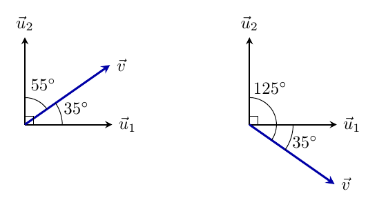



# Midterm 1

<a class="btn btn-info assignment-pdf-button" href="/resources/exams/fa26-mt1/fa26-mt1.pdf" target="_blank">View as PDF ✏️</a>
<a class="btn btn-info assignment-pdf-button" href="/resources/exams/fa26-mt1/fa26-mt1-solutions.pdf" target="_blank">Solutions PDF ✅</a>

*This page is meant to give you quick access to problems and their solutions. Refer to the original exam PDF, linked above, for test-taking instructions and formatting. Note that we’ve kept the problem text identical, which is why you may see things like “write your answer in the box below” despite there not being a box on this page.*

---

## Problems

- [Problem 1](#problem-1-10-pts)
- [Problem 2](#problem-2-14-pts)
- [Problem 3](#problem-3-15-pts)
- [Problem 4](#problem-4-11-pts)
- [Problem 5](#problem-5-12-pts)
- [Problem 6](#problem-6-16-pts)
- [Problem 7](#problem-7-10-pts)
- [Problem 8](#problem-8-12-pts)

---

## Problem 1 (10 pts)

Let

$$
\vec d=\begin{bmatrix}6\\-9\\18\end{bmatrix}
$$

 You may leave numbers as unsimplified fractions.

a)

(4 pts) Find a unit vector pointing in the same direction as \\(\vec d\\).

Solution

First factor out \\(3\\):

$$
\vec d=\begin{bmatrix}6\\-9\\18\end{bmatrix}
=3\begin{bmatrix}2\\-3\\6\end{bmatrix}
$$

 The length of the vector that remains is \\(\sqrt{2^2+(-3)^2+6^2}=\sqrt{49}=7\\). So \\(\|\vec d\|=3(7)=21\\). Dividing by the length gives the unit vector:

$$
\frac{\vec d}{\|\vec d\|}
=\frac3{21}\begin{bmatrix}2\\-3\\6\end{bmatrix}
=\frac17\begin{bmatrix}2\\-3\\6\end{bmatrix}
=\boxed{\begin{bmatrix}2/7\\-3/7\\6/7\end{bmatrix}}
$$

b)

(3 pts) Find a vector of length \\(6\\) pointing in the direction opposite to \\(\vec d\\).

Solution

Multiply the unit vector from part (a) by \\(-6\\). The factor \\(6\\) sets the length, and the negative sign reverses the direction:

$$
-6\frac{\vec d}{\|\vec d\|}
=-\frac6{21}\begin{bmatrix}6\\-9\\18\end{bmatrix}
=\boxed{\begin{bmatrix}-12/7\\18/7\\-36/7\end{bmatrix}}
$$

c)

(3 pts) A robot starts at \\(P=(5,-6,8)\\) and moves \\(x\\) units in the direction of \\(\vec d\\), ending at \\((9,-12,20)\\). What is the value of \\(x\\)?

Solution

The displacement from the starting point to the ending point is

$$
\begin{bmatrix}9-5\\-12-(-6)\\20-8\end{bmatrix}
=\begin{bmatrix}4\\-6\\12\end{bmatrix}
=\frac23\vec d
$$

 The positive scalar confirms that the robot moves in the direction of \\(\vec d\\). The distance traveled is the length of this displacement:

$$
x=\left\|\frac23\vec d\right\|=\frac23(21)=\boxed{14}
$$

---

## Problem 2 (14 pts)

Suppose \\(\vec u,\vec v\in\mathbb R^3\\) satisfy

$$
\|\vec u\|=3,\qquad \|\vec v\|=4,\qquad \vec u\cdot\vec v=-10
$$

a)

(6 pts) Find the value of \\(c\\) for which \\(\vec u+c\vec v\\) is orthogonal to \\(2\vec u-\vec v\\).

Solution

Orthogonal vectors have dot product \\(0\\). Distribute the dot product and use \\(\vec u\cdot\vec u=\|\vec u\|^2\\):

$$
\begin{align*}
0&=(\vec u+c\vec v)\cdot(2\vec u-\vec v)\\
&=2\|\vec u\|^2-\vec u\cdot\vec v+2c(\vec u\cdot\vec v)-c\|\vec v\|^2\\
&=2(9)-(-10)+2c(-10)-16c\\
&=28-36c
\end{align*}
$$

Therefore, \\(c=\dfrac{28}{36}=\boxed{\dfrac79}\\).

b)

(5 pts) Find \\(\|3\vec u+\vec v\|\\).

Solution

First find the squared length by taking a dot product:

$$
\begin{align*}
\|3\vec u+\vec v\|^2
&=(3\vec u+\vec v)\cdot(3\vec u+\vec v)\\
&=9\|\vec u\|^2+6(\vec u\cdot\vec v)+\|\vec v\|^2\\
&=9(9)+6(-10)+16=37
\end{align*}
$$

Taking the nonnegative square root gives \\(\boxed{\|3\vec u+\vec v\|=\sqrt{37}}\\).

c)

(3 pts) Find the angle between \\(\vec u\\) and \\(\vec v\\). Then select the angle type.

 Acute Right Obtuse

Solution

 Acute Right Obtuse

Using the formula for cosine similarity (which comes from the geometric definition of the dot product):

$$
\cos\theta=\frac{\vec u\cdot\vec v}{\|\vec u\|\|\vec v\|}
=\frac{-10}{3(4)}=-\frac56
$$

 Thus \\(\boxed{\theta=\cos^{-1}(-5/6)}\\). The dot product is negative, so the angle is **obtuse** (greater than \\(90^\circ\\)).

---

## Problem 3 (15 pts)

Consider the line \\(\ell\\) in \\(\mathbb R^2\\) given by

$$
\begin{bmatrix}x\\y\end{bmatrix}
=\begin{bmatrix}5\\3\end{bmatrix}
+t\begin{bmatrix}6\\5\end{bmatrix},\qquad t\in\mathbb R
$$

a)

(4 pts) Write an equation for \\(\ell\\) in the form \\(ax+by=c\\).

Solution

A normal \\(\begin{bmatrix}a\\\\b\end{bmatrix}\\) must be perpendicular to the direction \\(\begin{bmatrix}6\\\\5\end{bmatrix}\\), so \\(6a+5b=0\\). An easy choice is \\(a=5\\) and \\(b=-6\\); this comes from swapping \\(6\\) and \\(5\\) and negating one of them. Then, to find \\(c\\) in

$$
5x-6y=c
$$

 just plug in a known point on the line, e.g., \\((5,3)\\):

$$
5(5)-6(3)=7
$$

 Therefore, one equation is \\(\boxed{5x-6y=7}\\). Other equations for this line are nonzero scalar multiples of this equation.

b)

(7 pts) Which of the following are valid scalar-parametric forms of \\(\ell\\)? **Select all that apply.** In each option, \\(t\in\mathbb R\\).

 \(\begin{cases}x=5+12t\\y=4+10t\end{cases}\) \(\begin{cases}x=11+12t\\y=8+10t\end{cases}\) \(\begin{cases}x=-1-18t\\y=-2-15t\end{cases}\) \(\begin{cases}x=11+5t\\y=8-6t\end{cases}\)

Solution

 \(\begin{cases}x=5+12t\\y=4+10t\end{cases}\) \(\begin{cases}x=11+12t\\y=8+10t\end{cases}\) \(\begin{cases}x=-1-18t\\y=-2-15t\end{cases}\) \(\begin{cases}x=11+5t\\y=8-6t\end{cases}\)

**Select the second and third options.** A parametrization describes \\(\ell\\) when its starting point lies on \\(5x-6y=7\\) and its nonzero direction is a scalar multiple of the original direction.

<ol class="assignment-enumeration" markdown="1">

<li markdown="1">

1.

**Invalid:** The direction is correct, but \\((5,4)\\) is not on \\(\ell\\): \\(5(5)-6(4)=1\ne7\\).

</li>
<li markdown="1">

2.

**Valid:** \\(5(11)-6(8)=7\\), and the direction is twice the original direction.

</li>
<li markdown="1">

3.

**Valid:** \\(5(-1)-6(-2)=7\\), and the direction is \\(-3\\) times the original direction.

</li>
<li markdown="1">

4.

**Invalid:** The starting point is on \\(\ell\\), but the direction is perpendicular to the original direction, rather than parallel to it.

</li>
</ol>

c)

(4 pts) Let \\(\ell'\\) be the line perpendicular to \\(\ell\\) that passes through \\((7,-6)\\). Write an equation for \\(\ell'\\) in the form \\(ax+by=c\\).

Solution

Because \\(\ell'\\) is perpendicular to \\(\ell\\), the direction of \\(\ell\\) is a normal to \\(\ell'\\). Thus \\(\ell'\\) has an equation \\(6x+5y=c\\). Substituting its point \\((7,-6)\\) gives

$$
c=6(7)+5(-6)=12
$$

 One equation is \\(\boxed{6x+5y=12}\\).

---

## Problem 4 (11 pts)

Let \\(\vec u&#95;1\\) and \\(\vec u&#95;2\\) form an orthonormal basis of \\(\mathbb R^2\\). Suppose

$$
\vec w=6\vec u_1+2\vec u_2.
$$

a)

(4 pts) Find \\(\|\vec w\|\\).

Solution

Orthonormality gives \\(\|\vec u&#95;1\|=\|\vec u&#95;2\|=1\\) and \\(\vec u&#95;1\cdot\vec u&#95;2=0\\). Therefore,

$$
\|\vec w\|^2=(6\vec u_1+2\vec u_2)\cdot(6\vec u_1+2\vec u_2)
=36+24(0)+4=40
$$

 So \\(\boxed{\|\vec w\|=\sqrt{40}=2\sqrt{10}}\\).

b)

(3 pts) Find \\(\vec w\cdot\vec u&#95;1\\).

Solution

Distribute the dot product and use orthonormality:

$$
\vec w\cdot\vec u_1
=6(\vec u_1\cdot\vec u_1)+2(\vec u_2\cdot\vec u_1)
=6(1)+2(0)=\boxed{6}
$$

c)

(4 pts) Suppose \\(\vec v\\) is another vector in \\(\mathbb R^2\\). Given that the angle between \\(\vec v\\) and \\(\vec u&#95;1\\) is \\(35^\circ\\), which of the following *could be* the angle between \\(\vec v\\) and \\(\vec u&#95;2\\)? **Select all that apply.**

 \(35^\circ\) \(55^\circ\) \(90^\circ\) \(125^\circ\) \(145^\circ\)

Solution

 \(35^\circ\) \(55^\circ\) \(90^\circ\) \(125^\circ\) \(145^\circ\)

The basis vectors \\(\vec u&#95;1\\) and \\(\vec u&#95;2\\) are perpendicular. We're given that the angle between \\(\vec v\\) and \\(\vec u&#95;1\\) is \\(35^\circ\\)---this could mean \\(\vec v\\) is \\(35^\circ\\) "below" \\(\vec u&#95;1\\) or \\(35^\circ\\) "above" \\(\vec u&#95;1\\).

The angles with \\(\vec u&#95;2\\) are \\(90^\circ-35^\circ=55^\circ\\) and \\(90^\circ+35^\circ=125^\circ\\). These two pictures cover all possibilities up to rotation and reflection; the length of \\(\vec v\\) does not affect its angles.

---

## Problem 5 (12 pts)

Consider the vectors

$$
\vec u_1=\frac1{9}\begin{bmatrix}4\\4\\7\end{bmatrix},\qquad
\vec u_2=\frac1{9}\begin{bmatrix}-8\\1\\4\end{bmatrix},\qquad
\vec w=\begin{bmatrix}4\\2\\3\end{bmatrix}
$$

 The vector \\(\vec w\\) is in \\(\operatorname{span}(\vec u&#95;1,\vec u&#95;2)\\).

a)

(6 pts) Verify that \\(\vec u&#95;1\\) and \\(\vec u&#95;2\\) are orthogonal and each has length \\(1\\).

Solution

Compute the dot product and both lengths:

$$
\begin{align*}
\vec u_1\cdot\vec u_2&=\frac{4(-8)+4(1)+7(4)}{81}=\frac{-32+4+28}{81}=0\\
\|\vec u_1\|&=\frac{\sqrt{4^2+4^2+7^2}}9=\frac{\sqrt{81}}9=1\\
\|\vec u_2\|&=\frac{\sqrt{(-8)^2+1^2+4^2}}9=\frac{\sqrt{81}}9=1
\end{align*}
$$

The zero dot product verifies orthogonality, and the two lengths verify that both vectors are unit vectors.

b)

(6 pts) Write \\(\vec w\\) as a linear combination of \\(\vec u&#95;1\\) and \\(\vec u&#95;2\\).

Solution

Write \\(\vec w=a\vec u&#95;1+b\vec u&#95;2\\). Taking dot products with the orthonormal vectors isolates the coefficients:

$$
\begin{align*}
a=\vec w\cdot\vec u_1&=\frac{4(4)+2(4)+3(7)}9=\frac{45}9=5\\
b=\vec w\cdot\vec u_2&=\frac{4(-8)+2(1)+3(4)}9=\frac{-18}9=-2
\end{align*}
$$

Therefore, \\(\boxed{\vec w=5\vec u&#95;1-2\vec u&#95;2}\\). We can check the result directly:

$$
5\vec u_1-2\vec u_2
=\frac19\begin{bmatrix}20+16\\20-2\\35-8\end{bmatrix}
=\begin{bmatrix}4\\2\\3\end{bmatrix}=\vec w
$$

---

## Problem 6 (16 pts)

Let \\(P\\) be the plane through \\((6,-5,8)\\) with direction vectors

$$
\vec u=\begin{bmatrix}2\\5\\3\end{bmatrix},\qquad
\vec v=\begin{bmatrix}4\\5\\1\end{bmatrix}
$$

a)

(8 pts) Write an equation for \\(P\\) in the form \\(ax+by+cz=d\\).

Solution

Let \\(\vec n=\begin{bmatrix}a\\\\b\\\\c\end{bmatrix}\\) be a normal. It must be perpendicular to both directions, so

$$
\begin{cases}2a+5b+3c=0\\4a+5b+c=0\end{cases}
$$

 Subtract the first equation from the second to get \\(2a-2c=0\\), or \\(c=a\\). Substitute into the first:

$$
2a+5b+3a=0\quad\Longrightarrow\quad b=-a
$$

 Choose \\(a=1\\), giving \\(\vec n=\begin{bmatrix}1\\\\-1\\\\1\end{bmatrix}\\). The plane therefore has an equation \\(x-y+z=d\\). Its point \\((6,-5,8)\\) determines the constant:

$$
d=6-(-5)+8=19
$$

 Thus \\(\boxed{P:\ x-y+z=19}\\). The two given directions are not scalar multiples, so they span a plane, and our normal is perpendicular to both.

b)

(8 pts) For each vector-parametric equation below, select whether it is a valid description of \\(P\\) and give a brief justification. In every option, \\(s,t\in\mathbb R\\).

<em>Hint: Use the equation you found in the previous part.</em>

<ol class="assignment-enumeration" markdown="1">

<li markdown="1">

i)

(2 pts) \\(\displaystyle\begin{bmatrix}x\\\\y\\\\z\end{bmatrix}=\begin{bmatrix}6\\\\-5\\\\8\end{bmatrix}+s(\vec u+\vec v)+t\vec v\\)

 Valid Invalid

Solution

 Valid Invalid

**Valid.** The starting point is on \\(P\\), and \\(\vec u+\vec v\\) and \\(\vec v\\) span the same directions as \\(\vec u\\) and \\(\vec v\\): recover \\(\vec u=(\vec u+\vec v)-\vec v\\). Thus they still span the entire plane.

</li>
<li markdown="1">

ii)

(2 pts) \\(\displaystyle\begin{bmatrix}x\\\\y\\\\z\end{bmatrix}=\begin{bmatrix}9\\\\-4\\\\6\end{bmatrix}+s\vec u+t\vec v\\)

 Valid Invalid

Solution

 Valid Invalid

**Valid.** The new starting point satisfies \\(9-(-4)+6=19\\), so it lies on \\(P\\). The original two directions still span the plane; moving the starting point within \\(P\\) does not change the plane.

</li>
<li markdown="1">

iii)

(2 pts) \\(\displaystyle\begin{bmatrix}x\\\\y\\\\z\end{bmatrix}=\begin{bmatrix}6\\\\-5\\\\9\end{bmatrix}+s\vec u+t\vec v\\)

 Valid Invalid

Solution

 Valid Invalid

**Invalid.** The starting point does not satisfy the plane's equation:

$$
6-(-5)+9=20\ne19
$$

 This parametrization describes a parallel plane, \\(x-y+z=20\\).

</li>
<li markdown="1">

iv)

(2 pts) \\(\displaystyle\begin{bmatrix}x\\\\y\\\\z\end{bmatrix}=\begin{bmatrix}6\\\\-5\\\\8\end{bmatrix}+s(2\vec u-3\vec v)+t(4\vec u-6\vec v)\\)

 Valid Invalid

Solution

 Valid Invalid

**Invalid.** The directions are scalar multiples:

$$
4\vec u-6\vec v=2(2\vec u-3\vec v)
$$

 They provide only one independent direction, so this describes a line within \\(P\\), rather than the whole plane.

</li>
</ol>

---

## Problem 7 (10 pts)

The equations

$$
P_1:\ 5x+3y=10,\qquad P_2:\ 2x+6y+4z=20
$$

 describe two planes in \\(\mathbb R^3\\). Write the set of common solutions to these two equations in vector-parametric form.

Solution

First solve for \\(y\\) in terms of \\(x\\) using the first equation:

$$
5x+3y=10\quad\Longrightarrow\quad y=\frac{10-5x}{3}
$$

 Substitute this into the second equation to solve for \\(z\\):

$$
\begin{align*}
2x+6\left(\frac{10-5x}{3}\right)+4z&=20\\
2x+20-10x+4z&=20\\
z&=2x
\end{align*}
$$

Since \\(x\\) can be any real number, the common solutions are

$$
\begin{bmatrix}x\\y\\z\end{bmatrix}
=\begin{bmatrix}0\\10/3\\0\end{bmatrix}
+x\begin{bmatrix}1\\-5/3\\2\end{bmatrix},\qquad x\in\mathbb R
$$

 This is already a valid answer. To avoid fractions, multiply the direction vector by \\(3\\), which does not change the line. Choosing the point corresponding to \\(x=2\\) as our starting point gives

$$
\boxed{\begin{bmatrix}x\\y\\z\end{bmatrix}
=\begin{bmatrix}2\\0\\4\end{bmatrix}
+t\begin{bmatrix}3\\-5\\6\end{bmatrix},\qquad t\in\mathbb R}
$$

 Equivalently, we have reparameterized by setting \\(x=2+3t\\). As \\(t\\) ranges over all real numbers, \\(x\\) does too, so we still describe the entire intersection line.

---

## Problem 8 (12 pts)

Let

$$
\vec v=\begin{bmatrix}7\\5\\6\end{bmatrix},\qquad
\ell=\operatorname{span}\left(\begin{bmatrix}4\\-5\\7\end{bmatrix}\right),\qquad
P:\ 4x-5y+7z=0
$$

a)

(6 pts) Find the orthogonal projection of \\(\vec v\\) onto \\(\ell\\).

Solution

Let \\(\vec w=\begin{bmatrix}4\\\\-5\\\\7\end{bmatrix}\\), the vector spanning \\(\ell\\). Use the projection formula:

$$
\begin{align*}
\operatorname{proj}_{\ell}(\vec v)
&=\frac{\vec v\cdot\vec w}{\vec w\cdot\vec w}\vec w\\
&=\frac{7(4)+5(-5)+6(7)}{4^2+(-5)^2+7^2}\begin{bmatrix}4\\-5\\7\end{bmatrix}\\
&=\frac{45}{90}\begin{bmatrix}4\\-5\\7\end{bmatrix}
=\boxed{\begin{bmatrix}2\\-5/2\\7/2\end{bmatrix}}
\end{align*}
$$

b)

(6 pts) Find the orthogonal projection of \\(\vec v\\) onto \\(P\\).

Solution

The coefficients of \\(P\\) tell us that the vector \\(\begin{bmatrix}4\\\\-5\\\\7\end{bmatrix}\\) is perpendicular to \\(P\\). But \\(\ell\\) is the span of \\(\begin{bmatrix}4\\\\-5\\\\7\end{bmatrix}\\), so \\(P\\) and \\(\ell\\) are perpendicular, and \\(\vec v\\)'s projections onto \\(\ell\\) and onto \\(P\\) sum to \\(\vec v\\) exactly. Thus,

$$
\begin{align*}
\operatorname{proj}_{P}(\vec v)
&=\vec v-\operatorname{proj}_{\ell}(\vec v)\\
&=\begin{bmatrix}7\\5\\6\end{bmatrix}-\begin{bmatrix}2\\-5/2\\7/2\end{bmatrix}
=\boxed{\begin{bmatrix}5\\15/2\\5/2\end{bmatrix}}
\end{align*}
$$

As a check, this vector lies in \\(P\\):

$$
4(5)-5\left(\frac{15}2\right)+7\left(\frac52\right)=0
$$


