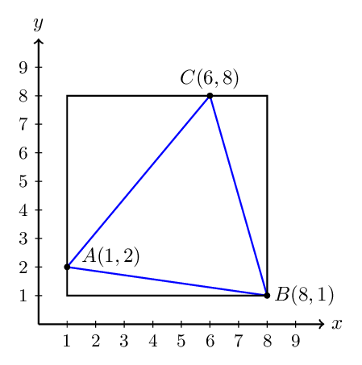
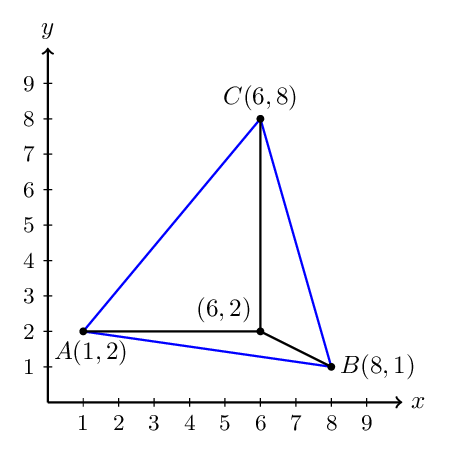
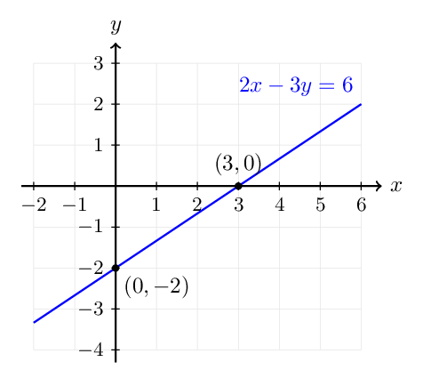



# Homework 1: Mathematical Foundations

**due** Tuesday, September 8th at 11:59PM

<a class="btn btn-info assignment-pdf-button" href="/resources/homeworks/hw01/hw01.pdf" target="_blank">View as PDF ✏️</a>
<a class="btn btn-info assignment-pdf-button" href="/resources/homeworks/hw01/hw01-solutions.pdf" target="_blank">Solutions PDF ✅</a>

{: .yellow }

Write your solutions to the following problems either by writing them on a piece of paper or on a tablet and scanning your answers as a PDF. Note that you are not allowed to use LaTeX, Google Docs, or any other digital document creation software to type your answers. Homeworks are due to Pensive by 11:59PM on the due date. See the [syllabus](https://math124.org/syllabus/#homework) for details on the slip day policy.

Homework will be evaluated not only on the correctness of your answers, but on your ability to present your ideas clearly and logically. You should always explain and justify your conclusions, using sound reasoning. Your goal should be to convince the reader of your assertions. If a question does not require explanation, it will be explicitly stated.

Before proceeding, make sure you're familiar with the [collaboration policy](https://math124.org/syllabus/#collaboration-and-generative-ai-policy).

---

## Problems

- [Problem 1: Triangle Time](#problem-1-triangle-time-24-pts)
- [Problem 2: Paralleling the Lab Activity](#problem-2-paralleling-the-lab-activity-14-pts)
- [Problem 3: Bob the Builder](#problem-3-bob-the-builder-16-pts)
- [Problem 4: Mathematical Feng Shui](#problem-4-mathematical-feng-shui-16-pts)
- [Problem 5: A Systematic Start](#problem-5-a-systematic-start-16-pts)
- [Problem 6: Programming Activity](#problem-6-programming-activity-14-pts)

---

Total Points: 24 + 14 + 16 + 16 + 16 + 14 = 100

---

## Problem 1: Triangle Time (24 pts)

Solve each part using any method you'd like. But, as with all homework problems, explain your solutions clearly. For expressions involving square roots or inverse trigonometric functions, make sure to provide both the unsimplified expression (e.g. \\(2 \cos^{-1}\left(\frac{1}{3}\right)\\) or \\(\sqrt{15}\\)) **and** a rounded estimate to two decimal places (e.g. \\(141.06^\circ\\) or \\(3.87\\)).

a)

(8 pts) Let \\(A = (1, 2)\\), \\(B = (8, 1)\\), and \\(C = (6, 8)\\). Compute the area of the triangle ABC. See [**here**](https://edstem.org/us/courses/103314/discussion/8236522) on Ed for a hint.

Solution

There are two different approaches. One is to inscribe the triangle in a rectangle:

The rectangle has area \\(49\\), while the three triangles each have areas \\(15,7,\frac{7}{2}\\). Hence the area is \\(49 - 15-7-\frac{7}{2} = \frac{47}{2}\\).

The other is to internally subdivide the triangle into three pieces:

The three internal triangles have areas \\(15,6,\frac{5}{2}\\), hence the area of the triangle is the sum of these areas which is \\(15+6+\frac{5}{2} = \frac{47}{2}\\).

b)

(8 pts) A right triangle has side lengths \\(9\\) cm, \\(18\\) cm, and \\(x\\) cm. Compute **all possible** values of \\(x\\), and find all three angles of the triangle in each case.

Solution

Here \\(x\\) can either be the base/height or the hypotenuse. We use Pythagoras' theorem to find the length of \\(x\\) and inverse trigonometric functions to find the angles.

For the first case, \\(x=\sqrt{18^2 - 9^2} = 9\sqrt{3}\approx 15.59\text{ cm}\\) and the angles are 30, 60, and 90 degrees.

For the second case, \\(x = \sqrt{9^2 + 18^2} = 9\sqrt{5}\approx 20.12\text{ cm}\\) and the angles are \\(\sin^{-1}(1/\sqrt{5})\approx 26.57\\), \\(\sin^{-1}(2/\sqrt{5}) \approx 63.43\\), and 90 degrees. Other valid answers for the first angle are \\(\cos^{-1}(2/\sqrt{5})\\) or \\(\tan^{-1}(1/2)\\); for the second angle are \\(\cos^{-1}(1/\sqrt5)\\) or \\(\tan^{-1}(2)\\).

c)

(8 pts) In a triangle \\(ABC\\), let side \\(a = 9\\) cm, side \\(b = 17\\) cm, and angle \\(C = 13^\circ\\). Compute the length of side \\(c\\), and the angles \\(A\\) and \\(B\\) in degrees. <em>Hint: use the law of cosines and law of sines.</em>

Solution

By the law of cosines,

$$
c= \sqrt{9^2 + 17^2 - 2\cdot 9\cdot 17\cos C} = \sqrt{370 - 306\cos(13^\circ)} \approx 8.48\text{ cm}.
$$

 Sketching the triangle, we see that \\(A\\) must be an acute angle, while \\(B\\) must be obtuse. Finding the angle at \\(A\\) using the law of sines, we obtain

$$
A = \sin^{-1}\left(\frac{9\sin(13^\circ)}{\sqrt{370 - 306\cos(13^\circ)}}\right) \approx 13.82^\circ.
$$

 The remaining angle at \\(B\\) is found by subtracting the angles at \\(A,C\\) from 180 degrees:

$$
B = 180^\circ - 13^\circ - \sin^{-1}\left(\frac{9\sin(13^\circ)}{\sqrt{370 - 306\cos(13^\circ)}}\right) \approx 153.18^\circ.
$$

---

## Problem 2: Paralleling the Lab Activity (14 pts)

Consider the line

$$
2x-3y=6.
$$

a)

(4 pts) Plot the line by hand. Make sure to label your axes and label at least two points on the line.

Solution

The line has slope \\(\frac{2}{3}\\), \\(x\\)-intercept \\((3,0)\\), and \\(y\\)-intercept \\((0,-2)\\).

b)

(5 pts) Find an equation for a line that is parallel to this line and passes through the point \\((5,3)\\).

Solution

The answer is \\(2x-3y=1\\). An equivalent form is \\(y = \frac{2}{3}x - \frac{1}{3}\\).

c)

(5 pts) Find an equation for a line that is perpendicular to this line and passes through the point \\((1,2)\\).

Solution

Tne answer is \\(3x+2y=7\\). An equivalent form is \\(y = -\frac{3}{2}x + \frac{7}{2}\\).

---

## Problem 3: Bob the Builder (16 pts)

Write each of the following sets in set-builder notation. Refer to [Chapter 1.2](https://notes.math124.org/ch01/01-02/) of the course notes and Lab 1 for examples.

a)

(4 pts) All even integers.

Solution

\\(\lbrace{}2x : x \in \mathbb{Z}\rbrace{}\\); another valid answer is \\(\lbrace{} x\in \mathbb{Z}: x=2n,\ n\in \mathbb{Z}\rbrace{}\\).

b)

(6 pts) All \\(y\\)-values of points on the parabola \\(y = x^2+3\\).

Solution

\\(\lbrace{}y \in \mathbb{R} : y = x^2+3, x \in \mathbb{R}\rbrace{}\\); other valid answers include \\(\lbrace{} y\in \mathbb{R}: y\geq 3\rbrace{}\\) and \\(\lbrace{} x^2 + 3: x\in \mathbb{R} \rbrace{}\\).

c)

(6 pts) The unit circle in \\(\mathbb{R}^2\\) (two-dimensional space), i.e., the circle with center \\((0,0)\\) and radius \\(1\\).

Solution

\\(\lbrace{}\begin{bmatrix} x\\\\y \end{bmatrix} \in \mathbb{R}^2 : x^2 + y^2 = 1\rbrace{}\\) or \\(\lbrace{}(x,y) \in \mathbb{R}^2 : x^2 + y^2 = 1\rbrace{}\\) or other equivalent forms.

---

## Problem 4: Mathematical Feng Shui (16 pts)

In each of the following subparts, you are given a problem along with a potential solution. Identify the mistakes in each solution, and rewrite the solution so that it is mathematically valid. *Note that a solution may yield the right answer, but may make grammatical mistakes along the way.*

a)

(7 pts) Problem: Solve for \\(x\\) in the equation

$$
3(x-2)+4=2x+7.
$$

Solution:

<table>
<tbody>
<tr>
<td style="text-align: right;">1</td>
<td style="text-align: left;">\(3(x-2)+4=3x-2=2x+7=x=9.\)</td>
</tr>
</tbody>
</table>

Solution

A correctly written solution is

$$
\begin{aligned}
3(x-2)+4&=2x+7,\\
3x-2&=2x+7,\\
x&=9.
\end{aligned}
$$

 The original answer incorrectly chains together expressions and equations with equals signs. While it correctly finds that \\(x=9\\), it is not true that \\(3(x-2) + 4 = 9\\), which is an implication of the equation written.

b)

(9 pts) Problem: Solve the inequality

$$
\frac{1}{x}>2.
$$

Solution:

<table>
<tbody>
<tr>
<td style="text-align: right;">1</td>
<td style="text-align: left;">\(\displaystyle \frac{1}{x}&gt;2\)</td>
</tr>
<tr>
<td style="text-align: right;"></td>
<td style="text-align: left;"></td>
</tr>
<tr>
<td style="text-align: right;">2</td>
<td style="text-align: left;">\(1&gt;2x\)</td>
</tr>
<tr>
<td style="text-align: right;"></td>
<td style="text-align: left;"></td>
</tr>
<tr>
<td style="text-align: right;">3</td>
<td style="text-align: left;">\(\displaystyle x&lt;\frac{1}{2}\)</td>
</tr>
<tr>
<td style="text-align: right;"></td>
<td style="text-align: left;"></td>
</tr>
<tr>
<td style="text-align: right;">4</td>
<td style="text-align: left;">So, the solution set is \(\{x \in \mathbb{R}: x &lt; \frac{1}{2} \}\).</td>
</tr>
</tbody>
</table>

Solution

The issue with the provided solution is that we don't know the sign of \\(x\\). If \\(x\\) were negative, then multiplying both sides of the inequality by \\(x\\) would require changing the direction of the inequality.

Here are two ways to correctly present this solution.

<ul>
<li>
Notice that \(\frac{1}{x} &gt; 2\) implies that \(x &gt; 0\), because if \(x\) were negative, then the left-hand side would be negative and could never be greater than positive \(2\). Then, when \(x &gt; 0\), we can multiply both sides of \(\frac{1}{x} &gt; 2\) by \(x\) without needing to change the direction of the inequality (as the original solution did), giving \(1 &gt; 2x\) and \(\frac{1}{2} &gt; x\). This makes the complete solution \[\{ x \in \mathbb{R} : 0 &lt; x &lt; \frac{1}{2} \}\]
</li>
<li>
Start from scratch, and break into two cases: \(x &gt; 0\) and \(x &lt; 0\). (\(x = 0\) is not a valid case; we can’t divide by \(0\)).

<ul>
<li>
\(x &gt; 0\): Same logic as above.
</li>
<li>
\(x &lt; 0\): From \(\frac{1}{x} &gt; 2\), we multiply both sides by \(x\) to get \[1 &lt; 2x.\] Notice that the direction of the inequality is flipped here since we are assuming \(x\) to be negative in this case. Then, dividing both sides by \(2\) gives \(\frac{1}{2} &lt; x\). But, it is impossible for \(x\) to be less than \(0\) and greater than \(\frac{1}{2}\) at the same time – this is a <strong>contradiction</strong>. So, no values of \(x\) can satisfy the inequality and be negative.
</li>
</ul></li>
</ul>

---

## Problem 5: A Systematic Start (16 pts)

A big focus of this class is learning how to solve systems of equations at scale. For now, let's review your prior knowledge of solving systems. Each part of this problem defines a system of equations --- your job is to state it and solve it without any calculator or software assistance.

a)

(7 pts) The University of Michigan has been hacked by conniving tricksters, and now their football ticket prices are all wrong! One boothsperson reported that they sold 3 student tickets and 5 adult tickets for $87.50. Another boothsperson reported that they sold 41 student tickets and 6 adult tickets for $217.20. What are the current costs of 1 student ticket and 1 adult ticket?

Solution

Set the student ticket price as \\(x\\) and the adult ticket price as \\(y\\). The system is

$$
\begin{cases}
        3x+5y=87.50,\\
        41x+6y=217.20.
      \end{cases}
$$

 We eliminate \\(y\\) by multiplying 6 to the first equation, 5 to the second equation and then subtracting the first from the second. This gives \\(187x=561\\), so \\(x=3\\). Substituting this into the first equation gives \\(y=15.70\\). Hence the student ticket is $3.00 and the adult ticket is $15.70.

b)

(9 pts) You, Sarah, and Stephen each have a pet bug. Each bug begins at position \\(0\\) on the number line. A positive position means that the bug moved to the right of its starting point, while a negative position means that it moved to the left.

At the end of the experiment, the following statements are true:

-   The sum of the three bugs' final positions is \\(35\\) centimeters.

-   Five times your bug's position, plus four times Sarah's bug's position, plus Stephen's bug's position is \\(7\\) centimeters.

-   Stephen's bug is \\(7\\) centimeters to the right of Sarah's bug.

Find the final position of each bug. If the winner is the bug whose final position has the greatest absolute value, which bug wins?

Solution

Let \\(x\\), \\(y\\), and \\(z\\) be your, Sarah's, and Stephen's bugs' final positions, respectively. Then the system of equations is

$$
\begin{cases}
        x+y+z=35,\\
        5x+4y+z=7,\\
        z=y+7.
      \end{cases}
$$

 Substituting \\(z=y+7\\) into the first two equations gives \\(x+2y=28\\) and \\(5x+5y=0\\). The second equation gives \\(x=-y\\), so substituting this into the first gives \\(y=28\\). It follows that \\(x=-28\\) and \\(z=35\\). Therefore your bug finishes at \\(-28\\) cm, Sarah's at \\(28\\) cm, and Stephen's at \\(35\\) cm. Stephen's bug wins.

---

## Problem 6: Programming Activity (14 pts)

Most homeworks and some labs will have a Jupyter Notebook, containing Python code that supplements our understanding of the relevant mathematical ideas of the week.

To open the notebook for Homework 1, click [**this link**](https://colab.research.google.com/github/math-124/fa26-code/blob/main/homeworks/hw01/hw01.ipynb). Instructions on how to use Google Colab are at [math124.org/running-code](https://math124.org/running-code).

You do not need to submit the notebook anywhere. To get credit for the work you did in this notebook, include screenshots of the following parts of your notebook as part of your PDF submission to Homework 1 on Pensive, specifically under Problem 6:

-   A screenshot of the **code** you wrote in Task 2, to implement the sepia filter.

-   A screenshot of the grayscale and sepia versions of the image you uploaded.


