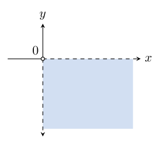
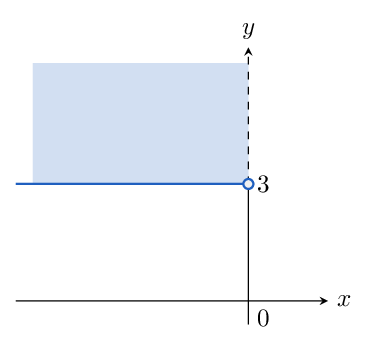
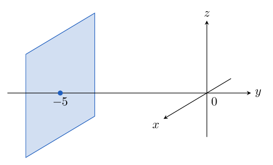
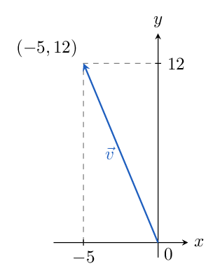
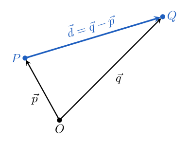
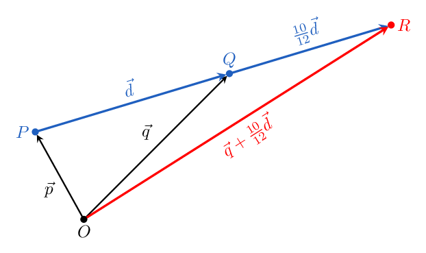
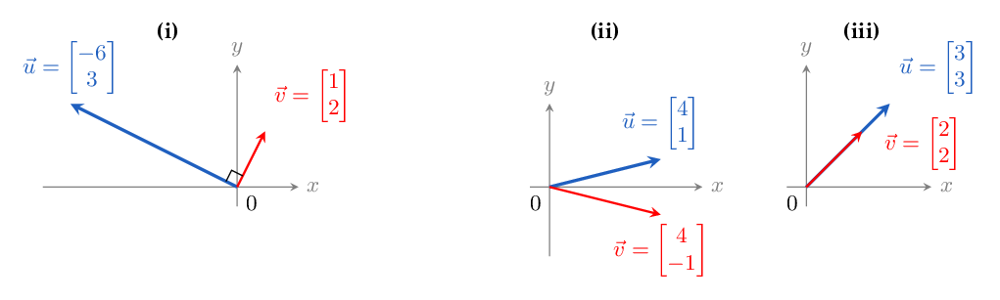



# Homework 2: Vector Arithmetic, Lengths, and the Dot Product

**due** Monday, September 14th at 11:59PM

<a class="btn btn-info assignment-pdf-button" href="/resources/homeworks/hw02/hw02.pdf" target="_blank">View as PDF ✏️</a>
<a class="btn btn-info assignment-pdf-button" href="/resources/homeworks/hw02/hw02-solutions.pdf" target="_blank">Solutions PDF ✅</a>

{: .yellow }

Write your solutions to the following problems either by writing them on a piece of paper or on a tablet and scanning your answers as a PDF. Note that you are not allowed to use LaTeX, Google Docs, or any other digital document creation software to type your answers. Homeworks are due to Pensive by 11:59PM on the due date. See the [syllabus](https://math124.org/syllabus/#homework) for details on the slip day policy.

Homework will be evaluated not only on the correctness of your answers, but on your ability to present your ideas clearly and logically. You should always explain and justify your conclusions, using sound reasoning. Your goal should be to convince the reader of your assertions. If a question does not require explanation, it will be explicitly stated.

Before proceeding, make sure you're familiar with the [collaboration policy](https://math124.org/syllabus/#collaboration-and-generative-ai-policy).

---

## Problems

- [Problem 1: Homework 1 Solutions Review](#problem-1-homework-1-solutions-review-8-pts)
- [Problem 2: Setting Ourselves Up](#problem-2-setting-ourselves-up-10-pts)
- [Problem 3: Add All Ingredients to the Bowl and Combine](#problem-3-add-all-ingredients-to-the-bowl-and-combine-8-pts)
- [Problem 4: *Norm*alize Doing Math 124!](#problem-4-normalize-doing-math-124-6-pts)
- [Problem 5: Displacement and Distance](#problem-5-displacement-and-distance-10-pts)
- [Problem 6: Dot Products, Angles, and Orthogonality](#problem-6-dot-products-angles-and-orthogonality-20-pts)
- [Problem 7: Distributing the Dots](#problem-7-distributing-the-dots-17-pts)
- [Problem 8: Triangle Inequality](#problem-8-triangle-inequality-6-pts)
- [Problem 9: Programming Activity](#problem-9-programming-activity-15-pts)

---

Total Points: 8 + 10 + 8 + 6 + 10 + 20 + 17 + 6 + 15 = 100

---

Note: While working on the homework, have Chapters [1.4](https://notes.math124.org/ch01/01-04/), [1.5](https://notes.math124.org/ch01/01-05/), and [1.6](https://notes.math124.org/ch01/01-06/) of the course notes open! They contain lots of relevant examples and explanations.

---

## Problem 1: Homework 1 Solutions Review (8 pts)

Review [the solutions to Homework 1](https://math124.org/resources/homeworks/hw01/). Pick **two problem parts** (for example, Problem 3a and Problem 5b) from Homework 1 in which your solutions have the most room for improvement, i.e., where they have unsound reasoning, could be significantly more efficient or clearer, etc. **Include a screenshot of your solution to each problem part**, and in a few sentences, explain what was deficient and how it could be fixed.

Alternatively, if you think one of your solutions is significantly better than the posted one, copy it here and explain why you think it is better. If you didn't do Homework 1, choose two problem parts from it that look challenging to you, and in a few sentences, explain the key ideas behind their solutions in your own words.

Solution

Responses will vary. Look for specific comparisons with the posted solutions and clear explanations of how to improve the selected work.

---

## Problem 2: Setting Ourselves Up (10 pts)

Given the following sets, translate the set notation into plain English and sketch a picture of what each set looks like in \\(\mathbb{R}^2\\) or \\(\mathbb{R}^3\\).

a)

(3 pts)
\\(\lbrace{}\begin{bmatrix} x\\\\y \end{bmatrix} \in \mathbb{R}^2 : x &gt; 0, y &lt; 0\rbrace{}\\)

Solution

This is the set of all vectors in \\(\mathbb{R}^2\\) with a positive first coordinate and negative second coordinate. Shade the fourth quadrant, excluding both axes; draw the boundary rays dashed.

b)

(3 pts)
\\(\lbrace{}\begin{bmatrix} x\\\\y \end{bmatrix} \in \mathbb{R}^2 : x &lt; 0, y \geq 3\rbrace{}\\)

Solution

This is the set of vectors in \\(\mathbb{R}^2\\) with a negative first coordinate and a second coordinate at least \\(3\\). Shade the region to the left of the \\(y\\)-axis and on or above the line \\(y=3\\). Include the boundary \\(y=3\\) for \\(x&lt;0\\) and exclude the boundary \\(x=0\\), including \\((0,3)\\); draw the horizontal boundary solid and the vertical boundary dashed.

c)

(4 pts)
\\(\lbrace{}\begin{bmatrix} x\\\\y\\\\z \end{bmatrix} \in \mathbb{R}^3 : x, z \in \mathbb{R}, y = -5\rbrace{}\\)

Solution

This is the plane \\(y=-5\\) in \\(\mathbb{R}^3\\): the first and third coordinates can be any real numbers, and the second coordinate is always \\(-5\\). Sketch a plane parallel to the \\(xz\\)-plane passing through the point \\((0,-5,0)\\).

---

## Problem 3: Add All Ingredients to the Bowl and Combine (8 pts)

A cake recipe uses three ingredients: sugar, flour, and milk. We represent the ingredients in one batch by a vector in \\(\mathbb{R}^3\\), using the order

$$
\begin{bmatrix}
\text{sugar in tbsp}\\
\text{flour in cups}\\
\text{milk in tbsp}
\end{bmatrix}.
$$

 Consider the following four recipe batches:

-   Recipe 1 uses \\(2\\) tbsp of sugar, \\(1\\) cup of flour, and \\(3\\) tbsp of milk.

-   Recipe 2 uses \\(3\\) tbsp of sugar, \\(2\\) cups of flour, and \\(4\\) tbsp of milk.

-   Recipe 3 uses \\(4\\) tbsp of sugar, \\(2\\) cups of flour, and \\(6\\) tbsp of milk.

-   Recipe 4 uses \\(1\\) tbsp of sugar, \\(1\\) cup of flour, and \\(2\\) tbsp of milk.

a)

(4 pts) Write vectors \\(\vec{v}&#95;1,\vec{v}&#95;2,\vec{v}&#95;3,\vec{v}&#95;4\\) representing the four recipes. Identify a relationship between two of the vectors and explain what that relationship means in the context of the recipes.

Solution

The recipe vectors are

$$
\vec{v}_1=\begin{bmatrix}2\\1\\3\end{bmatrix},\quad
\vec{v}_2=\begin{bmatrix}3\\2\\4\end{bmatrix},\quad
\vec{v}_3=\begin{bmatrix}4\\2\\6\end{bmatrix},\quad
\vec{v}_4=\begin{bmatrix}1\\1\\2\end{bmatrix}.
$$

 Since \\(\vec{v}&#95;3=2\vec{v}&#95;1\\), Recipe 3 is a double batch of Recipe 1, with the same ingredient proportions.

b)

(4 pts) Suppose you make two batches of Recipe 1, no batches of Recipe 2, three batches of Recipe 3, and two batches of Recipe 4. Write a linear combination representing the total ingredients used. Then determine the total amount of sugar, flour, and milk used.

Solution

The appropriate linear combination is

$$
2\vec{v}_1+0\vec{v}_2+3\vec{v}_3+2\vec{v}_4
=2\begin{bmatrix}2\\1\\3\end{bmatrix}
+3\begin{bmatrix}4\\2\\6\end{bmatrix}
+2\begin{bmatrix}1\\1\\2\end{bmatrix}
=\begin{bmatrix}18\\10\\28\end{bmatrix}.
$$

 Thus, the total is \\(18\\) tbsp of sugar, \\(10\\) cups of flour, and \\(28\\) tbsp of milk.

---

## Problem 4: *Norm*alize Doing Math 124! (6 pts)

The length, or norm, of a vector is denoted by \\(\lVert \vec{v} \rVert\\). Consider the vector

$$
\vec{v}=\begin{bmatrix}-5\\12\end{bmatrix}\in\mathbb{R}^2.
$$

a)

(2 pts) Sketch \\(\vec{v}\\) in the coordinate plane.

Solution

Draw an arrow from \\((0,0)\\) to \\((-5,12)\\), with the axes and endpoint labeled.

b)

(2 pts) Compute \\(\lVert \vec{v} \rVert\\).

Solution

By the Pythagorean theorem,

$$
\lVert \vec{v} \rVert=\sqrt{(-5)^2+12^2}=\sqrt{169}=13.
$$

c)

(2 pts) Find a unit vector (i.e. a vector of length one) pointing in the same direction as \\(\vec{v}\\).

Solution

Dividing by the length gives

$$
\frac{\vec{v}}{\lVert \vec{v} \rVert}=\frac1{13}\begin{bmatrix}-5\\12\end{bmatrix}
=\begin{bmatrix}-\frac5{13}\\[2pt]\frac{12}{13}\end{bmatrix}.
$$

 Its length is \\(1\\), and the positive scale factor preserves direction.

---

## Problem 5: Displacement and Distance (10 pts)

A drone begins at the point

$$
P=(2,-1,4)
$$

 and flies in a straight line to the point

$$
Q=(6,7,-4).
$$

 The coordinates here are in meters.

a)

(2 pts) Let \\(\vec{d}\\) be the vector that describes the displacement from \\(P\\) to \\(Q\\). Find \\(\vec{d}\\).

Solution

Let \\(\vec p, \vec q\\) be the position vectors of \\(P\\), \\(Q\\) respectively. We obtain \\(\vec d\\) by subtracting the two vectors:

$$
\vec{d}=\vec q - \vec p = \begin{bmatrix}6-2\\7-(-1)\\-4-4\end{bmatrix}
=\begin{bmatrix}4\\8\\-8\end{bmatrix}.
$$

b)

(2 pts) Find the exact distance traveled by the drone.

Solution

The distance is the length of the displacement:

$$
\lVert \vec{d} \rVert=\sqrt{4^2+8^2+(-8)^2}=\sqrt{144}=12\text{ meters}.
$$

c)

(6 pts) Suppose the drone continues to travel another 10 meters in the same direction. What are its coordinates?

Solution

We divide the displacement by its length \\(12\\) to obtain the unit vector in the direction of \\(\vec d\\). Scale this unit vector by \\(10\\) and add the additional displacement to \\(Q\\), where the drone starts this part of its flight:

$$
\vec q + \frac{10}{12}\vec{d} = \begin{bmatrix}6\\7\\-4\end{bmatrix}
+\frac{10}{12}\begin{bmatrix}4\\8\\-8\end{bmatrix}
=\begin{bmatrix}\frac{28}{3}\\[2pt]\frac{41}{3}\\[2pt]-\frac{32}{3}\end{bmatrix}.
$$

 The new coordinates are \\(\left(\frac{28}{3},\frac{41}{3},-\frac{32}{3}\right)\\). In the figure below, the drone's new position is \\(R\\).

---

## Problem 6: Dot Products, Angles, and Orthogonality (20 pts)

As discussed in [Chapter 1.6](https://notes.math124.org/ch01/01-06/), for nonzero vectors \\(\vec{u},\vec{v}\in\mathbb{R}^n\\), the angle \\(\theta\\) between them satisfies

$$
\cos\theta=\frac{\vec{u}\cdot\vec{v}}{\lVert \vec{u} \rVert\lVert \vec{v} \rVert}.
$$

 This ratio is called their **cosine similarity**: the dot product divided by the product of their lengths. To find the angle itself, take the inverse cosine of this ratio.

a)

(9 pts) For each pair below, draw the vectors, compute their dot product, and find their cosine similarity (i.e. the cosine of the angle between them). In which case are the vectors orthogonal?

<ol class="assignment-enumeration" markdown="1">

<li markdown="1">

(i)

(3 pts) \\(\vec{u}=\begin{bmatrix}-6\\\\3\end{bmatrix},\quad \vec{v}=\begin{bmatrix}1\\\\2\end{bmatrix}\\).

</li>
<li markdown="1">

(ii)

(3 pts) \\(\vec{u}=\begin{bmatrix}4\\\\1\end{bmatrix},\quad \vec{v}=\begin{bmatrix}4\\\\-1\end{bmatrix}\\).

</li>
<li markdown="1">

(iii)

(3 pts) \\(\vec{u}=\begin{bmatrix}3\\\\3\end{bmatrix},\quad \vec{v}=\begin{bmatrix}2\\\\2\end{bmatrix}\\).

</li>
</ol>

Solution

Draw each vector as an arrow from the origin to its coordinates.

The dot products are \\(0\\), \\(15\\), and \\(12\\), respectively. The corresponding cosine similarities are \\(0\\), \\(15/17\\), and \\(1\\). Only the first pair is orthogonal.

b)

(6 pts) For each pair below, find all values of \\(k\\) that make \\(\vec{u}\\) and \\(\vec{v}\\) orthogonal.

<ol class="assignment-enumeration" markdown="1">

<li markdown="1">

(i)

(3 pts) \\(\vec{u}=\begin{bmatrix}k\\\\3\\\\-\frac12\end{bmatrix},\quad \vec{v}=\begin{bmatrix}-5\\\\-k\\\\\frac12\end{bmatrix}\\).

</li>
<li markdown="1">

(ii)

(3 pts) \\(\vec{u}=\begin{bmatrix}2k\\\\-4\\\\1\end{bmatrix},\quad \vec{v}=\begin{bmatrix}2k\\\\-2k\\\\0\end{bmatrix}\\).

</li>
</ol>

Solution

In (i), orthogonality requires

$$
\vec u\cdot \vec v = -5k-3k-\frac14=0,
$$

 giving \\(k=-\frac1{32}\\). In (ii), it requires

$$
\vec u\cdot \vec v = 4k^2+8k=4k(k+2)=0,
$$

 giving \\(k=0\\) or \\(k=-2\\).

c)

(5 pts) Use the cosine formula to explain why, for nonzero vectors \\(\vec{u},\vec{v}\in\mathbb{R}^n\\),

$$
|\vec{u}\cdot\vec{v}|\leq\lVert \vec{u} \rVert\lVert \vec{v} \rVert.
$$

 Explain why equality holds exactly when the vectors point in the same or opposite directions. Finally, explain why the inequality also holds if either vector is zero. This inequality is called the Cauchy--Schwarz inequality.

Solution

Let \\(\theta\\) denote the angle between the vectors \\(\vec u\\) and \\(\vec v\\). Then since \\(|\cos\theta|\leq1\\),

$$
|\vec{u}\cdot\vec{v}|=\lVert \vec{u} \rVert\lVert \vec{v} \rVert\,|\cos\theta|
\leq\lVert \vec{u} \rVert\lVert \vec{v} \rVert.
$$

 For nonzero vectors, equality holds exactly when \\(|\cos\theta|=1\\), so \\(\theta=0^\circ\\) or \\(180^\circ\\): the vectors point in the same or opposite directions. If either vector is zero, both sides of the inequality are zero.

---

## Problem 7: Distributing the Dots (17 pts)

Let \\(\vec{u},\vec{v}\in\mathbb{R}^n\\) satisfy

$$
\lVert \vec{u} \rVert=3,\qquad \lVert \vec{v} \rVert=2,\qquad
(3\vec{u}-4\vec{v})\cdot(\vec{u}+9\vec{v})=-71.
$$

a)

(4 pts) Find \\(\vec{u}\cdot\vec{v}\\).

Solution

Distributing the dot product gives

$$
\begin{aligned}
-71 = (3\vec{u}-4\vec{v})\cdot(\vec{u}+9\vec{v})
&=3\lVert \vec{u} \rVert^2+27\vec{u}\cdot\vec{v}
-4\vec{v}\cdot\vec{u}-36\lVert \vec{v} \rVert^2\\
&=27+23\vec{u}\cdot\vec{v}-144.
\end{aligned}
$$

 Thus \\(23\vec{u}\cdot\vec{v}=46\\) and \\(\boxed{\vec{u}\cdot\vec{v}=2}\\).

b)

(2 pts) Find \\(\lVert -2\vec{u} \rVert\\) and \\(\lVert 3\vec{v} \rVert\\). Explain why neither length is negative.

Solution

The scaling property gives

$$
\lVert -2\vec{u} \rVert=|-2|\lVert \vec{u} \rVert=2(3)=6,
\qquad
\lVert 3\vec{v} \rVert=|3|\lVert \vec{v} \rVert=3(2)=6.
$$

 Lengths are nonnegative. A negative scalar reverses direction, but scales length by its absolute value.

c)

(4 pts) Find the cosine similarity of \\(\vec{u}\\) and \\(\vec{v}\\). Then find the cosine similarity of \\(-2\vec{u}\\) and \\(3\vec{v}\\). If the two cosine similarities are different, why are they different?

Solution

The original cosine similarity is

$$
\frac{\vec{u}\cdot\vec{v}}{\lVert \vec{u} \rVert\lVert \vec{v} \rVert}
=\frac{2}{3(2)}=\frac13.
$$

 For the scaled vectors, it is

$$
\frac{(-2\vec{u})\cdot(3\vec{v})}{\lVert -2\vec{u} \rVert\lVert 3\vec{v} \rVert}
=\frac{-6(\vec{u}\cdot\vec{v})}{6(6)}
=\frac{-12}{36}=-\frac13.
$$

 The cosine similarities differ because multiplying \\(\vec{u}\\) by \\(-2\\) reverses its direction, while multiplying \\(\vec{v}\\) by \\(3\\) preserves its direction. Reversing exactly one vector changes the sign of the cosine similarity; the positive scaling factors cancel between the numerator and denominator.

d)

(2 pts) Find \\(\vec{u}\cdot\vec{u}\\) and \\(\vec{v}\cdot\vec{v}\\).

Solution

A vector's dot product with itself is its squared length, so

$$
\vec{u}\cdot\vec{u}=\lVert \vec{u} \rVert^2=3^2=9,
\qquad
\vec{v}\cdot\vec{v}=\lVert \vec{v} \rVert^2=2^2=4.
$$

e)

(5 pts) Find \\(\lVert \vec{u}+\vec{v} \rVert\\). Is it equal to \\(\sqrt{\lVert \vec{u} \rVert^2+\lVert \vec{v} \rVert^2}\\)? Explain what condition would make these quantities equal.

<em>Hint: Start by writing \\(\lVert\vec{u}+\vec{v}\rVert^2\\) as \\((\vec{u}+\vec{v})\cdot(\vec{u}+\vec{v})\\). Then, expand this as we did in <a href="https://notes.math124.org/ch01/01-06/#orthogonality-and-the-pythagorean-theorem">Chapter 1.6</a>.</em>

Solution

Expanding gives

$$
\lVert \vec{u}+\vec{v} \rVert^2
=\lVert \vec{u} \rVert^2+2\vec{u}\cdot\vec{v}+\lVert \vec{v} \rVert^2
=9+4+4=17.
$$

 Thus \\(\lVert \vec{u}+\vec{v} \rVert=\sqrt{17}\\), whereas \\(\sqrt{\lVert \vec{u} \rVert^2+\lVert \vec{v} \rVert^2}=\sqrt{13}\\). The quantities are equal exactly when \\(\vec{u}\cdot\vec{v}=0\\), meaning the vectors are orthogonal.

---

## Problem 8: Triangle Inequality (6 pts)

In [Chapter 1.5](https://notes.math124.org/ch01/01-05/#the-triangle-inequality), we stated the triangle inequality without proof. Intuitively, the triangle inequality says that for any triangle (even in \\(\mathbb{R}^n\\)), the length of any side of the triangle is less than or equal to the sum of the lengths of the other two sides. Here, we'll prove the triangle inequality using the Cauchy--Schwarz inequality, established in Problem 6c.

a)

(4 pts) Let \\(\vec{u},\vec{v}\\) be any two vectors in \\(\mathbb{R}^n\\). Show that

$$
\lVert\vec{u}+\vec{v}\rVert^2\leq(\lVert\vec{u}\rVert+\lVert\vec{v}\rVert)^2.
$$

 <em>Hint: Start by following the same hint as in Problem 7e, then use the Cauchy--Schwarz inequality.</em>

Solution

Using distributivity, symmetry, and Cauchy--Schwarz,

$$
\begin{aligned}
\lVert \vec{u}+\vec{v} \rVert^2
&=\lVert \vec{u} \rVert^2+2\vec{u}\cdot\vec{v}+\lVert \vec{v} \rVert^2\\
&\leq\lVert \vec{u} \rVert^2+2|\vec{u}\cdot\vec{v}|+\lVert \vec{v} \rVert^2\\
&\leq\lVert \vec{u} \rVert^2+2\lVert \vec{u} \rVert\lVert \vec{v} \rVert+\lVert \vec{v} \rVert^2\\
&=(\lVert \vec{u} \rVert+\lVert \vec{v} \rVert)^2.
\end{aligned}
$$

b)

(2 pts) Why does the above imply that

$$
\lVert\vec{u}+\vec{v}\rVert\leq\lVert\vec{u}\rVert+\lVert\vec{v}\rVert
$$

Solution

Both \\(\lVert \vec{u}+\vec{v} \rVert\\) and \\(\lVert \vec{u} \rVert+\lVert \vec{v} \rVert\\) are nonnegative. Taking square roots preserves the inequality from part (a), giving \\(\lVert \vec{u}+\vec{v} \rVert\leq\lVert \vec{u} \rVert+\lVert \vec{v} \rVert\\).

---

## Problem 9: Programming Activity (15 pts)

Most homeworks and some labs will have a Jupyter Notebook, containing Python code that supplements our understanding of the relevant mathematical ideas of the week.

To open the notebook for Homework 2, click [**this link**](https://colab.research.google.com/github/math-124/fa26-code/blob/main/homeworks/hw02/hw02.ipynb). Instructions on how to use Google Colab are at [math124.org/running-code](https://math124.org/running-code).

You won't need to submit the notebook anywhere. To get credit for the work you did in this notebook, include the following in your PDF submission to Homework 2 on Pensive, specifically under **Problem 9**:

<ol class="assignment-enumeration" markdown="1">

<li markdown="1">

1.

**Task 1:** A screenshot of your three word-count arrays and their output.

</li>
<li markdown="1">

2.

**Task 2:** A screenshot of your completed cosine similarity function and the outputs of the three example calls.

</li>
<li markdown="1">

3.

**Task 3:** A screenshot of the three document comparisons and your written answer identifying the most similar pair.

</li>
<li markdown="1">

4.

**Task 4:** Your written responses to all three prompts.

</li>
</ol>


