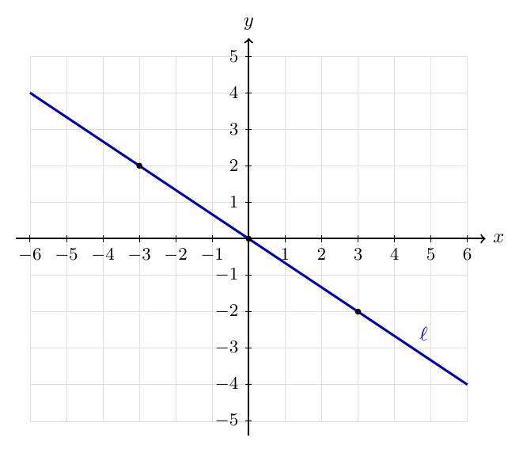
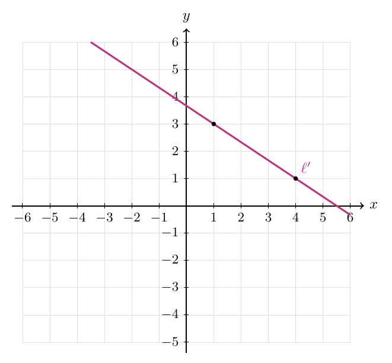
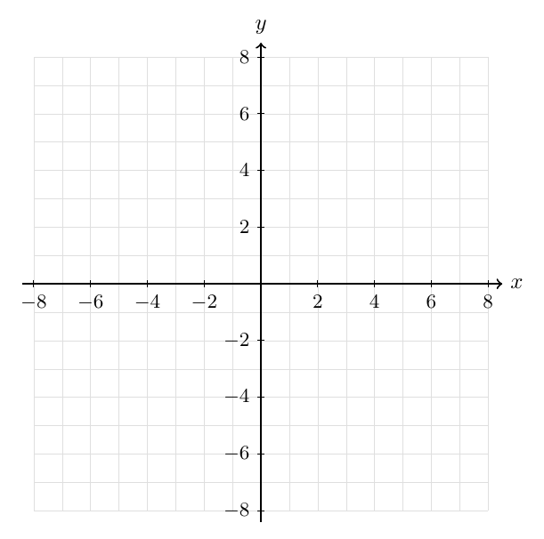
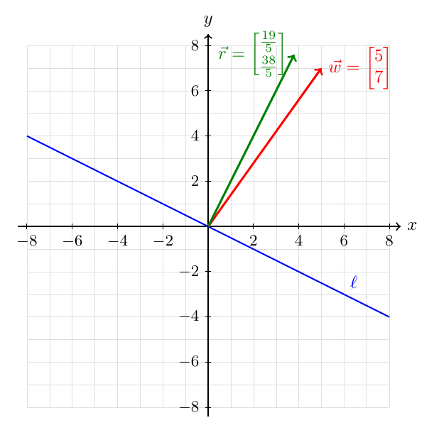
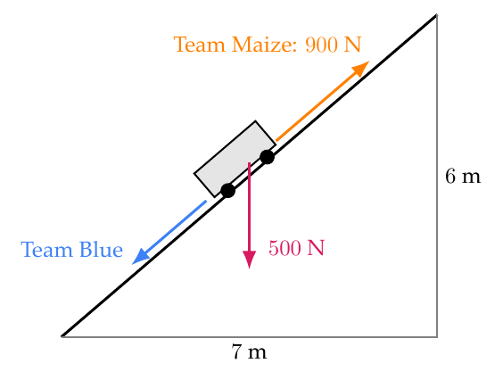
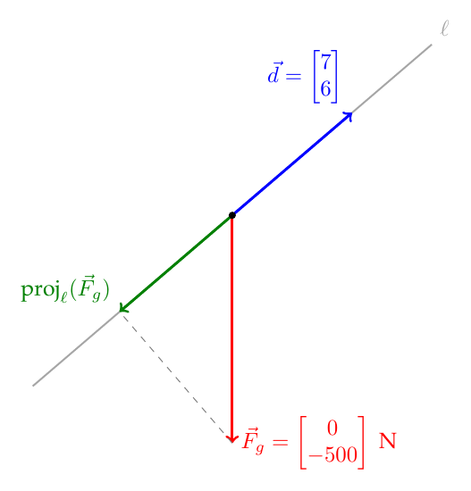



# Homework 3: Lines, Orthogonality, and Projections in $\mathbb{R}^2$

**due** Monday, September 21st at 11:59PM

<a class="btn btn-info assignment-pdf-button" href="/resources/homeworks/hw03/hw03.pdf" target="_blank">View as PDF ✏️</a>
<a class="btn btn-info assignment-pdf-button" href="/resources/homeworks/hw03/hw03-solutions.pdf" target="_blank">Solutions PDF ✅</a>

{: .yellow }

Write your solutions to the following problems either by writing them on a piece of paper or on a tablet and scanning your answers as a PDF. Note that you are not allowed to use LaTeX, Google Docs, or any other digital document creation software to type your answers. Homeworks are due to Pensive by 11:59PM on the due date. See the [syllabus](https://math124.org/syllabus/#homework) for details on the slip day policy.

Homework will be evaluated not only on the correctness of your answers, but on your ability to present your ideas clearly and logically. You should always explain and justify your conclusions, using sound reasoning. Your goal should be to convince the reader of your assertions. If a question does not require explanation, it will be explicitly stated.

Before proceeding, make sure you're familiar with the [collaboration policy](https://math124.org/syllabus/#collaboration-and-generative-ai-policy).

---

## Problems

- [Problem 1: Feedback](#problem-1-feedback-5-pts)
- [Problem 2: Line Dancing](#problem-2-line-dancing-15-pts)
- [Problem 3: Perfectly Normal](#problem-3-perfectly-normal-12-pts)
- [Problem 4: Covering All the Bases](#problem-4-covering-all-the-bases-24-pts)
- [Problem 5: Projecting Confidence](#problem-5-projecting-confidence-17-pts)
- [Problem 6: May the Force Be with Blue](#problem-6-may-the-force-be-with-blue-12-pts)
- [Problem 7: Programming Activity](#problem-7-programming-activity-15-pts)

---

Total Points: \\(5 + 15 + 12 + 24 + 17 + 12 + 15 = 100\\)

---

## Problem 1: Feedback (5 pts)

We'd like to get your feedback on how the course has been going so far!

You will find a survey [**at this link**](https://forms.gle/XrBKnzrFPDaxsfEB7). It is **not anonymous** --- we need to know your identity to give you homework credit for it, and so that you can give us feedback that we can reply to (if you'd like).

**Please fill out the survey AFTER you've finished the rest of Homework 3.** When submitting to Pensive, it does not matter which page of your submission you assign to Problem 1; we will enter survey completion credit in manually.

Thank you for your feedback --- it's helping shape our brand-new course.

---

## Problem 2: Line Dancing (15 pts)

a)

(5 pts) The line \\(\ell\\) shown below passes through the origin. Find a nonzero vector \\(\vec{v}\\) lying on \\(\ell\\). Use this vector to express \\(\ell\\) in parametric form, as we did in [Chapter 2.1](https://notes.math124.org/ch02/02-01/#affine-lines).

Solution

One possible choice is

$$
\vec{v}
      =
      \begin{bmatrix}
      3\\
      -2
      \end{bmatrix}.
$$

Therefore

$$
\ell
      =
      \operatorname{span}(\vec{v})
      =
      \left\{
      t
      \begin{bmatrix}
      3\\
      -2
      \end{bmatrix}
      :
      t\in\mathbb{R}
      \right\}.
$$

Equivalently,

$$
\ell
      =
      \left\{
      \begin{bmatrix}
      3t\\
      -2t
      \end{bmatrix}
      :
      t\in\mathbb{R}
      \right\}.
$$

b)

(10 pts) The affine line \\(\ell'\\) shown below is parallel to \\(\ell\\).

<ol class="assignment-enumeration" markdown="1">

<li markdown="1">

i.

(5 pts) Find a vector \\(\vec{v}&#95;0\\) whose endpoint lies on \\(\ell'\\). Use \\(\vec{v}&#95;0\\) and your vector \\(\vec{v}\\) from part (a) to express \\(\ell'\\) in parametric form.

Solution

One possible choice is

$$
\vec{v}_0
      =
      \begin{bmatrix}
      1\\
      3
      \end{bmatrix}.
$$

Using

$$
\vec{v}
      =
      \begin{bmatrix}
      3\\
      -2
      \end{bmatrix},
$$

 we obtain

$$
\ell'
      =
      \vec{v}_0+\operatorname{span}(\vec{v})
      =
      \left\{
      \begin{bmatrix}
      1\\
      3
      \end{bmatrix}
      +
      t
      \begin{bmatrix}
      3\\
      -2
      \end{bmatrix}
      :
      t\in\mathbb{R}
      \right\}.
$$

Equivalently,

$$
\ell'
      =
      \left\{
      \begin{bmatrix}
      1+3t\\
      3-2t
      \end{bmatrix}
      :
      t\in\mathbb{R}
      \right\}.
$$

</li>
<li markdown="1">

ii.

(5 pts) Give a different choice of \\(\vec{v}&#95;0\\) and \\(\vec{v}\\) that also works. Use these vectors to express \\(\ell'\\) in parametric form.

Solution

The point \\((4,1)\\) also lies on \\(\ell'\\), so we can choose

$$
\vec{v}_0
      =
      \begin{bmatrix}
      4\\
      1
      \end{bmatrix}.
$$

Any nonzero scalar multiple of the original direction vector works. For example, choose

$$
\vec{v}
      =
      \begin{bmatrix}
      -6\\
      4
      \end{bmatrix}.
$$

Then

$$
\ell'
      =
      \left\{
      \begin{bmatrix}
      4\\
      1
      \end{bmatrix}
      +
      t
      \begin{bmatrix}
      -6\\
      4
      \end{bmatrix}
      :
      t\in\mathbb{R}
      \right\}.
$$

</li>
</ol>

---

## Problem 3: Perfectly Normal (12 pts)

Let \\(\ell\\) and \\(\ell'\\) be the lines from Problem 2.

a)

(6 pts) First, let's work with \\(\ell\\), the line through the origin.

<ol class="assignment-enumeration" markdown="1">

<li markdown="1">

(i)

Find a nonzero vector \\(\vec{w}\\) that is normal to \\(\ell\\); that is, \\(\vec{w}\\) lies on \\(\ell^\perp\\) (the line through the origin that is perpendicular to \\(\ell\\)).

</li>
<li markdown="1">

(ii)

Use \\(\vec{w}\\) to express \\(\ell\\) as an equation in dot-product form.

</li>
<li markdown="1">

(iii)

Finally, express \\(\ell\\) as a linear equation in terms of \\(x\\) and \\(y\\) (with no vectors).

</li>
</ol>

Solution

One possible normal vector is

$$
\vec{w}
      =
      \begin{bmatrix}
      2\\
      3
      \end{bmatrix},
$$

 since

$$
\vec{w}\cdot\vec{v}
      =
      \begin{bmatrix}
      2\\
      3
      \end{bmatrix}
      \cdot
      \begin{bmatrix}
      3\\
      -2
      \end{bmatrix}
      =
      6-6
      =
      0.
$$

In dot-product form, the equation for \\(\ell\\) is

$$
\vec{w}\cdot\begin{bmatrix}
        x \\ y
      \end{bmatrix}=0.
$$

Explicitly,

$$
2x+3y=0.
$$

b)

(6 pts) Now, let's work with \\(\ell'\\), the affine line.

<ol class="assignment-enumeration" markdown="1">

<li markdown="1">

(i)

Use \\(\vec{w}\\) and \\(\vec{v}&#95;0\\) to express \\(\ell'\\) as an equation in dot-product form.

</li>
<li markdown="1">

(ii)

Express \\(\ell'\\) as a linear equation in terms of \\(x\\) and \\(y\\) (with no vectors).

</li>
</ol>

Solution

Every point \\((x,y)\\) on \\(\ell'\\) satisfies

$$
\vec{w}\cdot \begin{bmatrix}
        x \\ y
      \end{bmatrix}
      =
      \vec{w}\cdot\vec{v}_0.
$$

Using the point

$$
\vec{v}_0
      =
      \begin{bmatrix}
      1\\
      3
      \end{bmatrix},
$$

 we compute

$$
\vec{w}\cdot\vec{v}_0
      =
      \begin{bmatrix}
      2\\
      3
      \end{bmatrix}
      \cdot
      \begin{bmatrix}
      1\\
      3
      \end{bmatrix}
      =
      2+9
      =
      11.
$$

Thus, in dot-product form,

$$
\vec{w}\cdot \begin{bmatrix}
        x \\ y
      \end{bmatrix}=11.
$$

Explicitly,

$$
2x+3y=11.
$$

---

## Problem 4: Covering All the Bases (24 pts)

For each pair of vectors \\(\vec u\\) and \\(\vec v\\) below,

<ol class="assignment-enumeration" markdown="1">

<li markdown="1">

(i)

Determine whether it is an orthonormal basis of \\(\mathbb{R}^2\\), and explain why or why not.

</li>
<li markdown="1">

(ii)

If it is an orthonormal basis, write

$$
\vec{w}=\begin{bmatrix}7\\-4\end{bmatrix}
$$

 as a linear combination of \\(\vec u\\) and \\(\vec v\\), i.e. find scalars \\(a\\) and \\(b\\) such that

$$
a \vec u + b \vec v = \vec w.
$$

</li>
</ol>

a)

(6 pts)
\\(\displaystyle \quad \vec{u} = \begin{bmatrix} \frac35\\\\[2pt] \frac45 \end{bmatrix}, \quad \vec{v} = \begin{bmatrix} \frac45\\\\[2pt] \frac35 \end{bmatrix}\\)

Solution

Both vectors have length one, but

$$
\vec{u}\cdot\vec{v}
      =
      \frac{12}{25}+\frac{12}{25}
      =
      \frac{24}{25}\neq 0.
$$

Therefore the vectors are not orthogonal, so they do not form an orthonormal basis.

b)

(6 pts)
\\(\displaystyle \quad \vec{u} = \begin{bmatrix} 1\\\\ -2 \end{bmatrix}, \quad \vec{v} = \begin{bmatrix} 2\\\\ 1 \end{bmatrix}\\)

Solution

The vectors are orthogonal because

$$
\vec{u}\cdot\vec{v}
      =
      2-2
      =
      0.
$$

However,

$$
\lVert\vec{u}\rVert
      =
      \lVert\vec{v}\rVert
      =
      \sqrt{5},
$$

 so they are not unit vectors. Therefore this pair is not an orthonormal basis.

c)

(6 pts)
\\(\displaystyle \quad \vec{u} = \begin{bmatrix} \frac{5}{13}\\\\[2pt] \frac{12}{13} \end{bmatrix}, \quad \vec{v} = \begin{bmatrix} -\frac{12}{13}\\\\[2pt] \frac{5}{13} \end{bmatrix}\\)

Solution

We have

$$
\lVert\vec{u}\rVert
      =
      \sqrt{\frac{25}{169}+\frac{144}{169}}
      =
      1
$$

 and

$$
\lVert\vec{v}\rVert
      =
      \sqrt{\frac{144}{169}+\frac{25}{169}}
      =
      1.
$$

Also,

$$
\vec{u}\cdot\vec{v}
      =
      -\frac{60}{169}+\frac{60}{169}
      =
      0.
$$

Therefore this pair is an orthonormal basis of \\(\mathbb{R}^2\\).

Since the basis is orthonormal, the coefficients are found using dot products.

First,

$$
\vec{w}\cdot\vec{u}
    =
    \begin{bmatrix}
    7\\
    -4
    \end{bmatrix}
    \cdot
    \begin{bmatrix}
    \frac{5}{13}\\[2pt]
    \frac{12}{13}
    \end{bmatrix}
    =
    \frac{35}{13}-\frac{48}{13}
    =
    -1.
$$

Next,

$$
\vec{w}\cdot\vec{v}
    =
    \begin{bmatrix}
    7\\
    -4
    \end{bmatrix}
    \cdot
    \begin{bmatrix}
    -\frac{12}{13}\\[2pt]
    \frac{5}{13}
    \end{bmatrix}
    =
    -\frac{84}{13}-\frac{20}{13}
    =
    -8.
$$

Therefore

$$
\boxed{
    \vec{w}
    =
    -\vec{u}-8\vec{v}.
    }
$$

d)

(6 pts)
\\(\displaystyle \quad \vec{u}=\begin{bmatrix}\frac{3}{\sqrt{13}}\\\\[2pt]\frac{2}{\sqrt{13}}\end{bmatrix}, \quad \vec{v}=\begin{bmatrix}-\frac{2}{\sqrt{13}}\\\\[2pt]\frac{3}{\sqrt{13}}\end{bmatrix}\\)

Solution

We have

$$
\lVert\vec{u}\rVert
      =
      \sqrt{\frac{9}{13}+\frac{4}{13}}
      =
      1
$$

 and

$$
\lVert\vec{v}\rVert
      =
      \sqrt{\frac{4}{13}+\frac{9}{13}}
      =
      1.
$$

Also,

$$
\vec{u}\cdot\vec{v}
      =
      -\frac{6}{13}+\frac{6}{13}
      =
      0.
$$

Therefore this pair is an orthonormal basis of \\(\mathbb{R}^2\\).

Since the basis is orthonormal, the coefficients are found using dot products.

First,

$$
\vec{w}\cdot\vec{u}
    =
    \begin{bmatrix}
    7\\
    -4
    \end{bmatrix}
    \cdot
    \begin{bmatrix}
    \frac{3}{\sqrt{13}}\\[2pt]
    \frac{2}{\sqrt{13}}
    \end{bmatrix}
    =
    \frac{21}{\sqrt{13}}-\frac{8}{\sqrt{13}}
    =
    \sqrt{13}.
$$

Next,

$$
\vec{w}\cdot\vec{v}
    =
    \begin{bmatrix}
    7\\
    -4
    \end{bmatrix}
    \cdot
    \begin{bmatrix}
    -\frac{2}{\sqrt{13}}\\[2pt]
    \frac{3}{\sqrt{13}}
    \end{bmatrix}
    =
    -\frac{14}{\sqrt{13}}-\frac{12}{\sqrt{13}}
    =
    -2\sqrt{13}.
$$

Therefore

$$
\boxed{
    \vec{w}
    =
    \sqrt{13}\vec{u}-2\sqrt{13}\vec{v}.
    }
$$

---

## Problem 5: Projecting Confidence (17 pts)

Let

$$
\vec{w}
  =
  \begin{bmatrix}
  5\\
  7
  \end{bmatrix},
$$

 and let

$$
\ell
  =
  \operatorname{span}
  \left(
  \begin{bmatrix}
  2\\
  -1
  \end{bmatrix}
  \right).
$$

a)

(7 pts) Find the orthogonal projection of \\(\vec{w}\\) onto \\(\ell\\).

Solution

Let

$$
\vec{d}
      =
      \begin{bmatrix}
      2\\
      -1
      \end{bmatrix}.
$$

We may project directly using this direction vector (i.e., \\(\vec d\\) does not need to be a unit vector) as follows:

$$
\operatorname{proj}_{\ell}(\vec{w})
      =
      \frac{\vec{w}\cdot\vec{d}}
      {\vec{d}\cdot\vec{d}}
      \vec{d}.
$$

We have

$$
\vec{w}\cdot\vec{d}
      =
      \begin{bmatrix}
      5\\
      7
      \end{bmatrix}
      \cdot
      \begin{bmatrix}
      2\\
      -1
      \end{bmatrix}
      =
      10-7
      =
      3
$$

 and

$$
\vec{d}\cdot\vec{d}
      =
      \begin{bmatrix}
      2\\
      -1
      \end{bmatrix}
      \cdot
      \begin{bmatrix}
      2\\
      -1
      \end{bmatrix}
      =
      4+1
      =
      5.
$$

Therefore

$$
\boxed{
      \operatorname{proj}_{\ell}(\vec{w})
      =
      \frac35
      \begin{bmatrix}
      2\\
      -1
      \end{bmatrix}
      =
      \begin{bmatrix}
      \frac65\\[2pt]
      -\frac35
      \end{bmatrix}.
      }
$$

b)

(10 pts) Let \\(\vec p\\) be your answer to part (a). Let

$$
\vec r = \vec w - \vec p.
$$

 This means \\(\vec r\\) is the difference between \\(\vec w\\) and its projection onto \\(\ell\\).

<ol class="assignment-enumeration" markdown="1">

<li markdown="1">

i.

(5 pts) Draw \\(\vec{w}\\), \\(\ell\\), and \\(\vec{r}\\) on axes like the one below. Make sure to label each one.

</li>
<li markdown="1">

ii.

(5 pts) Using a dot product, verify that \\(\vec{r}\\) is perpendicular to \\(\ell\\).

</li>
</ol>

Solution

\\(i\\) The component perpendicular to \\(\ell\\) is

$$
\begin{aligned}
\vec{w}
-
\operatorname{proj}_{\ell}(\vec{w})
&=
\begin{bmatrix}
5\\
7
\end{bmatrix}
-
\begin{bmatrix}
\frac65\\[2pt]
-\frac35
\end{bmatrix}\\
&=
\boxed{
\begin{bmatrix}
\frac{19}{5}\\[2pt]
\frac{38}{5}
\end{bmatrix}.
}
\end{aligned}
$$

The line \\(\ell\\) and the two vectors are shown below.

\\(ii\\) To check that this vector is perpendicular to \\(\ell\\), take its dot product with the direction vector \\(\vec{d}\\):

$$
\begin{bmatrix}
      \frac{19}{5}\\[2pt]
      \frac{38}{5}
      \end{bmatrix}
      \cdot
      \begin{bmatrix}
      2\\
      -1
      \end{bmatrix}
      =
      \frac{38}{5}-\frac{38}{5}
      =
      0.
$$

---

## Problem 6: May the Force Be with Blue (12 pts)

A heavy equipment cart with a weight of \\(500\\) Newtons (N) rests on a frictionless inclined ramp. For every \\(7\\) meters of horizontal distance, the ramp rises \\(6\\) meters.

Team Maize stands uphill from the cart and pulls it up the ramp with a force of \\(900\\) N. Team Blue stands downhill from the cart and pulls it down the ramp. Both teams pull in directions parallel to the ramp.

a)

(8 pts) Find the component of the cart's weight that acts parallel to the ramp. Give both its magnitude and its direction.

Solution

Schematic picture (vectors not to scale).

A direction vector pointing up the ramp is

$$
\vec{d}
      =
      \begin{bmatrix}
      7\\
      6
      \end{bmatrix}.
$$

In the usual \\(x\\)-\\(y\\) coordinates (i.e., where \\(x\\) is horizontal and \\(y\\) is vertical in the picture above), the cart's weight is

$$
\vec{F}_g
      =
      \begin{bmatrix}
      0\\
      -500
      \end{bmatrix}
      \text{ N}.
$$

We can project the weight directly onto the line \\(l = \mathrm{span}(\vec d)\\) parallel to the ramp:

$$
\begin{aligned}
\operatorname{proj}_{l}(\vec{F}_g)
&=
\frac{\vec{F}_g\cdot\vec{d}}
{\vec{d}\cdot\vec{d}}\vec{d}\\
&=
\frac{
\begin{bmatrix}
0\\
-500
\end{bmatrix}
\cdot
\begin{bmatrix}
7\\
6
\end{bmatrix}
}{
\begin{bmatrix}
7\\
6
\end{bmatrix}
\cdot
\begin{bmatrix}
7\\
6
\end{bmatrix}
}
\begin{bmatrix}
7\\
6
\end{bmatrix}\\
&=
\frac{-3000}{85}
\begin{bmatrix}
7\\
6
\end{bmatrix}\\
&=
\begin{bmatrix}
-\frac{4200}{17}\\[2pt]
-\frac{3600}{17}
\end{bmatrix}
\text{ N}.
\end{aligned}
$$

The negative coefficient means that the component points down the ramp. Its magnitude is

$$
\begin{aligned}
\left\|
\operatorname{proj}_{l}(\vec{F}_g)
\right\|
&=
\left|
\frac{-3000}{85}
\right|
\left\|
\begin{bmatrix}
7\\
6
\end{bmatrix}
\right\|\\
&=
\frac{3000}{85}\sqrt{85}\\
&=
\frac{3000}{\sqrt{85}}.
\end{aligned}
$$

Therefore the component of the cart's weight parallel to the ramp has magnitude

$$
\boxed{\frac{3000}{\sqrt{85}}\text{ N}}
$$

and points down the ramp.

b)

(4 pts) How hard must Team Blue pull to keep the cart stationary? Give your answer in Newtons.

Solution

Along the ramp, Team Maize pulls with \\(900\\) N uphill, while gravity pulls with

$$
\frac{3000}{\sqrt{85}}\text{ N}
$$

downhill. Let \\(F&#95;B\\) be the magnitude of Team Blue's downhill force.

For the cart to remain stationary, the net force parallel to the ramp must be zero:

$$
900-\frac{3000}{\sqrt{85}}-F_B=0.
$$

Therefore

$$
\boxed{
      F_B
      =
      900-\frac{3000}{\sqrt{85}}
      \text{ N}.
      }
$$

Team Blue must pull down the ramp with a force of

$$
\boxed{
      900-\frac{3000}{\sqrt{85}}\text{ N}.
      }
$$

---

## Problem 7: Programming Activity (15 pts)

Most homeworks and some labs will have a Jupyter Notebook, containing Python code that supplements our understanding of the relevant mathematical ideas of the week.

To open the notebook for Homework 3, click [**this link**](https://colab.research.google.com/github/math-124/fa26-code/blob/main/homeworks/hw03/hw03.ipynb). Instructions on how to use Google Colab are at [math124.org/running-code](https://math124.org/running-code).

You won't need to submit the notebook anywhere. To get credit for the work you did in this notebook, include the following in your PDF submission to Homework 3 on Pensive, specifically under **Problem 7**:

<ol class="assignment-enumeration" markdown="1">

<li markdown="1">

1.

**Task 1 (3 pts):** A screenshot of the plot showing your two wind vectors.

</li>
<li markdown="1">

2.

**Task 2 (0 pts; but must complete):** Nothing to submit.

</li>
<li markdown="1">

3.

**Task 3 (0 pts; but must complete):** Nothing to submit.

</li>
<li markdown="1">

4.

**Task 4 (4 pts):** A screenshot of your completed reconstruction code, plus a written response stating the sign of \\(a\\), using it to identify whether `w = np.array([10, 0])` is a headwind or tailwind for Runway 24, and stating the crosswind magnitude \\(|b|\\).

</li>
<li markdown="1">

5.

**Task 5 (8 pts):** Your written answers to both questions (4 pts each). No screenshots are required.

</li>
</ol>


