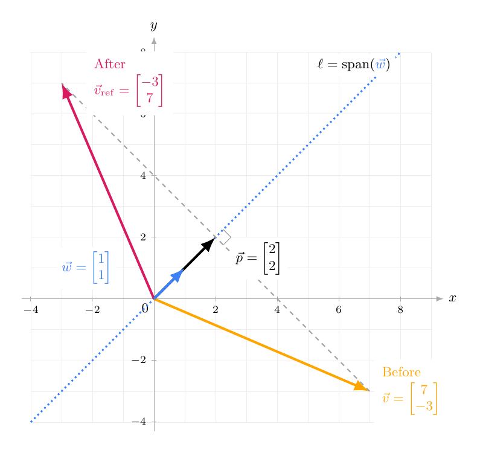



# Homework 4: Lines and Planes in $\mathbb{R}^3$

**due** Friday, October 2nd at 11:59PM

<a class="btn btn-info assignment-pdf-button" href="/resources/homeworks/hw04/hw04.pdf" target="_blank">View as PDF ✏️</a>

{: .yellow }

Write your solutions to the following problems either by writing them on a piece of paper or on a tablet and scanning your answers as a PDF. Note that you are not allowed to use LaTeX, Google Docs, or any other digital document creation software to type your answers. Homeworks are due to Pensive by 11:59PM on the due date. See the [syllabus](https://math124.org/syllabus/#homework) for details on the slip day policy.

Homework will be evaluated not only on the correctness of your answers, but on your ability to present your ideas clearly and logically. You should always explain and justify your conclusions, using sound reasoning. Your goal should be to convince the reader of your assertions. If a question does not require explanation, it will be explicitly stated.

Before proceeding, make sure you're familiar with the [collaboration policy](https://math124.org/syllabus/#collaboration-and-generative-ai-policy).

---

## Problems

- [Problem 1: Homework 3 Solutions Review](#problem-1-homework-3-solutions-review-6-pts)
- [Problem 2: A Line as an Intersection](#problem-2-a-line-as-an-intersection-12-pts)
- [Problem 3: Perfectly Normal](#problem-3-perfectly-normal-7-pts)
- [Problem 4: Common Ground](#problem-4-common-ground-12-pts)
- [Problem 5: Three Points, One Plane](#problem-5-three-points-one-plane-13-pts)
- [Problem 6: Three Points, Take Two](#problem-6-three-points-take-two-11-pts)
- [Problem 7: Changing the Spanning Vectors](#problem-7-changing-the-spanning-vectors-7-pts)
- [Problem 8: Breaking It Down](#problem-8-breaking-it-down-15-pts)
- [Problem 9: A Change of Reflection](#problem-9-a-change-of-reflection-10-pts)
- [Problem 10: Programming Activity](#problem-10-programming-activity-7-pts)

---

Total Points: \\(6 + 12 + 7 + 12 + 13 + 11 + 7 + 15 + 10 + 7 = 100\\)

---

**Have the notes open while working on the homework!** [Chapter 2.4](https://notes.math124.org/ch02/02-04), [Chapter 2.5](https://notes.math124.org/ch02/02-05), [Chapter 2.6](https://notes.math124.org/ch02/02-06), and Chapter 2.7 (coming soon) are all very relevant. We've added the relevant lab and lecture worksheet content to them, so they are comprehensive.

---

## Problem 1: Homework 3 Solutions Review (6 pts)

Review [the solutions to Homework 3](https://math124.org/resources/homeworks/hw03/). Pick **two problem parts** (for example, Problem 3a and Problem 5b) from Homework 3 in which your solutions have the most room for improvement, i.e., where they have unsound reasoning, could be significantly more efficient or clearer, etc. **Include a screenshot of your solution to each problem part**, and in a few sentences, explain what was deficient and how it could be fixed.

Alternatively, if you think one of your solutions is significantly better than the posted one, copy it here and explain why you think it is better. If you didn't do Homework 3, choose two problem parts from it that look challenging to you, and in a few sentences, explain the key ideas behind their solutions in your own words.

---

## Problem 2: A Line as an Intersection (12 pts)

First, consider the line through the origin

$$
\ell_0=\operatorname{span}\left(\begin{bmatrix}6\\-4\\9\end{bmatrix}\right).
$$

a)

(2 pts) Write \\(\ell&#95;0\\) in parametric form. In other words, write three separate equations: \\(x=\cdots\\), \\(y=\cdots\\), and \\(z=\cdots\\), each of which involves the same parameter, e.g., \\(t\\).

b)

(4 pts) Write a system of two linear equations in \\(x\\), \\(y\\), and \\(z\\) whose common solutions are exactly the points on \\(\ell&#95;0\\). Your equations should not contain a parameter.

Then, verify that every point on \\(\ell&#95;0\\) satisfies your system by plugging in your parametric formulas from part (a).

c)

(4 pts) Now, consider the affine line

$$
\ell=\begin{bmatrix}-5\\7\\4\end{bmatrix}+\operatorname{span}\left(\begin{bmatrix}6\\-4\\9\end{bmatrix}\right).
$$

 Write \\(\ell\\) in parametric form, then find a system of two linear equations whose common solutions are exactly the points on \\(\ell\\). Verify your equations by substituting your parametric formulas. How do the equations change from part (b)?

d)

(2 pts) Give a geometric interpretation of your systems in parts (b) and (c): in each case, what type of object does each equation describe in \\(\mathbb{R}^3\\), and what is the connection between those two objects and the corresponding line (\\(\ell&#95;0\\) or \\(\ell\\))?

---

## Problem 3: Perfectly Normal (7 pts)

The point \\(A=(8,11,9)\\) lies on the plane \\(P\\) with equation

$$
4x-7y+5z=0.
$$

a)

(3 pts) Find a nonzero vector normal to \\(P\\).

b)

(4 pts) Find a parametric form for the line through \\(A\\) that is perpendicular to \\(P\\). Explain why your line passes through \\(A\\) and is perpendicular to \\(P\\).

---

## Problem 4: Common Ground (12 pts)

You might find [desmos.com/3d](https://desmos.com/3d) useful for visualizing the planes in this question.

Consider the vectors

$$
\vec{v}_1=\begin{bmatrix}5\\4\\2\end{bmatrix},\qquad
\vec{v}_2=\begin{bmatrix}-4\\1\\11\end{bmatrix},\qquad
\vec{v}_3=\begin{bmatrix}4\\-7\\-5\end{bmatrix},\qquad
\vec{v}_4=\begin{bmatrix}8\\3\\7\end{bmatrix},
$$

 and the planes

$$
P=\operatorname{span}(\vec{v}_1,\vec{v}_2),\qquad
Q=\operatorname{span}(\vec{v}_3,\vec{v}_4).
$$

a)

(4 pts) Find equations for \\(P\\) and \\(Q\\) in the form \\(ax+by+cz=d\\).

b)

(4 pts) The planes \\(P\\) and \\(Q\\) intersect in a line \\(\ell\\). Give a parametric description of \\(\ell\\), and write it as the span of a single vector.

<em>Hint: Points on \\(\ell\\) satisfy both equations from part (a). Solve this system of two equations in three variables by eliminating variables.</em>

c)

(4 pts) Now, let \\(R=\operatorname{span}(\vec{v}&#95;2,\vec{v}&#95;3)\\). Find an equation for \\(R\\), and use it to find all points that belong to all three planes. What type of geometric object is their intersection?

---

## Problem 5: Three Points, One Plane (13 pts)

Let \\(A=(4,-7,5)\\), \\(B=(10,-3,7)\\), and \\(C=(-2,-1,13)\\).

a)

(4 pts) Find vectors \\(\vec{u}\\) and \\(\vec{v}\\) pointing from \\(A\\) to \\(B\\) and from \\(A\\) to \\(C\\), respectively. Then, explain how you know these three points do not lie on one line.

b)

(5 pts) Find a nonzero normal vector to the plane through \\(A\\), \\(B\\), and \\(C\\).

c)

(4 pts) Find an equation for this plane in the form \\(ax+by+cz=d\\). Verify that all three points satisfy your equation.

---

## Problem 6: Three Points, Take Two (11 pts)

Let \\(A=(-5,8,6)\\), \\(B=(-1,15,1)\\), and \\(C=(-13,-6,16)\\).

a)

(4 pts) Is there a unique plane through \\(A\\), \\(B\\), and \\(C\\)? Justify your answer using vectors pointing from \\(A\\) to the other two points.

b)

(7 pts) Find equations for two distinct planes that contain all three points. Verify that both planes contain all three points, and explain how you know the planes are different.

---

## Problem 7: Changing the Spanning Vectors (7 pts)

Let \\(\vec{u}\\) and \\(\vec{v}\\) be nonzero vectors in \\(\mathbb{R}^3\\) that are not scalar multiples of one another, and let

$$
P=\operatorname{span}(\vec{u},\vec{v}).
$$

For each pair below, determine whether it also spans \\(P\\).

-   If the pair does span \\(P\\), show how to write an arbitrary vector \\(a\vec{u}+b\vec{v}\\) as a linear combination of the new pair.

-   If the pair does not span \\(P\\), describe its span and give a vector that is in \\(P\\) but not in the span of the new pair.

a)

(4 pts)
\\(\vec{u}\\) and \\(\vec{u}+\vec{v}\\).

b)

(3 pts)
\\(\vec{u}+\vec{v}\\) and \\(2(\vec{u}+\vec{v})\\).

---

## Problem 8: Breaking It Down (15 pts)

**Note:** This problem involves content from Tuesday, September 29th's lecture, and the soon-to-be-released Chapter 2.7.

Let \\(\vec{v}=\begin{bmatrix}19\\\\2\\\\9\end{bmatrix}\\).

a)

(3 pts) Find the orthogonal projection of \\(\vec{v}\\) onto the line

$$
\ell=\operatorname{span}\left(\begin{bmatrix}2\\3\\6\end{bmatrix}\right).
$$

b)

(4 pts) Find the orthogonal projection of \\(\vec{v}\\) onto the plane \\(P\\) with equation \\(2x+3y+6z=0\\).

<em>Hint: The line in part (a) is perpendicular to \\(P\\). What happens if you subtract the projection onto that line from \\(\vec{v}\\)?</em>

c)

(4 pts) Find the orthogonal projection of \\(\vec{v}\\) onto the plane

$$
Q=\operatorname{span}\left(\begin{bmatrix}5\\4\\-3\end{bmatrix},\begin{bmatrix}-2\\6\\5\end{bmatrix}\right).
$$

 <em>Hint: First find a nonzero vector normal to \\(Q\\).</em>

d)

(4 pts) The vectors

$$
\vec{u}_1=\frac{1}{7}\begin{bmatrix}2\\3\\6\end{bmatrix},\qquad
\vec{u}_2=\frac{1}{7}\begin{bmatrix}-3\\6\\-2\end{bmatrix},\qquad
\vec{u}_3=\frac{1}{7}\begin{bmatrix}-6\\-2\\3\end{bmatrix}
$$

 form an orthonormal basis of \\(\mathbb{R}^3\\). Write \\(\vec{v}\\) as a linear combination of \\(\vec{u}&#95;1\\), \\(\vec{u}&#95;2\\), and \\(\vec{u}&#95;3\\).

---

## Problem 9: A Change of Reflection (10 pts)

In this problem, we will explore the idea of **reflecting** a vector across a line. This problem has applications to computer graphics, where reflecting the position vectors of points creates a mirror image of a two-dimensional shape.

Let \\(\vec w=\begin{bmatrix}1\\\\1\end{bmatrix}\\). The picture below shows reflection of the vector \\(\vec v=\begin{bmatrix}7\\\\-3\end{bmatrix}\\) across the line \\(\ell=\operatorname{span}(\vec w)=\operatorname{span}\left(\begin{bmatrix}1\\\\1\end{bmatrix}\right)\\).

In the picture above, reflecting \\(\vec{v}=\begin{bmatrix}7\\\\-3\end{bmatrix}\\) across \\(\ell=\operatorname{span}(\vec w)\\) gives us \\(\vec{v}&#95;{\mathrm{ref}}=\begin{bmatrix}-3\\\\7\end{bmatrix}\\). Notice that \\(\vec{p}=\begin{bmatrix}2\\\\2\end{bmatrix}\\), the projection of \\(\vec{v}\\) onto \\(\ell=\operatorname{span}(\vec w)\\), has its tip halfway between the tips of \\(\vec v\\) and \\(\vec v&#95;{\mathrm{ref}}\\). To get from \\(\vec{v}\\) to \\(\vec{v}&#95;{\mathrm{ref}}\\), we move to \\(\vec{p}\\), then keep going the same distance in the same direction.

We'll use this same idea to reflect vectors across lines in \\(\mathbb{R}^2\\), \\(\mathbb{R}^3\\), and eventually \\(\mathbb{R}^n\\). All of the lines in this problem pass through the origin.

a)

(5 pts) Let \\(\vec v=\begin{bmatrix}4\\\\3\end{bmatrix}\\) and \\(\vec w=\begin{bmatrix}1\\\\2\end{bmatrix}\\).

<ol class="assignment-enumeration" markdown="1">

<li markdown="1">

(i)

Find the projection \\(\vec p\\) of \\(\vec v\\) onto \\(\ell=\operatorname{span}(\vec w)\\).

</li>
<li markdown="1">

(ii)

Now, find \\(\vec v&#95;{\mathrm{ref}}\\), the reflection of \\(\vec v\\) across \\(\ell=\operatorname{span}(\vec w)\\).

</li>
<li markdown="1">

(iii)

Draw a picture showing \\(\vec w\\), \\(\ell=\operatorname{span}(\vec w)\\) (dotted, as in our example), \\(\vec p\\), \\(\vec v\\), and \\(\vec v&#95;{\mathrm{ref}}\\).

</li>
</ol>

b)

(2 pts) Now, let \\(\vec w=\begin{bmatrix}1\\\\1\\\\2\end{bmatrix}\\) and find the reflection of \\(\vec{v}=\begin{bmatrix}3\\\\-1\\\\2\end{bmatrix}\\) across the line \\(\ell=\operatorname{span}(\vec w)\\) in \\(\mathbb{R}^3\\). Again, start by finding \\(\vec{p}\\). You don't need to draw a picture.

c)

(3 pts) Let \\(\vec{v}\in\mathbb{R}^n\\), and let \\(\ell=\operatorname{span}(\vec{w})\\), where \\(\vec{w}\\) is nonzero. Find a formula for the reflection \\(\vec{v}&#95;{\mathrm{ref}}\\) of \\(\vec{v}\\) across \\(\ell=\operatorname{span}(\vec w)\\). First, write your formula in terms of \\(\vec{v}\\) and its projection \\(\vec{p}\\) onto \\(\ell=\operatorname{span}(\vec w)\\). Then, write it using only \\(\vec{w}\\), \\(\vec{v}\\), and their dot products.

---

## Problem 10: Programming Activity (7 pts)

Let's implement your logic from Problem 9 in Python! In Homework 1, you changed the **colors** of pixels in an image. This time, you'll change their **positions** to create a mirror image, while keeping the colors the same.

To open the notebook for Homework 4, click [**this link**](https://colab.research.google.com/github/math-124/fa26-code/blob/main/homeworks/hw04/hw04.ipynb). Instructions on how to use Google Colab are at [math124.org/running-code](https://math124.org/running-code).

You won't need to submit the notebook anywhere. To get credit, complete both tasks in the notebook and include the following in your PDF submission to Homework 4 on Pensive, specifically under **Problem 10**:

<ol class="assignment-enumeration" markdown="1">

<li markdown="1">

1.

**Task 1 (5 pts):** A screenshot of your completed `reflection(v, w)` function and the successful check output.

</li>
<li markdown="1">

2.

**Task 2 (2 pts):** One screenshot of your canvas with a tilted line, showing the angle, original image, and reflected image. No written response is required.

</li>
</ol>


