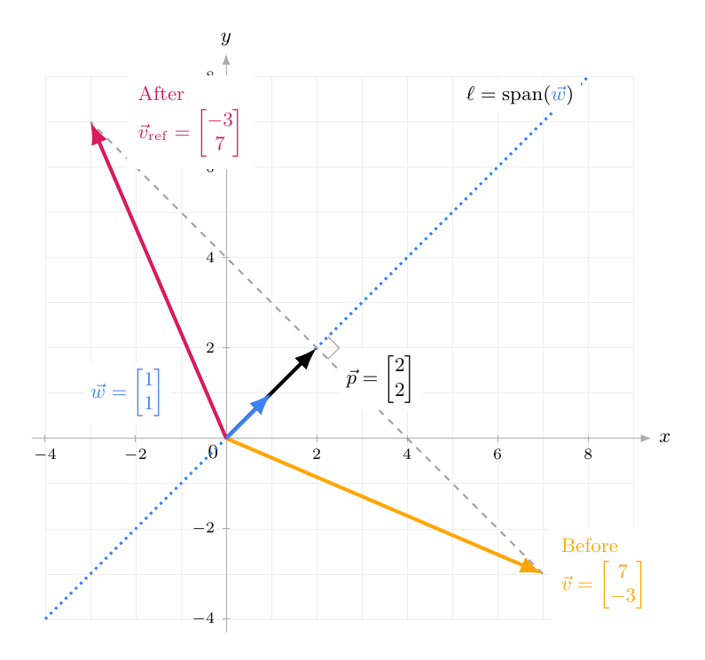
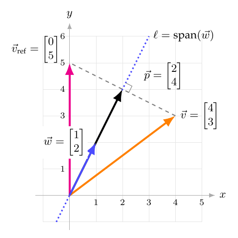



<script>
window.MathJax = {
  tex: {inlineMath: [['$', '$'], ['\\(', '\\)']]},
  options: {ignoreHtmlClass: 'tex2jax_ignore'}
};
</script>
<script src="https://cdn.jsdelivr.net/npm/mathjax@3/es5/tex-mml-chtml.js" async></script>

<style>
.main-content p {
  margin-bottom: 1.15em;
}
.assignment-pdf-button {
  font-size: 0.95rem;
  padding: 0.35rem 0.65rem;
}
.assignment-actions {
  align-items: center;
  display: flex;
  flex-wrap: wrap;
  gap: 0.55rem;
  margin: 0 0 1rem;
}
.assignment-vector-plot {
  max-width: 100%;
  height: auto;
  display: block;
  margin: 1rem auto;
}
.math-display,
mjx-container[jax="CHTML"][display="true"] {
  max-width: 100%;
  overflow-x: auto;
  overflow-y: hidden;
}
.math-display {
  padding-bottom: 0.2rem;
}
.math-display mjx-container[jax="CHTML"][display="true"] {
  padding-bottom: 0.2rem;
}
.answer-blank {
  border-bottom: 1px solid currentColor;
  display: inline-block;
  min-width: 8rem;
  height: 1em;
  vertical-align: baseline;
}
.assignment-parts {
  margin: 1rem 0;
}
.assignment-part {
  align-items: baseline;
  column-gap: 0.55rem;
  display: grid;
  grid-template-columns: 1.4rem minmax(0, 1fr);
  margin-bottom: 1.05rem;
}
.assignment-part-label {
  font-weight: 600;
  text-align: right;
}
.assignment-part-content > :first-child {
  margin-top: 0;
}
.main-content ol.assignment-enumeration {
  padding-left: 0;
  list-style: none;
}
.main-content ol.assignment-enumeration > li {
  display: grid;
  grid-template-columns: 2.5em minmax(0, 1fr);
  align-items: baseline;
  column-gap: 0.5em;
  padding-left: 0;
  margin: 0.8em 0;
}
.main-content ol.assignment-enumeration > li::before {
  content: none;
}
.assignment-enumeration-label {
  text-align: right;
}
.assignment-enumeration-content > :first-child {
  margin-top: 0;
}
.assignment-enumeration-content > :last-child {
  margin-bottom: 0;
}
.mc-options {
  display: flex;
  flex-wrap: wrap;
  gap: 0.9rem 1.6rem;
  margin: 0.9rem 0 1.1rem;
}
.mc-option {
  display: inline-flex;
  align-items: center;
  gap: 0.35rem;
  white-space: nowrap;
}
.mc-bubble,
.mc-square {
  display: inline-block;
  flex: 0 0 auto;
  height: 0.95em;
  width: 0.95em;
  vertical-align: -0.12em;
}
.mc-bubble {
  border: 1.5px solid currentColor;
  border-radius: 50%;
}
.mc-square {
  border: 1.5px solid currentColor;
}
.mc-correct {
  background: currentColor;
}
.main-content table {
  font-size: 0.9rem;
  width: auto;
  max-width: 100%;
}
.main-content table th,
.main-content table td {
  padding: 0.35rem 0.5rem;
  white-space: nowrap;
}
.crossnumber-grid {
  display: grid;
  grid-template-columns: repeat(3, 2.4rem);
  grid-template-rows: repeat(3, 2.4rem);
  margin: 1rem auto;
  width: max-content;
}
.crossnumber-cell {
  align-items: center;
  border: 1.5px solid currentColor;
  display: flex;
  font-size: 1.1rem;
  justify-content: center;
  position: relative;
}
.crossnumber-label {
  font-size: 0.55rem;
  left: 0.15rem;
  line-height: 1;
  position: absolute;
  top: 0.15rem;
}
.crossnumber-missing {
  border: 0;
}
</style>

# Homework 4: Lines and Planes in $\mathbb{R}^3$

**due** Friday, October 2nd at 11:59PM

<div class="assignment-actions">
<a class="btn btn-info assignment-pdf-button" href="/resources/homeworks/hw04/hw04.pdf" target="_blank">View as PDF ✏️</a>
<a class="btn btn-info assignment-pdf-button" href="/resources/homeworks/hw04/hw04-solutions.pdf" target="_blank">Solutions PDF ✅</a>
</div>

{: .yellow }
<div markdown="1">
Write your solutions to the following problems either by writing them on a piece of paper or on a tablet and scanning your answers as a PDF. Note that you are not allowed to use LaTeX, Google Docs, or any other digital document creation software to type your answers. Homeworks are due to Pensive by 11:59PM on the due date. See the [syllabus](https://math124.org/syllabus/#homework) for details on the slip day policy.

Homework will be evaluated not only on the correctness of your answers, but on your ability to present your ideas clearly and logically. You should always explain and justify your conclusions, using sound reasoning. Your goal should be to convince the reader of your assertions. If a question does not require explanation, it will be explicitly stated.

Before proceeding, make sure you're familiar with the [collaboration policy](https://math124.org/syllabus/#collaboration-and-generative-ai-policy).
</div>

---

## Problems

- [Problem 1: Homework 3 Solutions Review](#problem-1-homework-3-solutions-review-6-pts)
- [Problem 2: A Line as an Intersection](#problem-2-a-line-as-an-intersection-12-pts)
- [Problem 3: Perfectly Normal](#problem-3-perfectly-normal-7-pts)
- [Problem 4: Common Ground](#problem-4-common-ground-12-pts)
- [Problem 5: Three Points, One Plane](#problem-5-three-points-one-plane-13-pts)
- [Problem 6: Three Points, Take Two](#problem-6-three-points-take-two-11-pts)
- [Problem 7: Changing the Spanning Vectors](#problem-7-changing-the-spanning-vectors-7-pts)
- [Problem 8: Breaking It Down](#problem-8-breaking-it-down-15-pts)
- [Problem 9: A Change of Reflection](#problem-9-a-change-of-reflection-10-pts)
- [Problem 10: Programming Activity](#problem-10-programming-activity-7-pts)

---

Total Points: <span class="math-inline">\\(6 + 12 + 7 + 12 + 13 + 11 + 7 + 15 + 10 + 7 = 100\\)</span>

---

**Have the notes open while working on the homework!** [Chapter 2.4](https://notes.math124.org/ch02/02-04), [Chapter 2.5](https://notes.math124.org/ch02/02-05), [Chapter 2.6](https://notes.math124.org/ch02/02-06), and Chapter 2.7 (coming soon) are all very relevant. We've added the relevant lab and lecture worksheet content to them, so they are comprehensive.

---

## Problem 1: Homework 3 Solutions Review (6 pts)

Review [the solutions to Homework 3](https://math124.org/resources/homeworks/hw03/). Pick **two problem parts** (for example, Problem 3a and Problem 5b) from Homework 3 in which your solutions have the most room for improvement, i.e., where they have unsound reasoning, could be significantly more efficient or clearer, etc. **Include a screenshot of your solution to each problem part**, and in a few sentences, explain what was deficient and how it could be fixed.

Alternatively, if you think one of your solutions is significantly better than the posted one, copy it here and explain why you think it is better. If you didn't do Homework 3, choose two problem parts from it that look challenging to you, and in a few sentences, explain the key ideas behind their solutions in your own words.

<details markdown="1"><summary>Solution</summary>

Responses will vary. Look for specific comparisons with the posted solutions and clear explanations of how to improve the selected work.
</details>

---

## Problem 2: A Line as an Intersection (12 pts)

First, consider the line through the origin

<div class="math-display">
$$
\ell_0=\operatorname{span}\left(\begin{bmatrix}6\\-4\\9\end{bmatrix}\right).
$$
</div>

<div class="assignment-parts" markdown="1">
<div class="assignment-part" markdown="1">
<div class="assignment-part-label">a)</div>
<div class="assignment-part-content" markdown="1">
(2 pts) Write <span class="math-inline">\\(\ell&#95;0\\)</span> in parametric form. In other words, write three separate equations: <span class="math-inline">\\(x=\cdots\\)</span>, <span class="math-inline">\\(y=\cdots\\)</span>, and <span class="math-inline">\\(z=\cdots\\)</span>, each of which involves the same parameter, e.g., <span class="math-inline">\\(t\\)</span>.

<details markdown="1"><summary>Solution</summary>

The scalar-parametric equations are

<div class="math-display">
$$
\boxed{x=6t,\qquad y=-4t,\qquad z=9t,\qquad t\in\mathbb R.}
$$
</div>

 Every vector on <span class="math-inline">\\(\ell&#95;0\\)</span> is a scalar multiple of its spanning vector:

<div class="math-display">
$$
\begin{bmatrix}x\\y\\z\end{bmatrix}
=t\begin{bmatrix}6\\-4\\9\end{bmatrix}
=\begin{bmatrix}6t\\-4t\\9t\end{bmatrix}.
$$
</div>

 Reading off the entries gives the three equations above. They use the same <span class="math-inline">\\(t\\)</span> because each value of <span class="math-inline">\\(t\\)</span> selects one point on the line.
</details>

</div>
</div>

<div class="assignment-part" markdown="1">
<div class="assignment-part-label">b)</div>
<div class="assignment-part-content" markdown="1">
(4 pts) Write a system of two linear equations in <span class="math-inline">\\(x\\)</span>, <span class="math-inline">\\(y\\)</span>, and <span class="math-inline">\\(z\\)</span> whose common solutions are exactly the points on <span class="math-inline">\\(\ell&#95;0\\)</span>. Your equations should not contain a parameter.

Then, verify that every point on <span class="math-inline">\\(\ell&#95;0\\)</span> satisfies your system by plugging in your parametric formulas from part (a).

<details markdown="1"><summary>Solution</summary>

One possible system is

<div class="math-display">
$$
\boxed{\begin{cases}2x+3y=0,\\3x-2z=0.\end{cases}}
$$
</div>

 Following Chapter 2.5, let's find two independent vectors perpendicular to the direction of the line. A vector <span class="math-inline">\\(\begin{bmatrix}a\\\\b\\\\c\end{bmatrix}\\)</span> is perpendicular to <span class="math-inline">\\(\begin{bmatrix}6\\\\-4\\\\9\end{bmatrix}\\)</span> when

<div class="math-display">
$$
6a-4b+9c=0.
$$
</div>

 Setting <span class="math-inline">\\(c=0\\)</span> gives <span class="math-inline">\\(6a=4b\\)</span>, so one choice is <span class="math-inline">\\(\vec n&#95;1=\begin{bmatrix}2\\\\3\\\\0\end{bmatrix}\\)</span>. Setting <span class="math-inline">\\(b=0\\)</span> gives <span class="math-inline">\\(6a=-9c\\)</span>, so another is <span class="math-inline">\\(\vec n&#95;2=\begin{bmatrix}3\\\\0\\\\-2\end{bmatrix}\\)</span>. These vectors are not scalar multiples of each other.

Substituting the formulas from part (a) verifies both equations:

<div class="math-display">
$$
\begin{align*}
2x+3y&=2(6t)+3(-4t)=12t-12t=0,\\
3x-2z&=3(6t)-2(9t)=18t-18t=0.
\end{align*}
$$
</div>

Thus every point on <span class="math-inline">\\(\ell&#95;0\\)</span> satisfies both equations.

To see that the system has no extra solutions, set <span class="math-inline">\\(t=x/6\\)</span>. The first equation forces <span class="math-inline">\\(y=-2x/3=-4t\\)</span>, and the second forces <span class="math-inline">\\(z=3x/2=9t\\)</span>. We recover exactly the parametrization in part (a).
</details>

</div>
</div>

<div class="assignment-part" markdown="1">
<div class="assignment-part-label">c)</div>
<div class="assignment-part-content" markdown="1">
(4 pts) Now, consider the affine line

<div class="math-display">
$$
\ell=\begin{bmatrix}-5\\7\\4\end{bmatrix}+\operatorname{span}\left(\begin{bmatrix}6\\-4\\9\end{bmatrix}\right).
$$
</div>

 Write <span class="math-inline">\\(\ell\\)</span> in parametric form, then find a system of two linear equations whose common solutions are exactly the points on <span class="math-inline">\\(\ell\\)</span>. Verify your equations by substituting your parametric formulas. How do the equations change from part (b)?

<details markdown="1"><summary>Solution</summary>

The parametric equations are

<div class="math-display">
$$
\boxed{x=-5+6t,\qquad y=7-4t,\qquad z=4+9t,\qquad t\in\mathbb R.}
$$
</div>

 The direction has not changed, so we can keep the normals from part (b). Chapter 2.6 tells us how to find the new right-hand sides: take each normal's dot product with the translation vector <span class="math-inline">\\(\vec p=\begin{bmatrix}-5\\\\7\\\\4\end{bmatrix}\\)</span>.

<div class="math-display">
$$
\begin{align*}
\vec n_1\cdot\vec p&=2(-5)+3(7)=11,\\
\vec n_2\cdot\vec p&=3(-5)-2(4)=-23.
\end{align*}
$$
</div>

Therefore, one possible system is

<div class="math-display">
$$
\boxed{\begin{cases}2x+3y=11,\\3x-2z=-23.\end{cases}}
$$
</div>

 Let's verify the parametric formulas:

<div class="math-display">
$$
\begin{align*}
2(-5+6t)+3(7-4t)&=-10+12t+21-12t=11,\\
3(-5+6t)-2(4+9t)&=-15+18t-8-18t=-23.
\end{align*}
$$
</div>

Conversely, set <span class="math-inline">\\(t=(x+5)/6\\)</span>. The two equations give

<div class="math-display">
$$
y=\frac{11-2x}{3}=7-4t,\qquad
z=\frac{23+3x}{2}=4+9t.
$$
</div>

 So the common solutions are exactly the points on <span class="math-inline">\\(\ell\\)</span>. Compared with part (b), the coefficients stay the same; only the right-hand sides change. Translating the line changes its location but preserves its direction.
</details>

</div>
</div>

<div class="assignment-part" markdown="1">
<div class="assignment-part-label">d)</div>
<div class="assignment-part-content" markdown="1">
(2 pts) Give a geometric interpretation of your systems in parts (b) and (c): in each case, what type of object does each equation describe in <span class="math-inline">\\(\mathbb{R}^3\\)</span>, and what is the connection between those two objects and the corresponding line (<span class="math-inline">\\(\ell&#95;0\\)</span> or <span class="math-inline">\\(\ell\\)</span>)?

<details markdown="1"><summary>Solution</summary>

Each equation describes a **plane** in <span class="math-inline">\\(\mathbb R^3\\)</span>. Solving both equations means finding the points common to the two planes.

**Part (b):** The planes <span class="math-inline">\\(2x+3y=0\\)</span> and <span class="math-inline">\\(3x-2z=0\\)</span> both pass through the origin. Their intersection is the line <span class="math-inline">\\(\ell&#95;0\\)</span>.

**Part (c):** The planes <span class="math-inline">\\(2x+3y=11\\)</span> and <span class="math-inline">\\(3x-2z=-23\\)</span> intersect in the affine line <span class="math-inline">\\(\ell\\)</span>. These planes are translations of those in part (b), so their normals stay the same, and <span class="math-inline">\\(\ell\\)</span> is parallel to <span class="math-inline">\\(\ell&#95;0\\)</span>.

In both systems, the normals are not scalar multiples, so the two planes intersect in a line.
</details>

</div>
</div>

</div>

---

## Problem 3: Perfectly Normal (7 pts)

The point <span class="math-inline">\\(A=(8,11,9)\\)</span> lies on the plane <span class="math-inline">\\(P\\)</span> with equation

<div class="math-display">
$$
4x-7y+5z=0.
$$
</div>

<div class="assignment-parts" markdown="1">
<div class="assignment-part" markdown="1">
<div class="assignment-part-label">a)</div>
<div class="assignment-part-content" markdown="1">
(3 pts) Find a nonzero vector normal to <span class="math-inline">\\(P\\)</span>.

<details markdown="1"><summary>Solution</summary>

One choice is

<div class="math-display">
$$
\boxed{\vec n=\begin{bmatrix}4\\-7\\5\end{bmatrix}.}
$$
</div>

 As in Chapter 2.5, we read the coefficients of <span class="math-inline">\\(x\\)</span>, <span class="math-inline">\\(y\\)</span>, and <span class="math-inline">\\(z\\)</span> from the plane's equation. Indeed,

<div class="math-display">
$$
4x-7y+5z=0
\quad\Longleftrightarrow\quad
\vec n\cdot\begin{bmatrix}x\\y\\z\end{bmatrix}=0.
$$
</div>

 Every vector on <span class="math-inline">\\(P\\)</span> is perpendicular to this nonzero vector, so it is normal to <span class="math-inline">\\(P\\)</span>.
</details>

</div>
</div>

<div class="assignment-part" markdown="1">
<div class="assignment-part-label">b)</div>
<div class="assignment-part-content" markdown="1">
(4 pts) Find a parametric form for the line through <span class="math-inline">\\(A\\)</span> that is perpendicular to <span class="math-inline">\\(P\\)</span>. Explain why your line passes through <span class="math-inline">\\(A\\)</span> and is perpendicular to <span class="math-inline">\\(P\\)</span>.

<details markdown="1"><summary>Solution</summary>

Use <span class="math-inline">\\(A\\)</span> as the starting point and the normal from part (a) as the direction:

<div class="math-display">
$$
\boxed{\begin{bmatrix}x\\y\\z\end{bmatrix}
=\begin{bmatrix}8\\11\\9\end{bmatrix}
+t\begin{bmatrix}4\\-7\\5\end{bmatrix},\qquad t\in\mathbb R.}
$$
</div>

 Equivalently, <span class="math-inline">\\(x=8+4t\\)</span>, <span class="math-inline">\\(y=11-7t\\)</span>, and <span class="math-inline">\\(z=9+5t\\)</span>.

Our line **passes through <span class="math-inline">\\(A\\)</span>** because setting <span class="math-inline">\\(t=0\\)</span> gives <span class="math-inline">\\((8,11,9)\\)</span>. It is **perpendicular to <span class="math-inline">\\(P\\)</span>** because its direction vector is the normal from part (a).
</details>

</div>
</div>

</div>

---

## Problem 4: Common Ground (12 pts)

You might find [desmos.com/3d](https://desmos.com/3d) useful for visualizing the planes in this question.

Consider the vectors

<div class="math-display">
$$
\vec{v}_1=\begin{bmatrix}5\\4\\2\end{bmatrix},\qquad
\vec{v}_2=\begin{bmatrix}-4\\1\\11\end{bmatrix},\qquad
\vec{v}_3=\begin{bmatrix}4\\-7\\-5\end{bmatrix},\qquad
\vec{v}_4=\begin{bmatrix}8\\3\\7\end{bmatrix},
$$
</div>

 and the planes

<div class="math-display">
$$
P=\operatorname{span}(\vec{v}_1,\vec{v}_2),\qquad
Q=\operatorname{span}(\vec{v}_3,\vec{v}_4).
$$
</div>

<div class="assignment-parts" markdown="1">
<div class="assignment-part" markdown="1">
<div class="assignment-part-label">a)</div>
<div class="assignment-part-content" markdown="1">
(4 pts) Find equations for <span class="math-inline">\\(P\\)</span> and <span class="math-inline">\\(Q\\)</span> in the form <span class="math-inline">\\(ax+by+cz=d\\)</span>.

<details markdown="1"><summary>Solution</summary>

The equations are

<div class="math-display">
$$
\boxed{P:\ 2x-3y+z=0,\qquad Q:\ x+2y-2z=0.}
$$
</div>

 Both planes are spans, so they contain the origin and have <span class="math-inline">\\(d=0\\)</span>. To find their coefficients, we'll use the method from Chapter 2.5: write an unknown normal <span class="math-inline">\\(\vec n=\begin{bmatrix}a\\\\b\\\\c\end{bmatrix}\\)</span> and require it to be perpendicular to both spanning vectors.

**For <span class="math-inline">\\(P\\)</span>:** The two dot-product conditions are

<div class="math-display">
$$
5a+4b+2c=0,\qquad -4a+b+11c=0.
$$
</div>

 The second equation gives <span class="math-inline">\\(b=4a-11c\\)</span>. Substitute into the first:

<div class="math-display">
$$
\begin{align*}
5a+4(4a-11c)+2c&=0,\\
21a-42c&=0,\\
a&=2c.
\end{align*}
$$
</div>

Then <span class="math-inline">\\(b=4(2c)-11c=-3c\\)</span>. Choosing <span class="math-inline">\\(c=1\\)</span> gives <span class="math-inline">\\(\vec n&#95;P=\begin{bmatrix}2\\\\-3\\\\1\end{bmatrix}\\)</span>, and hence <span class="math-inline">\\(2x-3y+z=0\\)</span>.

**For <span class="math-inline">\\(Q\\)</span>:** This time the conditions are

<div class="math-display">
$$
4a-7b-5c=0,\qquad 8a+3b+7c=0.
$$
</div>

 Subtract twice the first equation from the second:

<div class="math-display">
$$
17b+17c=0\quad\Longrightarrow\quad b=-c.
$$
</div>

 Substituting into the first equation gives <span class="math-inline">\\(4a+2c=0\\)</span>, or <span class="math-inline">\\(a=-c/2\\)</span>. Choose <span class="math-inline">\\(c=-2\\)</span>; then <span class="math-inline">\\(a=1\\)</span> and <span class="math-inline">\\(b=2\\)</span>. Thus <span class="math-inline">\\(\vec n&#95;Q=\begin{bmatrix}1\\\\2\\\\-2\end{bmatrix}\\)</span> and <span class="math-inline">\\(x+2y-2z=0\\)</span>.

In each case, the two given spanning vectors are independent, so their span is a plane. The equation we found describes that same plane: its normal is perpendicular to both spanning directions, and it passes through the origin.
</details>

</div>
</div>

<div class="assignment-part" markdown="1">
<div class="assignment-part-label">b)</div>
<div class="assignment-part-content" markdown="1">
(4 pts) The planes <span class="math-inline">\\(P\\)</span> and <span class="math-inline">\\(Q\\)</span> intersect in a line <span class="math-inline">\\(\ell\\)</span>. Give a parametric description of <span class="math-inline">\\(\ell\\)</span>, and write it as the span of a single vector.

<em>Hint: Points on <span class="math-inline">\\(\ell\\)</span> satisfy both equations from part (a). Solve this system of two equations in three variables by eliminating variables.</em>

<details markdown="1"><summary>Solution</summary>

The line is

<div class="math-display">
$$
\boxed{\begin{bmatrix}x\\y\\z\end{bmatrix}
=t\begin{bmatrix}4\\5\\7\end{bmatrix},\qquad t\in\mathbb R,}
\qquad
\boxed{\ell=\operatorname{span}\left(\begin{bmatrix}4\\5\\7\end{bmatrix}\right).}
$$
</div>

 To find it, solve the equations from part (a) simultaneously:

<div class="math-display">
$$
\begin{cases}2x-3y+z=0,\\x+2y-2z=0.\end{cases}
$$
</div>

 Subtract twice the second equation from the first to eliminate <span class="math-inline">\\(x\\)</span>:

<div class="math-display">
$$
-7y+5z=0\quad\Longrightarrow\quad y=\frac57z.
$$
</div>

 The second equation now gives

<div class="math-display">
$$
x=2z-2y=2z-\frac{10}{7}z=\frac47z.
$$
</div>

 Since <span class="math-inline">\\(z\\)</span> can be any real number, write <span class="math-inline">\\(z=7t\\)</span>. This avoids fractions and gives <span class="math-inline">\\(x=4t\\)</span>, <span class="math-inline">\\(y=5t\\)</span>, <span class="math-inline">\\(z=7t\\)</span>.
</details>

</div>
</div>

<div class="assignment-part" markdown="1">
<div class="assignment-part-label">c)</div>
<div class="assignment-part-content" markdown="1">
(4 pts) Now, let <span class="math-inline">\\(R=\operatorname{span}(\vec{v}&#95;2,\vec{v}&#95;3)\\)</span>. Find an equation for <span class="math-inline">\\(R\\)</span>, and use it to find all points that belong to all three planes. What type of geometric object is their intersection?

<details markdown="1"><summary>Solution</summary>

An equation for the third plane is

<div class="math-display">
$$
\boxed{R:\ 3x+y+z=0.}
$$
</div>

 As before, a normal <span class="math-inline">\\(\begin{bmatrix}a\\\\b\\\\c\end{bmatrix}\\)</span> must be perpendicular to both spanning vectors, so

<div class="math-display">
$$
-4a+b+11c=0,\qquad 4a-7b-5c=0.
$$
</div>

 Adding the equations gives <span class="math-inline">\\(-6b+6c=0\\)</span>, so <span class="math-inline">\\(b=c\\)</span>. The first equation then becomes <span class="math-inline">\\(-4a+12c=0\\)</span>, giving <span class="math-inline">\\(a=3c\\)</span>. Choosing <span class="math-inline">\\(c=1\\)</span> gives the normal <span class="math-inline">\\(\begin{bmatrix}3\\\\1\\\\1\end{bmatrix}\\)</span> and the displayed equation.

A point belonging to all three planes must first belong to <span class="math-inline">\\(P\\)</span> and <span class="math-inline">\\(Q\\)</span>, so part (b) tells us it has the form <span class="math-inline">\\((4t,5t,7t)\\)</span>. For it to lie on <span class="math-inline">\\(R\\)</span> as well, we need

<div class="math-display">
$$
3(4t)+5t+7t=0\quad\Longrightarrow\quad24t=0\quad\Longrightarrow\quad t=0.
$$
</div>

 The intersection is therefore the **single point** <span class="math-inline">\\(\boxed{(0,0,0)}\\)</span>.
</details>

</div>
</div>

</div>

---

## Problem 5: Three Points, One Plane (13 pts)

Let <span class="math-inline">\\(A=(4,-7,5)\\)</span>, <span class="math-inline">\\(B=(10,-3,7)\\)</span>, and <span class="math-inline">\\(C=(-2,-1,13)\\)</span>.

<div class="assignment-parts" markdown="1">
<div class="assignment-part" markdown="1">
<div class="assignment-part-label">a)</div>
<div class="assignment-part-content" markdown="1">
(4 pts) Find vectors <span class="math-inline">\\(\vec{u}\\)</span> and <span class="math-inline">\\(\vec{v}\\)</span> pointing from <span class="math-inline">\\(A\\)</span> to <span class="math-inline">\\(B\\)</span> and from <span class="math-inline">\\(A\\)</span> to <span class="math-inline">\\(C\\)</span>, respectively. Then, explain how you know these three points do not lie on one line.

<details markdown="1"><summary>Solution</summary>

Subtract the starting point from the ending point:

<div class="math-display">
$$
\boxed{\vec u=\begin{bmatrix}10-4\\-3-(-7)\\7-5\end{bmatrix}
=\begin{bmatrix}6\\4\\2\end{bmatrix},\qquad
\vec v=\begin{bmatrix}-2-4\\-1-(-7)\\13-5\end{bmatrix}
=\begin{bmatrix}-6\\6\\8\end{bmatrix}.}
$$
</div>

 If the three points lay on one line, the two displacement vectors would be scalar multiples. Their first entries would require <span class="math-inline">\\(\vec v=-\vec u\\)</span>, but the second entry of <span class="math-inline">\\(-\vec u\\)</span> is <span class="math-inline">\\(-4\\)</span>, not <span class="math-inline">\\(6\\)</span>. So they are independent, and the three points do not lie on one line.
</details>

</div>
</div>

<div class="assignment-part" markdown="1">
<div class="assignment-part-label">b)</div>
<div class="assignment-part-content" markdown="1">
(5 pts) Find a nonzero normal vector to the plane through <span class="math-inline">\\(A\\)</span>, <span class="math-inline">\\(B\\)</span>, and <span class="math-inline">\\(C\\)</span>.

<details markdown="1"><summary>Solution</summary>

One possible normal is

<div class="math-display">
$$
\boxed{\vec n=\begin{bmatrix}1\\-3\\3\end{bmatrix}.}
$$
</div>

 To find it, write <span class="math-inline">\\(\vec n=\begin{bmatrix}a\\\\b\\\\c\end{bmatrix}\\)</span>. A normal must be perpendicular to both directions from part (a):

<div class="math-display">
$$
6a+4b+2c=0,\qquad -6a+6b+8c=0.
$$
</div>

 The first equation gives <span class="math-inline">\\(c=-3a-2b\\)</span>. Substituting into the second gives

<div class="math-display">
$$
\begin{align*}
-6a+6b+8(-3a-2b)&=0,\\
-30a-10b&=0,\\
b&=-3a.
\end{align*}
$$
</div>

Then <span class="math-inline">\\(c=-3a-2(-3a)=3a\\)</span>. Choosing <span class="math-inline">\\(a=1\\)</span> gives the stated normal. As a check,

<div class="math-display">
$$
\vec n\cdot\vec u=6-12+6=0,\qquad
\vec n\cdot\vec v=-6-18+24=0.
$$
</div>

</details>

</div>
</div>

<div class="assignment-part" markdown="1">
<div class="assignment-part-label">c)</div>
<div class="assignment-part-content" markdown="1">
(4 pts) Find an equation for this plane in the form <span class="math-inline">\\(ax+by+cz=d\\)</span>. Verify that all three points satisfy your equation.

<details markdown="1"><summary>Solution</summary>

The plane has equation

<div class="math-display">
$$
\boxed{x-3y+3z=40.}
$$
</div>

 The normal tells us the left-hand side. To find the constant, use the point <span class="math-inline">\\(A\\)</span> as in Chapter 2.6:

<div class="math-display">
$$
\vec n\cdot\left(\begin{bmatrix}x\\y\\z\end{bmatrix}
-\begin{bmatrix}4\\-7\\5\end{bmatrix}\right)=0.
$$
</div>

 Equivalently, <span class="math-inline">\\(\vec n\cdot\begin{bmatrix}x\\\\y\\\\z\end{bmatrix} =\vec n\cdot\begin{bmatrix}4\\\\-7\\\\5\end{bmatrix}\\)</span>, so

<div class="math-display">
$$
d=4-3(-7)+3(5)=4+21+15=40.
$$
</div>

 Let's verify all three points:

<div class="math-display">
$$
\begin{align*}
A:&\quad 4-3(-7)+3(5)=40,\\
B:&\quad 10-3(-3)+3(7)=10+9+21=40,\\
C:&\quad -2-3(-1)+3(13)=-2+3+39=40.
\end{align*}
$$
</div>

</details>

</div>
</div>

</div>

---

## Problem 6: Three Points, Take Two (11 pts)

Let <span class="math-inline">\\(A=(-5,8,6)\\)</span>, <span class="math-inline">\\(B=(-1,15,1)\\)</span>, and <span class="math-inline">\\(C=(-13,-6,16)\\)</span>.

<div class="assignment-parts" markdown="1">
<div class="assignment-part" markdown="1">
<div class="assignment-part-label">a)</div>
<div class="assignment-part-content" markdown="1">
(4 pts) Is there a unique plane through <span class="math-inline">\\(A\\)</span>, <span class="math-inline">\\(B\\)</span>, and <span class="math-inline">\\(C\\)</span>? Justify your answer using vectors pointing from <span class="math-inline">\\(A\\)</span> to the other two points.

<details markdown="1"><summary>Solution</summary>

**No, there is not a unique plane.** The displacement vectors are

<div class="math-display">
$$
\overrightarrow{AB}=\begin{bmatrix}4\\7\\-5\end{bmatrix},\qquad
\overrightarrow{AC}=\begin{bmatrix}-8\\-14\\10\end{bmatrix}
=-2\begin{bmatrix}4\\7\\-5\end{bmatrix}.
$$
</div>

 They are scalar multiples, so <span class="math-inline">\\(A\\)</span>, <span class="math-inline">\\(B\\)</span>, and <span class="math-inline">\\(C\\)</span> lie on the same line. Any plane containing that line contains all three points, and there are infinitely many such planes. In part (b), we'll construct two of them explicitly.
</details>

</div>
</div>

<div class="assignment-part" markdown="1">
<div class="assignment-part-label">b)</div>
<div class="assignment-part-content" markdown="1">
(7 pts) Find equations for two distinct planes that contain all three points. Verify that both planes contain all three points, and explain how you know the planes are different.

<details markdown="1"><summary>Solution</summary>

Two possible planes are

<div class="math-display">
$$
\boxed{7x-4y=-67,\qquad 5x+4z=-1.}
$$
</div>

 To construct them, find two independent normals perpendicular to the common line direction <span class="math-inline">\\(\begin{bmatrix}4\\\\7\\\\-5\end{bmatrix}\\)</span>. Their entries must satisfy

<div class="math-display">
$$
4a+7b-5c=0.
$$
</div>

 Setting <span class="math-inline">\\(c=0\\)</span> gives the choice <span class="math-inline">\\(\vec n&#95;1=\begin{bmatrix}7\\\\-4\\\\0\end{bmatrix}\\)</span>. Setting <span class="math-inline">\\(b=0\\)</span> gives <span class="math-inline">\\(\vec n&#95;2=\begin{bmatrix}5\\\\0\\\\4\end{bmatrix}\\)</span>. Taking dot products with <span class="math-inline">\\(A\\)</span> supplies the constants:

<div class="math-display">
$$
\vec n_1\cdot\begin{bmatrix}-5\\8\\6\end{bmatrix}=-35-32=-67,\qquad
\vec n_2\cdot\begin{bmatrix}-5\\8\\6\end{bmatrix}=-25+24=-1.
$$
</div>

 Both planes contain all three points, as these substitutions show:

<div class="math-display">
$$
\begin{array}{c|c|c}
\text{Point}&7x-4y&5x+4z\\\hline
A&7(-5)-4(8)=-67&5(-5)+4(6)=-1\\
B&7(-1)-4(15)=-67&5(-1)+4(1)=-1\\
C&7(-13)-4(-6)=-67&5(-13)+4(16)=-1
\end{array}
$$
</div>

 Finally, the normals are not scalar multiples, so the planes have different orientations and are distinct. For a direct check, <span class="math-inline">\\((-5,8,0)\\)</span> is on the first plane, but not the second: <span class="math-inline">\\(5(-5)+4(0)=-25\ne-1\\)</span>.
</details>

</div>
</div>

</div>

---

## Problem 7: Changing the Spanning Vectors (7 pts)

Let <span class="math-inline">\\(\vec{u}\\)</span> and <span class="math-inline">\\(\vec{v}\\)</span> be nonzero vectors in <span class="math-inline">\\(\mathbb{R}^3\\)</span> that are not scalar multiples of one another, and let

<div class="math-display">
$$
P=\operatorname{span}(\vec{u},\vec{v}).
$$
</div>

For each pair below, determine whether it also spans <span class="math-inline">\\(P\\)</span>.

-   If the pair does span <span class="math-inline">\\(P\\)</span>, show how to write an arbitrary vector <span class="math-inline">\\(a\vec{u}+b\vec{v}\\)</span> as a linear combination of the new pair.

-   If the pair does not span <span class="math-inline">\\(P\\)</span>, describe its span and give a vector that is in <span class="math-inline">\\(P\\)</span> but not in the span of the new pair.

<div class="assignment-parts" markdown="1">
<div class="assignment-part" markdown="1">
<div class="assignment-part-label">a)</div>
<div class="assignment-part-content" markdown="1">
(4 pts)
<span class="math-inline">\\(\vec{u}\\)</span> and <span class="math-inline">\\(\vec{u}+\vec{v}\\)</span>.

<details markdown="1"><summary>Solution</summary>

**Yes, this pair spans <span class="math-inline">\\(P\\)</span>.** We can rewrite any vector in <span class="math-inline">\\(P\\)</span> as

<div class="math-display">
$$
\boxed{a\vec u+b\vec v=(a-b)\vec u+b(\vec u+\vec v).}
$$
</div>

 To see where the coefficients come from, expand an arbitrary combination of the new pair:

<div class="math-display">
$$
c\vec u+d(\vec u+\vec v)=(c+d)\vec u+d\vec v.
$$
</div>

 To obtain <span class="math-inline">\\(a\vec u+b\vec v\\)</span>, choose <span class="math-inline">\\(d=b\\)</span> and <span class="math-inline">\\(c=a-b\\)</span>.

We also need the reverse direction: any combination of the new pair is a combination of <span class="math-inline">\\(\vec u\\)</span> and <span class="math-inline">\\(\vec v\\)</span>, as the expansion shows. Thus both pairs produce exactly the same vectors, which is the span argument from Chapter 2.4.
</details>

</div>
</div>

<div class="assignment-part" markdown="1">
<div class="assignment-part-label">b)</div>
<div class="assignment-part-content" markdown="1">
(3 pts)
<span class="math-inline">\\(\vec{u}+\vec{v}\\)</span> and <span class="math-inline">\\(2(\vec{u}+\vec{v})\\)</span>.

<details markdown="1"><summary>Solution</summary>

**No, this pair spans only a line:**

<div class="math-display">
$$
\boxed{\operatorname{span}(\vec u+\vec v).}
$$
</div>

 The second vector is twice the first, so every combination has the form

<div class="math-display">
$$
c(\vec u+\vec v)+d\bigl(2(\vec u+\vec v)\bigr)
=(c+2d)(\vec u+\vec v).
$$
</div>

 Also, <span class="math-inline">\\(\vec u+\vec v\ne\vec0\\)</span>: otherwise <span class="math-inline">\\(\vec v=-\vec u\\)</span>, contradicting the assumption that they are not scalar multiples.

An example of a missing vector is <span class="math-inline">\\(\boxed{\vec u}\\)</span>. It belongs to <span class="math-inline">\\(P\\)</span>, but suppose it belonged to the new span. Then <span class="math-inline">\\(\vec u=t(\vec u+\vec v)\\)</span> for some <span class="math-inline">\\(t\\)</span>. If <span class="math-inline">\\(t=0\\)</span>, this says <span class="math-inline">\\(\vec u=\vec0\\)</span>, a contradiction. If <span class="math-inline">\\(t\ne0\\)</span>, rearranging gives

<div class="math-display">
$$
\vec v=\frac{1-t}{t}\vec u,
$$
</div>

 again contradicting the assumption. Thus <span class="math-inline">\\(\vec u\\)</span> cannot belong to the new span.
</details>

</div>
</div>

</div>

---

## Problem 8: Breaking It Down (15 pts)

**Note:** This problem involves content from Tuesday, September 29th's lecture, and the soon-to-be-released Chapter 2.7.

Let <span class="math-inline">\\(\vec{v}=\begin{bmatrix}19\\\\2\\\\9\end{bmatrix}\\)</span>.

<div class="assignment-parts" markdown="1">
<div class="assignment-part" markdown="1">
<div class="assignment-part-label">a)</div>
<div class="assignment-part-content" markdown="1">
(3 pts) Find the orthogonal projection of <span class="math-inline">\\(\vec{v}\\)</span> onto the line

<div class="math-display">
$$
\ell=\operatorname{span}\left(\begin{bmatrix}2\\3\\6\end{bmatrix}\right).
$$
</div>

<details markdown="1"><summary>Solution</summary>

The projection is <span class="math-inline">\\(\boxed{\operatorname{proj}&#95;{\ell}(\vec v)=\begin{bmatrix}4\\\\6\\\\12\end{bmatrix}}\\)</span>. Let <span class="math-inline">\\(\vec w\\)</span> be the given direction vector. Using the projection formula from Chapter 2.3,

<div class="math-display">
$$
\begin{align*}
\operatorname{proj}_{\ell}(\vec v)
&=\frac{\vec v\cdot\vec w}{\vec w\cdot\vec w}\vec w\\
&=\frac{19(2)+2(3)+9(6)}{2^2+3^2+6^2}\begin{bmatrix}2\\3\\6\end{bmatrix}\\
&=\frac{98}{49}\begin{bmatrix}2\\3\\6\end{bmatrix}
=2\begin{bmatrix}2\\3\\6\end{bmatrix}=\begin{bmatrix}4\\6\\12\end{bmatrix}.
\end{align*}
$$
</div>

The squared length in the denominator accounts for the fact that <span class="math-inline">\\(\vec w\\)</span> is not a unit vector.
</details>

</div>
</div>

<div class="assignment-part" markdown="1">
<div class="assignment-part-label">b)</div>
<div class="assignment-part-content" markdown="1">
(4 pts) Find the orthogonal projection of <span class="math-inline">\\(\vec{v}\\)</span> onto the plane <span class="math-inline">\\(P\\)</span> with equation <span class="math-inline">\\(2x+3y+6z=0\\)</span>.

<em>Hint: The line in part (a) is perpendicular to <span class="math-inline">\\(P\\)</span>. What happens if you subtract the projection onto that line from <span class="math-inline">\\(\vec{v}\\)</span>?</em>

<details markdown="1"><summary>Solution</summary>

The vector <span class="math-inline">\\(\begin{bmatrix}2\\\\3\\\\6\end{bmatrix}\\)</span> is normal to <span class="math-inline">\\(P\\)</span>, so the line in part (a) is perpendicular to <span class="math-inline">\\(P\\)</span>. Split <span class="math-inline">\\(\vec v\\)</span> into its component along that line and its component in the plane. Subtracting the first leaves the second:

<div class="math-display">
$$
\operatorname{proj}_{P}(\vec v)
=\vec v-\operatorname{proj}_{\ell}(\vec v)
=\begin{bmatrix}19\\2\\9\end{bmatrix}
-\begin{bmatrix}4\\6\\12\end{bmatrix}
=\begin{bmatrix}15\\-4\\-3\end{bmatrix}.
$$
</div>

 Let's check the geometry. The answer lies in <span class="math-inline">\\(P\\)</span> because <span class="math-inline">\\(2(15)+3(-4)+6(-3)=0\\)</span>. The part we removed is normal to <span class="math-inline">\\(P\\)</span>, so the error is perpendicular to the plane, as required for an orthogonal projection.
</details>

</div>
</div>

<div class="assignment-part" markdown="1">
<div class="assignment-part-label">c)</div>
<div class="assignment-part-content" markdown="1">
(4 pts) Find the orthogonal projection of <span class="math-inline">\\(\vec{v}\\)</span> onto the plane

<div class="math-display">
$$
Q=\operatorname{span}\left(\begin{bmatrix}5\\4\\-3\end{bmatrix},\begin{bmatrix}-2\\6\\5\end{bmatrix}\right).
$$
</div>

 <em>Hint: First find a nonzero vector normal to <span class="math-inline">\\(Q\\)</span>.</em>

<details markdown="1"><summary>Solution</summary>

The projection onto <span class="math-inline">\\(Q\\)</span> is

<div class="math-display">
$$
\boxed{\operatorname{proj}_{Q}(\vec v)=\begin{bmatrix}7\\8\\-3\end{bmatrix}.}
$$
</div>

 Let's first find a normal, then subtract the component along it. If <span class="math-inline">\\(\vec n=\begin{bmatrix}a\\\\b\\\\c\end{bmatrix}\\)</span> is perpendicular to both spanning vectors, then

<div class="math-display">
$$
5a+4b-3c=0,\qquad -2a+6b+5c=0.
$$
</div>

 Multiply the first equation by <span class="math-inline">\\(5\\)</span> and the second by <span class="math-inline">\\(3\\)</span>, then add:

<div class="math-display">
$$
19a+38b=0\quad\Longrightarrow\quad a=-2b.
$$
</div>

 Substituting into the first gives <span class="math-inline">\\(-6b-3c=0\\)</span>, so <span class="math-inline">\\(c=-2b\\)</span>. Choosing <span class="math-inline">\\(b=-1\\)</span> gives <span class="math-inline">\\(\vec n=\begin{bmatrix}2\\\\-1\\\\2\end{bmatrix}\\)</span>. Thus <span class="math-inline">\\(Q\\)</span> has equation <span class="math-inline">\\(2x-y+2z=0\\)</span>.

The component of <span class="math-inline">\\(\vec v\\)</span> along the normal line is

<div class="math-display">
$$
\begin{align*}
\operatorname{proj}_{\operatorname{span}(\vec n)}(\vec v)
&=\frac{19(2)+2(-1)+9(2)}{2^2+(-1)^2+2^2}\begin{bmatrix}2\\-1\\2\end{bmatrix}\\
&=\frac{54}{9}\begin{bmatrix}2\\-1\\2\end{bmatrix}
=\begin{bmatrix}12\\-6\\12\end{bmatrix}.
\end{align*}
$$
</div>

Subtracting this component leaves the projection into the plane:

<div class="math-display">
$$
\operatorname{proj}_{Q}(\vec v)
=\begin{bmatrix}19\\2\\9\end{bmatrix}
-\begin{bmatrix}12\\-6\\12\end{bmatrix}
=\begin{bmatrix}7\\8\\-3\end{bmatrix}.
$$
</div>

 Indeed, <span class="math-inline">\\(2(7)-8+2(-3)=0\\)</span>, so the answer is on <span class="math-inline">\\(Q\\)</span>, and the removed component is parallel to its normal.
</details>

</div>
</div>

<div class="assignment-part" markdown="1">
<div class="assignment-part-label">d)</div>
<div class="assignment-part-content" markdown="1">
(4 pts) The vectors

<div class="math-display">
$$
\vec{u}_1=\frac{1}{7}\begin{bmatrix}2\\3\\6\end{bmatrix},\qquad
\vec{u}_2=\frac{1}{7}\begin{bmatrix}-3\\6\\-2\end{bmatrix},\qquad
\vec{u}_3=\frac{1}{7}\begin{bmatrix}-6\\-2\\3\end{bmatrix}
$$
</div>

 form an orthonormal basis of <span class="math-inline">\\(\mathbb{R}^3\\)</span>. Write <span class="math-inline">\\(\vec{v}\\)</span> as a linear combination of <span class="math-inline">\\(\vec{u}&#95;1\\)</span>, <span class="math-inline">\\(\vec{u}&#95;2\\)</span>, and <span class="math-inline">\\(\vec{u}&#95;3\\)</span>.

<details markdown="1"><summary>Solution</summary>

The linear combination is

<div class="math-display">
$$
\boxed{\vec v=14\vec u_1-9\vec u_2-13\vec u_3.}
$$
</div>

 As in Chapter 2.2, orthonormality lets us find each coefficient with a dot product. If <span class="math-inline">\\(\vec v=a\vec u&#95;1+b\vec u&#95;2+c\vec u&#95;3\\)</span>, then

<div class="math-display">
$$
\vec v\cdot\vec u_1
=a(\vec u_1\cdot\vec u_1)+b(\vec u_2\cdot\vec u_1)+c(\vec u_3\cdot\vec u_1)
=a.
$$
</div>

 The same argument works for the other two coefficients. Computing them gives

<div class="math-display">
$$
\begin{align*}
\vec v\cdot\vec u_1&=\frac{19(2)+2(3)+9(6)}7=\frac{98}7=14,\\
\vec v\cdot\vec u_2&=\frac{19(-3)+2(6)+9(-2)}7=\frac{-63}7=-9,\\
\vec v\cdot\vec u_3&=\frac{19(-6)+2(-2)+9(3)}7=\frac{-91}7=-13.
\end{align*}
$$
</div>

As a check, reconstructing the vector gives

<div class="math-display">
$$
14\vec u_1-9\vec u_2-13\vec u_3
=\frac17\begin{bmatrix}28+27+78\\42-54+26\\84+18-39\end{bmatrix}
=\begin{bmatrix}19\\2\\9\end{bmatrix}.
$$
</div>

</details>

</div>
</div>

</div>

---

## Problem 9: A Change of Reflection (10 pts)

In this problem, we will explore the idea of **reflecting** a vector across a line. This problem has applications to computer graphics, where reflecting the position vectors of points creates a mirror image of a two-dimensional shape.

Let <span class="math-inline">\\(\vec w=\begin{bmatrix}1\\\\1\end{bmatrix}\\)</span>. The picture below shows reflection of the vector <span class="math-inline">\\(\vec v=\begin{bmatrix}7\\\\-3\end{bmatrix}\\)</span> across the line <span class="math-inline">\\(\ell=\operatorname{span}(\vec w)=\operatorname{span}\left(\begin{bmatrix}1\\\\1\end{bmatrix}\right)\\)</span>.

<div style="text-align: center;">

</div>

In the picture above, reflecting <span class="math-inline">\\(\vec{v}=\begin{bmatrix}7\\\\-3\end{bmatrix}\\)</span> across <span class="math-inline">\\(\ell=\operatorname{span}(\vec w)\\)</span> gives us <span class="math-inline">\\(\vec{v}&#95;{\mathrm{ref}}=\begin{bmatrix}-3\\\\7\end{bmatrix}\\)</span>. Notice that <span class="math-inline">\\(\vec{p}=\begin{bmatrix}2\\\\2\end{bmatrix}\\)</span>, the projection of <span class="math-inline">\\(\vec{v}\\)</span> onto <span class="math-inline">\\(\ell=\operatorname{span}(\vec w)\\)</span>, has its tip halfway between the tips of <span class="math-inline">\\(\vec v\\)</span> and <span class="math-inline">\\(\vec v&#95;{\mathrm{ref}}\\)</span>. To get from <span class="math-inline">\\(\vec{v}\\)</span> to <span class="math-inline">\\(\vec{v}&#95;{\mathrm{ref}}\\)</span>, we move to <span class="math-inline">\\(\vec{p}\\)</span>, then keep going the same distance in the same direction.

We'll use this same idea to reflect vectors across lines in <span class="math-inline">\\(\mathbb{R}^2\\)</span>, <span class="math-inline">\\(\mathbb{R}^3\\)</span>, and eventually <span class="math-inline">\\(\mathbb{R}^n\\)</span>. All of the lines in this problem pass through the origin.

<div class="assignment-parts" markdown="1">
<div class="assignment-part" markdown="1">
<div class="assignment-part-label">a)</div>
<div class="assignment-part-content" markdown="1">
(5 pts) Let <span class="math-inline">\\(\vec v=\begin{bmatrix}4\\\\3\end{bmatrix}\\)</span> and <span class="math-inline">\\(\vec w=\begin{bmatrix}1\\\\2\end{bmatrix}\\)</span>.

<ol class="assignment-enumeration" markdown="1">

<li markdown="1">
<div class="assignment-enumeration-label">(i)</div>
<div class="assignment-enumeration-content" markdown="1">

Find the projection <span class="math-inline">\\(\vec p\\)</span> of <span class="math-inline">\\(\vec v\\)</span> onto <span class="math-inline">\\(\ell=\operatorname{span}(\vec w)\\)</span>.

</div></li>
<li markdown="1">
<div class="assignment-enumeration-label">(ii)</div>
<div class="assignment-enumeration-content" markdown="1">

Now, find <span class="math-inline">\\(\vec v&#95;{\mathrm{ref}}\\)</span>, the reflection of <span class="math-inline">\\(\vec v\\)</span> across <span class="math-inline">\\(\ell=\operatorname{span}(\vec w)\\)</span>.

</div></li>
<li markdown="1">
<div class="assignment-enumeration-label">(iii)</div>
<div class="assignment-enumeration-content" markdown="1">

Draw a picture showing <span class="math-inline">\\(\vec w\\)</span>, <span class="math-inline">\\(\ell=\operatorname{span}(\vec w)\\)</span> (dotted, as in our example), <span class="math-inline">\\(\vec p\\)</span>, <span class="math-inline">\\(\vec v\\)</span>, and <span class="math-inline">\\(\vec v&#95;{\mathrm{ref}}\\)</span>.

</div></li>
</ol>

<details markdown="1"><summary>Solution</summary>

**(i)** The projection is <span class="math-inline">\\(\boxed{\vec p=\begin{bmatrix}2\\\\4\end{bmatrix}}\\)</span>. Using the direction vector <span class="math-inline">\\(\vec w\\)</span>,

<div class="math-display">
$$
\vec p=\frac{4(1)+3(2)}{1^2+2^2}\begin{bmatrix}1\\2\end{bmatrix}
=\frac{10}{5}\begin{bmatrix}1\\2\end{bmatrix}
=\begin{bmatrix}2\\4\end{bmatrix}.
$$
</div>

 **(ii)** To move from the tip of <span class="math-inline">\\(\vec v\\)</span> to the tip of <span class="math-inline">\\(\vec p\\)</span>, add <span class="math-inline">\\(\vec p-\vec v\\)</span>. To reach the reflection, make the same move once more:

<div class="math-display">
$$
\vec v_{\mathrm{ref}}=\vec p+(\vec p-\vec v)
=2\vec p-\vec v
=2\begin{bmatrix}2\\4\end{bmatrix}-\begin{bmatrix}4\\3\end{bmatrix}
=\boxed{\begin{bmatrix}0\\5\end{bmatrix}}.
$$
</div>

 **(iii)** Here is the completed picture. The tip of <span class="math-inline">\\(\vec p\\)</span> is halfway between the tips of <span class="math-inline">\\(\vec v\\)</span> and <span class="math-inline">\\(\vec v&#95;{\mathrm{ref}}\\)</span>, and the dashed segment joining them is perpendicular to <span class="math-inline">\\(\ell=\operatorname{span}(\vec w)\\)</span>.

<div style="text-align: center;">

</div>
</details>

</div>
</div>

<div class="assignment-part" markdown="1">
<div class="assignment-part-label">b)</div>
<div class="assignment-part-content" markdown="1">
(2 pts) Now, let <span class="math-inline">\\(\vec w=\begin{bmatrix}1\\\\1\\\\2\end{bmatrix}\\)</span> and find the reflection of <span class="math-inline">\\(\vec{v}=\begin{bmatrix}3\\\\-1\\\\2\end{bmatrix}\\)</span> across the line <span class="math-inline">\\(\ell=\operatorname{span}(\vec w)\\)</span> in <span class="math-inline">\\(\mathbb{R}^3\\)</span>. Again, start by finding <span class="math-inline">\\(\vec{p}\\)</span>. You don't need to draw a picture.

<details markdown="1"><summary>Solution</summary>

The reflection is

<div class="math-display">
$$
\boxed{\vec v_{\mathrm{ref}}=\begin{bmatrix}-1\\3\\2\end{bmatrix}.}
$$
</div>

 First find the projection onto <span class="math-inline">\\(\ell=\operatorname{span}(\vec w)\\)</span>:

<div class="math-display">
$$
\vec p=\frac{3(1)+(-1)(1)+2(2)}{1^2+1^2+2^2}\begin{bmatrix}1\\1\\2\end{bmatrix}
=\frac66\begin{bmatrix}1\\1\\2\end{bmatrix}
=\begin{bmatrix}1\\1\\2\end{bmatrix}.
$$
</div>

 As in part (a), the tip of <span class="math-inline">\\(\vec p\\)</span> is the midpoint between the original tip and the reflected tip. Therefore,

<div class="math-display">
$$
\vec v_{\mathrm{ref}}=2\vec p-\vec v
=2\begin{bmatrix}1\\1\\2\end{bmatrix}-\begin{bmatrix}3\\-1\\2\end{bmatrix}
=\begin{bmatrix}-1\\3\\2\end{bmatrix}.
$$
</div>

</details>

</div>
</div>

<div class="assignment-part" markdown="1">
<div class="assignment-part-label">c)</div>
<div class="assignment-part-content" markdown="1">
(3 pts) Let <span class="math-inline">\\(\vec{v}\in\mathbb{R}^n\\)</span>, and let <span class="math-inline">\\(\ell=\operatorname{span}(\vec{w})\\)</span>, where <span class="math-inline">\\(\vec{w}\\)</span> is nonzero. Find a formula for the reflection <span class="math-inline">\\(\vec{v}&#95;{\mathrm{ref}}\\)</span> of <span class="math-inline">\\(\vec{v}\\)</span> across <span class="math-inline">\\(\ell=\operatorname{span}(\vec w)\\)</span>. First, write your formula in terms of <span class="math-inline">\\(\vec{v}\\)</span> and its projection <span class="math-inline">\\(\vec{p}\\)</span> onto <span class="math-inline">\\(\ell=\operatorname{span}(\vec w)\\)</span>. Then, write it using only <span class="math-inline">\\(\vec{w}\\)</span>, <span class="math-inline">\\(\vec{v}\\)</span>, and their dot products.

<details markdown="1"><summary>Solution</summary>

The formulas are

<div class="math-display">
$$
\boxed{\vec v_{\mathrm{ref}}=2\vec p-\vec v}
\qquad\text{and}\qquad
\boxed{\vec v_{\mathrm{ref}}=2\frac{\vec v\cdot\vec w}{\vec w\cdot\vec w}\vec w-\vec v.}
$$
</div>

 Let's see why. Going from the tip of <span class="math-inline">\\(\vec v\\)</span> to the tip of <span class="math-inline">\\(\vec p\\)</span> adds <span class="math-inline">\\(\vec p-\vec v\\)</span>. The reflection continues the same distance in the same direction, so it adds this vector twice:

<div class="math-display">
$$
\begin{align*}
\vec v_{\mathrm{ref}}
&=\vec v+2(\vec p-\vec v)\\
&=2\vec p-\vec v.
\end{align*}
$$
</div>

Now substitute the projection formula <span class="math-inline">\\(\vec p=\dfrac{\vec v\cdot\vec w}{\vec w\cdot\vec w}\vec w\\)</span> to get the second expression. The denominator is nonzero because <span class="math-inline">\\(\vec w\ne\vec0\\)</span>.

Equivalently, the perpendicular decomposition <span class="math-inline">\\(\vec v=\vec p+(\vec v-\vec p)\\)</span> becomes <span class="math-inline">\\(\vec p-(\vec v-\vec p)\\)</span>. Reflection keeps the component along the line and reverses the perpendicular component.
</details>

</div>
</div>

</div>

---

## Problem 10: Programming Activity (7 pts)

Let's implement your logic from Problem 9 in Python! In Homework 1, you changed the **colors** of pixels in an image. This time, you'll change their **positions** to create a mirror image, while keeping the colors the same.

To open the notebook for Homework 4, click [**this link**](https://colab.research.google.com/github/math-124/fa26-code/blob/main/homeworks/hw04/hw04.ipynb). Instructions on how to use Google Colab are at [math124.org/running-code](https://math124.org/running-code).

You won't need to submit the notebook anywhere. To get credit, complete both tasks in the notebook and include the following in your PDF submission to Homework 4 on Pensive, specifically under **Problem 10**:

<ol class="assignment-enumeration" markdown="1">

<li markdown="1">
<div class="assignment-enumeration-label">1.</div>
<div class="assignment-enumeration-content" markdown="1">

**Task 1 (5 pts):** A screenshot of your completed `reflection(v, w)` function and the successful check output.

</div></li>
<li markdown="1">
<div class="assignment-enumeration-label">2.</div>
<div class="assignment-enumeration-content" markdown="1">

**Task 2 (2 pts):** One screenshot of your canvas with a tilted line, showing the angle, original image, and reflected image. No written response is required.

</div></li>
</ol>

<details markdown="1"><summary>Solution</summary>

**Task 1:** One implementation is

```python
def reflection(v, w):
    p = np.dot(v, w) / np.dot(w, w) * w
    return 2 * p - v
```

The first line of the function computes the projection onto <span class="math-inline">\\(\operatorname{span}(\vec w)\\)</span>; the second uses the reflection formula from Problem 9. This implementation passes all six supplied checks, including the two examples with direction vectors that span the same line.

**Task 2:** Images will vary. The screenshot should show a tilted line and its angle, with the original image and reflected image on opposite sides. Corresponding points should be equally far from the line, and the segment joining each pair should be perpendicular to it.
</details>


