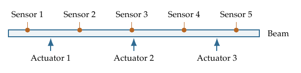
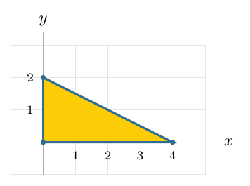



# Homework 5: Matrices and Linear Transformations

**due** Friday, October 16th at 11:59PM

<a class="btn btn-info assignment-pdf-button" href="/resources/homeworks/hw05/hw05.pdf" target="_blank">View as PDF ✏️</a>

{: .yellow }

Write your solutions to the following problems either by writing them on a piece of paper or on a tablet and scanning your answers as a PDF. Note that you are not allowed to use LaTeX, Google Docs, or any other digital document creation software to type your answers. Homeworks are due to Pensive by 11:59PM on the due date. See the [syllabus](https://math124.org/syllabus/#homework) for details on the slip day policy.

Homework will be evaluated not only on the correctness of your answers, but on your ability to present your ideas clearly and logically. You should always explain and justify your conclusions, using sound reasoning. Your goal should be to convince the reader of your assertions. If a question does not require explanation, it will be explicitly stated.

Before proceeding, make sure you're familiar with the [collaboration policy](https://math124.org/syllabus/#collaboration-and-generative-ai-policy).

---

## Problems

- [Problem 1: Midterm 1 Solutions Reflection](#problem-1-midterm-1-solutions-reflection-6-pts)
- [Problem 2: Matrix--Vector Practice](#problem-2-matrix--vector-practice-8-pts)
- [Problem 3: Is It Linear?](#problem-3-is-it-linear-9-pts)
- [Problem 4: What Linearity Tells Us](#problem-4-what-linearity-tells-us-8-pts)
- [Problem 5: Finding a Transformation's Matrix](#problem-5-finding-a-transformations-matrix-8-pts)
- [Problem 6: Can We Work Backward?](#problem-6-can-we-work-backward-6-pts)
- [Problem 7: Matrix Products](#problem-7-matrix-products-12-pts)
- [Problem 8: Do the Usual Rules Still Work?](#problem-8-do-the-usual-rules-still-work-6-pts)
- [Problem 9: Transforming a Triangle](#problem-9-transforming-a-triangle-8-pts)
- [Problem 10: From Projection to Reflection](#problem-10-from-projection-to-reflection-9-pts)
- [Problem 11: Programming Activity](#problem-11-programming-activity-20-pts)

---

Total Points: \\(6 + 8 + 9 + 8 + 8 + 6 + 12 + 6 + 8 + 9 + 20 = 100\\)

---

## Problem 1: Midterm 1 Solutions Reflection (6 pts)

Review the solutions to Midterm 1. Pick **two problem parts** in which your solutions have the most room for improvement: for example, where your reasoning was unsound or your presentation could have been clearer or more efficient. Include a screenshot of your solution to each part. For each, explain what was deficient and how to fix it.

Alternatively, if one of your solutions is significantly better than the posted one, include it and explain why. If you did not take Midterm 1, choose two challenging parts and explain the key ideas behind their solutions in your own words.

---

## Problem 2: Matrix--Vector Practice (8 pts)

Compute each product, or explain why it is undefined. For each defined product, state the shape of the output. Show your arithmetic.

a)

(2 pts)
\\(\displaystyle \begin{bmatrix}4&amp;-2&amp;0&amp;3\\\\-3&amp;5&amp;2&amp;-1\\\\4&amp;1&amp;-5&amp;2\end{bmatrix} \begin{bmatrix}-2\\\\3\\\\1\\\\-2\end{bmatrix}\\)

b)

(2 pts)
\\(\displaystyle \begin{bmatrix}-8&amp;0&amp;0&amp;0&amp;0\\\\0&amp;\frac32&amp;0&amp;0&amp;0\\\\0&amp;0&amp;11&amp;0&amp;0\\\\0&amp;0&amp;0&amp;-5&amp;0\\\\0&amp;0&amp;0&amp;0&amp;7\end{bmatrix} \begin{bmatrix}3\\\\-4\\\\2\\\\6\\\\-3\end{bmatrix}\\)

c)

(2 pts)
\\(\displaystyle \begin{bmatrix}12&amp;-7&amp;\frac12&amp;9\end{bmatrix}\begin{bmatrix}3\\\\-2\\\\8\\\\-4\end{bmatrix}\\)

d)

(2 pts)
\\(\displaystyle \begin{bmatrix}-5&amp;8&amp;3&amp;12\\\\7&amp;-2&amp;6&amp;-9\end{bmatrix}\begin{bmatrix}4\\\\-1\\\\5\end{bmatrix}\\)

---

## Problem 3: Is It Linear? (9 pts)

For each transformation, decide whether it is linear. A linear transformation must satisfy both properties below for all vectors \\(\vec u,\vec v\\) in its domain and all scalars \\(c\\):

-   **Additivity:** \\(T(\vec u+\vec v)=T(\vec u)+T(\vec v)\\).

-   **Compatibility with scaling:** \\(T(c\vec v)=cT(\vec v)\\).

For a linear transformation, verify both properties for arbitrary inputs. For a nonlinear transformation, give a specific counterexample to at least one property. State your inputs and show that the two sides are different.

a)

(3 pts)
\\(T:\mathbb R^2\to\mathbb R^2\\), defined by \\(T\left(\begin{bmatrix}x\\\\y\end{bmatrix}\right) =\begin{bmatrix}(3x+2y)^2-9x^2-4y^2\\\\7x-5y\end{bmatrix}\\).

b)

(3 pts)
\\(T:\mathbb R^3\to\mathbb R^2\\), defined by \\(T\left(\begin{bmatrix}x\\\\y\\\\z\end{bmatrix}\right) =\begin{bmatrix}4(x-2y)+3(2y-z)\\\\5(x+z)-2(3x-y)\end{bmatrix}\\).

c)

(3 pts)
\\(T:\mathbb R^2\to\mathbb R^3\\), defined by \\(T\left(\begin{bmatrix}x\\\\y\end{bmatrix}\right) =\begin{bmatrix}6x-5y+8\\\\4(x+y)-7\\\\9x+2y-8\end{bmatrix}\\).

---

## Problem 4: What Linearity Tells Us (8 pts)

Let \\(T:\mathbb R^3\to\mathbb R^2\\) be a linear transformation, and let

$$
\vec u=\begin{bmatrix}2\\-1\\3\end{bmatrix},\qquad
\vec v=\begin{bmatrix}-1\\2\\1\end{bmatrix}.
$$

 Suppose we know that

$$
T(3\vec u+\vec v)=\begin{bmatrix}8\\-1\end{bmatrix},\qquad
T(2\vec u-3\vec v)=\begin{bmatrix}9\\-8\end{bmatrix}.
$$

 Use linearity directly; you do not need to find the matrix of \\(T\\).

a)

(3 pts) Find \\(T(\vec u)\\) and \\(T(\vec v)\\). Show how you use the two given outputs.

b)

(3 pts) Find \\(T\left(\begin{bmatrix}8\\\\-7\\\\7\end{bmatrix}\right)\\). Explain how you express this input using \\(\vec u\\) and \\(\vec v\\).

c)

(2 pts) A student claims that \\(T\left(\begin{bmatrix}3\\\\0\\\\7\end{bmatrix}\right)=\begin{bmatrix}5\\\\1\end{bmatrix}\\). Is this consistent? Explain.

---

## Problem 5: Finding a Transformation's Matrix (8 pts)

Let \\(S:\mathbb R^2\to\mathbb R^2\\) be a linear transformation satisfying

$$
S\!\left(\begin{bmatrix}2\\0\end{bmatrix}\right)=\begin{bmatrix}8\\6\end{bmatrix},\qquad
S\!\left(\begin{bmatrix}0\\3\end{bmatrix}\right)=\begin{bmatrix}-9\\12\end{bmatrix}.
$$

a)

(3 pts) Find \\(S\left(\begin{bmatrix}1\\\\0\end{bmatrix}\right)\\) and \\(S\left(\begin{bmatrix}0\\\\1\end{bmatrix}\right)\\), then construct the matrix of \\(S\\). Explain how you chose its columns.

b)

(2 pts) Use your matrix to find \\(S\left(\begin{bmatrix}3\\\\-2\end{bmatrix}\right)\\).

c)

(3 pts) Describe the geometric effect of \\(S\\) in words, using the types of linear transformations we saw in [Chapter 3.2](https://notes.math124.org/ch03/03-02/) and [Chapter 3.4](https://notes.math124.org/ch03/03-04/). Specify any scale factor and, if there is a rotation, its direction and angle. You may specify an angle by giving its sine and cosine.

---

## Problem 6: Can We Work Backward? (6 pts)

Let \\(\displaystyle A=\begin{bmatrix}4&amp;-6\\\\-2&amp;3\end{bmatrix}\\).

a)

(2 pts) Find two different inputs \\(\vec u\\) and \\(\vec v\\) such that \\(A\vec u=A\vec v=\begin{bmatrix}12\\\\-6\end{bmatrix}\\). Write the system of equations you are solving.

b)

(2 pts) Is there an input with output \\(\begin{bmatrix}12\\\\-5\end{bmatrix}\\)? Explain using the columns of \\(A\\) and their span.

c)

(2 pts) Using your inputs from part (a), find a nonzero input with output \\(\vec0\\). Explain why your construction works using linearity.

**Note: Problems 7--11 require material from Tuesday's lecture.**

---

## Problem 7: Matrix Products (12 pts)

Compute the requested products and state their shapes. Show your arithmetic.

a)

(4 pts) Let

$$
A=\begin{bmatrix}3&-2\\-1&4\\4&1\\2&-3\end{bmatrix},\qquad
B=\begin{bmatrix}2&-3&1&2\\-2&1&4&-1\end{bmatrix}.
$$

 Compute both \\(AB\\) and \\(BA\\).

b)

(4 pts) Let

$$
C=\begin{bmatrix}3&-2&4\\0&5&2\\0&0&-2\end{bmatrix},\qquad
D=\begin{bmatrix}2&4&-3\\5&-2&1\\-4&3&2\end{bmatrix}.
$$

 Compute both \\(CD\\) and \\(DC\\).

c)

(4 pts) A mechanical engineer wants to measure how a beam bends when forces are applied at different locations. A **test rig** is a laboratory setup built to test a component under controlled conditions. This rig has three **actuators**, motor-driven devices that push or pull on the beam, and five **sensors**, devices that measure the beam's vertical movement at five locations.

In a simplified linear model, \\(H\vec u\\) gives the five sensor readings, in millimeters, when \\(\vec u\\) lists the forces applied by the three actuators, in **newtons (N)**. For example, \\(\vec u=\begin{bmatrix}2\\\\-3\\\\4\end{bmatrix}\\) corresponds to the first actuator pushing upward with a force of \\(2\\) N, the second pulling downward with a force of \\(3\\) N, and the third pushing upward with a force of \\(4\\) N. Sensor readings are displacements from the beam's unloaded position; positive readings mean upward movement.

The columns of \\(U\\) give the actuator forces for two separate trials:

$$
H=\begin{bmatrix}
3&-2&4\\-2&4&3\\5&1&-3\\3&-4&2\\-4&3&2
\end{bmatrix},\qquad
U=\begin{bmatrix}2&-3\\-3&4\\4&2\end{bmatrix}.
$$

 Compute \\(HU\\). What does the entry in row 4, column 2 of your answer represent? Why is \\(UH\\) undefined? Write a sentence involving the actuators, sensors, and two trials; simply saying that the matrix shapes do not match is not enough.

---

## Problem 8: Do the Usual Rules Still Work? (6 pts)

All matrices in this problem are \\(2\times2\\) and all vectors are in \\(\mathbb R^2\\). Justify each answer. A counterexample must include specific matrices or vectors and the relevant products.

<em>Hint: It may help to complete Problem 6(c) first, where you find a nonzero vector whose product with a matrix is zero.</em>

a)

(2 pts) If \\(B\vec v=\vec0\\), must \\(AB\vec v=\vec0\\)? If \\(AB\vec v=\vec0\\), must \\(B\vec v=\vec0\\)? Address both directions.

b)

(2 pts) Can \\(AB=0&#95;{2\times2}\\) even when neither \\(A\\) nor \\(B\\) is the zero matrix? Give an example or explain why it is impossible.

c)

(2 pts) Expand \\((A+B)^2\\) using distributivity, keeping the factors in their original order. Is it always equal to \\(A^2+2AB+B^2\\)? If not, give a counterexample.

---

## Problem 9: Transforming a Triangle (8 pts)

Consider the triangle with vertices \\(\begin{bmatrix}0\\\\0\end{bmatrix}\\), \\(\begin{bmatrix}4\\\\0\end{bmatrix}\\), and \\(\begin{bmatrix}0\\\\2\end{bmatrix}\\). To transform it, transform its three vertices and connect their images.

Let \\(D\\) stretch horizontally by a factor of \\(2\\), leaving vertical coordinates unchanged. Let \\(Q\\) rotate counterclockwise by \\(45^\circ\\) about the origin. Recall that the rotation matrix is

$$
\begin{bmatrix}\cos\theta&-\sin\theta\\\sin\theta&\cos\theta\end{bmatrix}.
$$

 Give exact matrix entries and vertex coordinates. You may use decimal approximations when drawing.

a)

(2 pts) Write the matrices \\(Q\\) and \\(D\\).

b)

(3 pts) Find the matrix for stretching first and then rotating. Draw the resulting triangle on a coordinate plane, labeling the coordinates of all three vertices.

c)

(3 pts) Reverse the order, find the new combined matrix, and draw the resulting triangle on a second coordinate plane with the same scale. Label the coordinates of all three vertices. Describe how the two transformed triangles differ.

---

## Problem 10: From Projection to Reflection (9 pts)

In [Homework 4, Problem 9](https://math124.org/resources/homeworks/hw04/), you found that the reflection of a vector \\(\vec v\\) across a line can be written as

$$
\vec v_{\mathrm{ref}}=2\vec p-\vec v,
$$

 where \\(\vec p\\) is the projection of \\(\vec v\\) onto the line. Here's the same picture again: the tip of \\(\vec p\\) is halfway between the tips of \\(\vec v\\) and \\(\vec v&#95;{\mathrm{ref}}\\).

In Lab 6, you used the matrix

$$
P=\begin{bmatrix}w_1^2&w_1w_2\\w_1w_2&w_2^2\end{bmatrix}
$$

 to project onto a line spanned by a **unit vector** \\(\vec w=\begin{bmatrix}w&#95;1\\\\w&#95;2\end{bmatrix}\\). Thus \\(\vec p=P\vec v\\).

a)

(2 pts) Derive a matrix \\(R\\), expressed in terms of \\(P\\) and the identity matrix \\(I\\), such that \\(R\vec v=\vec v&#95;{\mathrm{ref}}\\) for every \\(\vec v\\). Then write all four entries of \\(R\\) in terms of \\(w&#95;1,w&#95;2\\).

b)

(3 pts) Now use the line spanned by \\(\vec w=\begin{bmatrix}3/5\\\\4/5\end{bmatrix}\\). Find \\(P\\), \\(R\\), and the reflection of \\(\vec v=\begin{bmatrix}7\\\\1\end{bmatrix}\\) across this line.

c)

(2 pts) What does \\(R\\) do to a vector parallel to the line? To a vector perpendicular to it? Explain using projections.

d)

(2 pts) Explain geometrically why \\(P^2=P\\) and \\(R^2=I\\). Then use \\(P^2=P\\) and your expression for \\(R\\) to verify \\(R^2=I\\) algebraically.

---

## Problem 11: Programming Activity (20 pts)

The programming activity will be posted separately. It will be worth 20 points.


