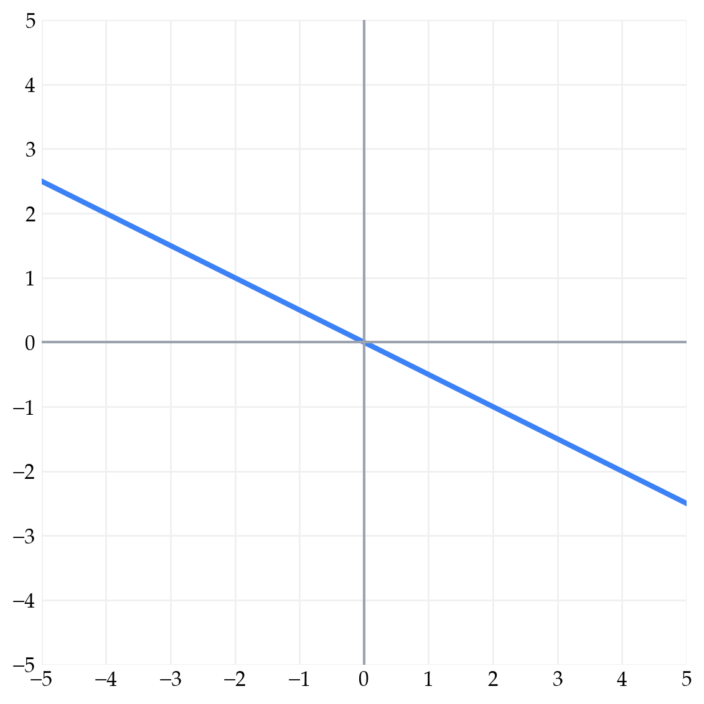
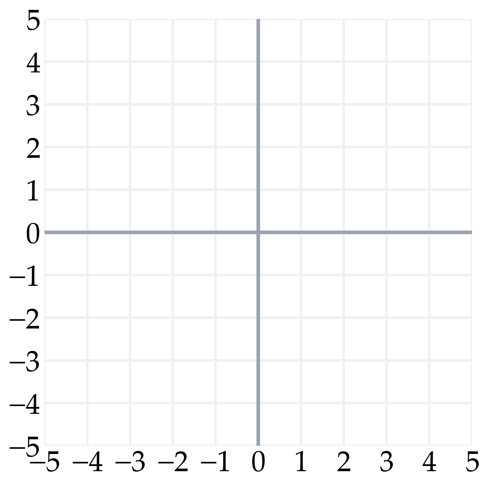
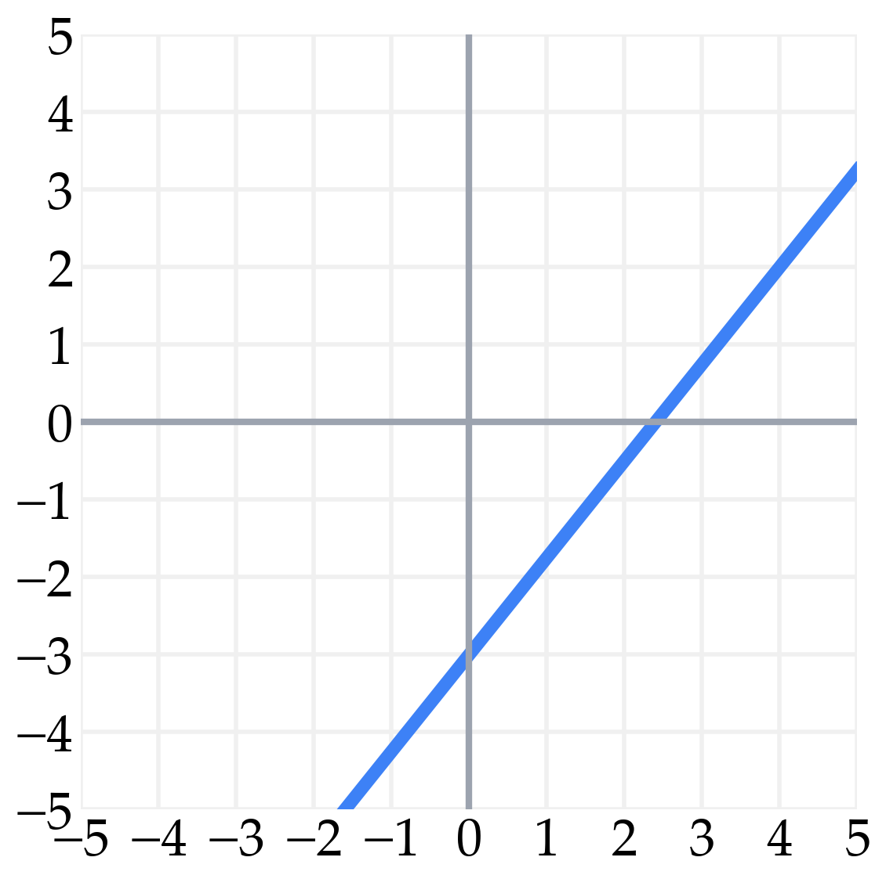



# Lab 1: Mathematical Foundations

**due** by the end of your lab section on Wednesday, September 2nd, 2026

<a class="btn btn-info assignment-pdf-button" href="/resources/labs/lab01/lab01.pdf" target="_blank">View as PDF ✏️</a>
<a class="btn btn-info assignment-pdf-button" href="/resources/labs/lab01/lab01-solutions.pdf" target="_blank">Solutions PDF ✅</a>

{: .yellow }

Welcome to the first lab of Math 124!

Each lab worksheet will contain several activities, most of which will involve writing math on paper, and some of which will involve running code in a Jupyter Notebook. Lab activities are meant to last an hour, and the second hour of lab is dedicated to starting the homework assignment. To receive credit for a lab, you must show your lab TA your work on both the lab worksheet and homework assignment.

While you must get checked off by your lab TA **individually**, we encourage you to form groups with 1-2 other students to complete the activities together.

---

## Activities

- [Activity 1: Hello World!](#activity-1-hello-world)
- [Activity 2: Sets and subsets](#activity-2-sets-and-subsets)
- [Activity 3: Mathematical Hygiene](#activity-3-mathematical-hygiene)
- [Activity 4: (Set)ting the Stage](#activity-4-setting-the-stage)
- [Activity 5: Parallel and Perpendicular Lines](#activity-5-parallel-and-perpendicular-lines)
- [Activity 6: Programming Activity](#activity-6-programming-activity)

---

## Activity 1: Hello World!

In this class and in labs, collaboration is key because together groups can accomplish much more than individuals can on their own.

First, introduce yourself to two people in the class and exchange contact information. Write down their names and contact information below.

Next, pair up with one or two other students and solve the following cross-number crossword puzzle, adapted from the [Berkeley Math Tournament 2023](https://berkeley.mt/resources/archives/bmmt-2023/puzzle-problems.pdf). Each spot in the grid should be filled with a digit from 0 to 9 using the clues below. Digits may be repeated.

 
A
 
B
 
C
 
D
 

 

 
E
 

 

 

<table>
<tbody>
<tr>
<td style="text-align: left;">A Across:</td>
<td style="text-align: left;">A number with only even digits, in strictly descending order (3)</td>
</tr>
<tr>
<td style="text-align: left;">D Across:</td>
<td style="text-align: left;">A number not divisible by 9 (3)</td>
</tr>
<tr>
<td style="text-align: left;">E Across:</td>
<td style="text-align: left;">A number divisible by 11 (2)</td>
</tr>
<tr>
<td style="text-align: left;">A Down:</td>
<td style="text-align: left;">A number with consecutive digits, in ascending order (3)</td>
</tr>
<tr>
<td style="text-align: left;">B Down:</td>
<td style="text-align: left;">A number where the product of the lesser-valued two digits</td>
</tr>
<tr>
<td style="text-align: left;"></td>
<td style="text-align: left;">is equal to the largest digit (3)</td>
</tr>
<tr>
<td style="text-align: left;">C Down:</td>
<td style="text-align: left;">A prime number greater than 10 (2)</td>
</tr>
</tbody>
</table>

After you solve the puzzle, compare your thinking with the rest of your group. Write one insight that someone else in your group had that you did not think of.

Solution

The completed grid is

 
A6
 
B4
 
C2
 
D7
 
2
 
3
 
E8
 
8
 

 

The written insight will vary. See a walkthrough of the puzzle solution on [page 75 of this PDF](https://berkeley.mt/resources/archives/bmmt-2023/puzzle-solutions.pdf#page=75).

**Overview: Sets and set-builder notation**

<em>The material here is a summary of <a href="https://notes.math124.org/ch01/01-02/">Chapter 1.2</a> of the course notes.</em>

A **set** is a well-defined collection of distinct objects. For example,

$$
A=\{2,4,6,8\}
$$

 is the set of even numbers between \\(2\\) and \\(8\\). The numbers \\(2\\), \\(4\\), \\(6\\), and \\(8\\) are the **elements** of \\(A\\). We write \\(2\in A\\) and \\(3\notin A\\). Sets do not contain duplicates, so \\(\lbrace{}2, 2, 4, 6, 6\rbrace{}\\) is not a valid set. Sets do not keep track of order, so

$$
\{2,4,6\}=\{6,4,2\}.
$$

**Set-builder notation** describes a set by stating a rule that all of its elements follow. Its general form is

$$
\{\text{what goes in the set}:\text{condition}\}.
$$

 For example, if \\(A=\lbrace{}2,4,6,8\rbrace{}\\), then the set \\(C = \lbrace{}6, 12, 18, 24\rbrace{}\\) can be described as

$$
C = \{3x:x\in A\}.
$$

More examples:

<ol class="assignment-enumeration" markdown="1">

<li markdown="1">

\\(\lbrace{}x: x \in C, x &gt; 10\rbrace{}\\) is the set of elements of \\(C\\) that are greater than \\(10\\).

</li>
<li markdown="1">

\\(\lbrace{}10, 20, 30, ..., 100\rbrace{}\\) can be expressed in set-builder notation as

$$
\{10x: x \in \mathbb{Z}, 1 \leq x \leq 10 \}.
$$

 \\(\mathbb{Z}\\) is the set of all **integers**.

</li>
<li markdown="1">

\\(\lbrace{}x: x \in \mathbb{Z}, x \geq 0\rbrace{}\\) is the set of all non-negative integers.

</li>
<li markdown="1">

\\(\lbrace{}(x, y): x^2 + y^2 = 16, x \in \mathbb{R}, y \in \mathbb{R} \rbrace{}\\) is the set of all points on the circle with radius \\(4\\) centered at \\((0, 0)\\). \\(\mathbb{R}\\) refers to the set of **real numbers**.

</li>
</ol>

In many of these examples, the item before the colon \\(:\\) was simply \\(x\\), and following the colon were multiple conditions on \\(x\\), one of which was the set we were selecting elements from to create our new set (e.g. \\(C\\), \\(\mathbb{Z}\\), or \\(\mathbb{R}\\)). There is a shorter notation that is often used for sets like these:

-   \\(\lbrace{}x : x \in C,\ x &gt; 10\rbrace{}\\) can be shortened to \\(\lbrace{}x \in C : x &gt; 10\rbrace{}\\).

-   \\(\lbrace{}x : x \in \mathbb{Z},\ x \geq 0\rbrace{}\\) can be shortened to \\(\lbrace{}x \in \mathbb{Z} : x \geq 0\rbrace{}\\).

In general, the two forms you'll see are:

$$
\{f(x): \text{conditions on } x \}
$$

$$
\{x \in S: \text{conditions on } x\}
$$

---

## Activity 2: Sets and subsets

a)

Write the set \\(\lbrace{}k\in\mathbb{Z}:|k+1|&lt;5\rbrace{}\\) using enumerative notation.

Solution

The set \\(\lbrace{}k\in\mathbb{Z}:|k+1|&lt;5\rbrace{}\\) in enumerative notation is

$$
\{-5,-4,-3,\ldots,3\}.
$$

b)

Write the set \\(\lbrace{}2,5,10,17,26,37,\ldots\rbrace{}\\) using set-builder notation. Try doing so in at least two different ways, each using a different formula before the colon.

Solution

One way to write the set is

$$
\{x^2+1:x\in\mathbb{Z},x\geq 1\}.
$$

 Two other forms are

$$
\{(x-1)^2+1:x\in\mathbb{Z},x\geq 2\}
\quad\text{and}\quad
\{(x+1)^2+1:x\in\mathbb{Z},x\geq 0\}.
$$

A set \\(B\\) is a **subset** of a set \\(A\\) if every element of \\(B\\) is also an element of \\(A\\), written \\(B\subseteq A\\).

c)

Let \\(A=\lbrace{}x\in\mathbb{Z}:x&gt;2\rbrace{}\\) and \\(B=\lbrace{}x\in\mathbb{Z}:x&gt;6\rbrace{}\\). Is \\(A\subseteq B\\)? Is \\(B\subseteq A\\)? Both? Neither?

Solution

In enumerative notation,

$$
A=\{3,4,5,6,7,8,9,10,\ldots\},
\qquad
B=\{7,8,9,10,\ldots\}.
$$

 Every element in \\(B\\) is also in \\(A\\), so \\(B\subseteq A\\). The opposite is not true: \\(3\in A\\) but \\(3\notin B\\), so \\(A\\) is not a subset of \\(B\\).

d)

Let \\(C=\lbrace{}x\in\mathbb{R}:x^2&gt;4\rbrace{}\\) and \\(D=\lbrace{}x\in\mathbb{R}:x&gt;2\rbrace{}\\). Explain why it is **not true** that \\(C\subseteq D\\) by finding one element in \\(C\\) that is not in \\(D\\).

Solution

The set \\(C\\) includes negative numbers such as \\(-3\\), since \\((-3)^2&gt;4\\). But \\(-3\notin D\\), so \\(C\\) cannot be a subset of \\(D\\).

---

## Activity 3: Mathematical Hygiene

One of the main learning objectives in this course is to develop proper mathematical **hygiene** --- that is, writing clear solutions using proper mathematical grammar and correctly stating assumptions.

a)

The "proof" below shows that \\(0 = 1\\).

<table>
<tbody>
<tr>
<td style="text-align: right;">1</td>
<td style="text-align: left;">Suppose \(a=b\). Then,</td>
</tr>
<tr>
<td style="text-align: right;">2</td>
<td style="text-align: left;">\(a^2=ab\)</td>
</tr>
<tr>
<td style="text-align: right;">3</td>
<td style="text-align: left;">\(a^2-b^2=ab-b^2\)</td>
</tr>
<tr>
<td style="text-align: right;">4</td>
<td style="text-align: left;">\((a-b)(a+b)=b(a-b)\)</td>
</tr>
<tr>
<td style="text-align: right;">5</td>
<td style="text-align: left;">\(a+b=b\)</td>
</tr>
<tr>
<td style="text-align: right;">6</td>
<td style="text-align: left;">\(2b=b\)</td>
</tr>
<tr>
<td style="text-align: right;">7</td>
<td style="text-align: left;">\(2=1\)</td>
</tr>
<tr>
<td style="text-align: right;">8</td>
<td style="text-align: left;">\(1=0\)</td>
</tr>
</tbody>
</table>

Identify the line on which a mistake is first made and explain what the mistake is.

Solution

The error is in going from line 4 to line 5: we cannot divide by \\(a-b\\), because it is \\(0\\).

b)

Express the set of solutions \\(x\\) to the inequality below in set-builder notation.

$$
\frac{-3x+2}{7}\le 5
$$

Solution

Solving the inequality step by step,

$$
\begin{align*}
\frac{-3x+2}{7} &\le 5 \\\\
-3x+2 &\le 35 && \text{(multiply both sides by 7)} \\\\
-3x &\le 33 && \text{(subtract 2 from both sides)} \\\\
x &\ge -11 && \text{(divide by -3 and reverse the inequality).}
\end{align*}
$$

Therefore, in set-builder notation, the solution set is

$$
\{x\in\mathbb{R}: x\ge -11\}.
$$

---

## Activity 4: (Set)ting the Stage

Find the equation of the line below. Then, describe the set of all points \\((x, y)\\) that satisfy the equation in set-builder notation.

Solution

The line has slope \\(-\frac12\\) and passes through the origin, so its equation is \\(y=-\frac12x\\). In set-builder notation, the solution set is \\(\lbrace{}(x,y)\in\mathbb{R}^2: y=-\frac12x\rbrace{}\\).

---

## Activity 5: Parallel and Perpendicular Lines

Consider the line

$$
5x-4y=12.
$$

a)

Plot the line on the axes below.

Solution

The line has slope \\(\frac54\\) and \\(y\\)-intercept \\(-3\\). It passes through \\((0,-3)\\) and \\((4,2)\\), for example.

b)

Find an equation for a line that is parallel to this line.

Solution

Parallel lines have the same slope. Any line of the form \\(5x-4y=c\\) with \\(c\neq 12\\) works. For example,

$$
5x-4y=20.
$$

c)

Find an equation for a line that is perpendicular to this line.

Solution

Perpendicular lines have slopes that are the negative reciprocals of each other. Thus, any line of the form \\(4x+5y=c\\) is perpendicular. For example,

$$
4x+5y=10.
$$

d)

Find the point where this line intersects with the line

$$
y=x-2.
$$

Solution

Rewrite the first line as \\(y=\frac54x-3\\) and set the two expressions for \\(y\\) equal to each other. Solving gives \\(x=4\\) and \\(y=2\\), so the intersection point is

$$
(4,2).
$$

---

## Activity 6: Programming Activity

Most homeworks and some labs will have a Jupyter Notebook, containing Python code that supplements our understanding of the relevant mathematical ideas of the week.

To open the notebook for Lab 1, click the Google Colab link under "Code" on the course website for Lab 1. Instructions on how to use Google Colab are at [math124.org/running-code](https://math124.org/running-code). If you are viewing the lab worksheet after it has been posted, [this](https://colab.research.google.com/github/math-124/fa26-code/blob/main/labs/lab01/lab01.ipynb) direct link will work, too.

To receive credit for the programming component of the lab, work through the entire notebook and show your lab TA the graph you create at the very bottom, with your name in it.


