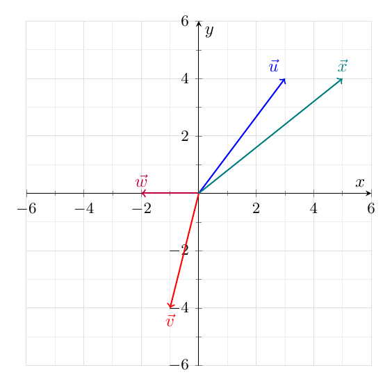
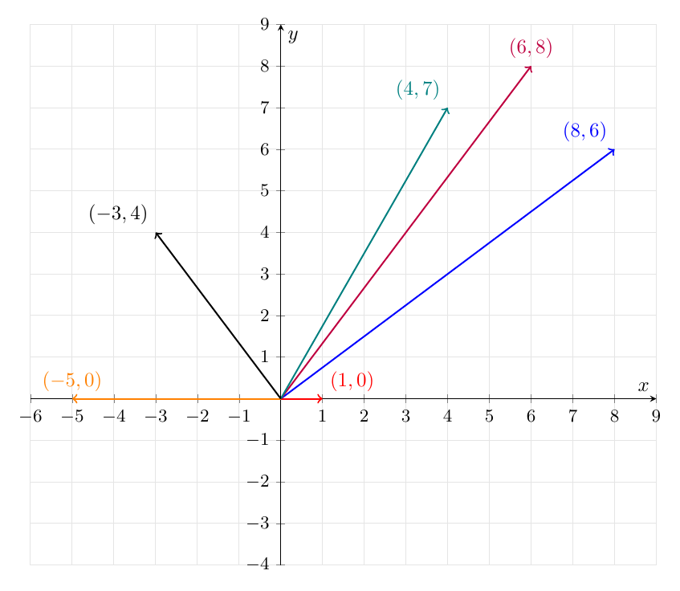



# Lab 2: Vector Arithmetic, Lengths, and the Dot Product

**due** by the end of class on Wednesday, September 9, 2026

<a class="btn btn-info assignment-pdf-button" href="/resources/labs/lab02/lab02.pdf" target="_blank">View as PDF ✏️</a>
<a class="btn btn-info assignment-pdf-button" href="/resources/labs/lab02/lab02-solutions.pdf" target="_blank">Solutions PDF ✅</a>

{: .yellow }

Each lab worksheet will contain several activities, most of which will involve writing math on paper, and some of which will involve running code in a Jupyter Notebook. Lab activities are meant to last an hour, and the second hour of lab is dedicated to starting the homework assignment. To receive credit for a lab, you must show your lab TA your work on both the lab worksheet and homework assignment.

While you must get checked off by your lab TA **individually**, we encourage you to form groups with 1-2 other students to complete the activities together.

---

## Activities

- [Activity 1: Linear Combinations and Lengths](#activity-1-linear-combinations-and-lengths)
- [Activity 2: The Dot Product](#activity-2-the-dot-product)
- [Activity 3: Angles and Orthogonality](#activity-3-angles-and-orthogonality)
- [Activity 4: Comparing Vectors](#activity-4-comparing-vectors)

---

**Review**

-   \\(\vec v\in\mathbb R^n\\), pronounced "v in R n", means that \\(\vec v\\) is a vector with \\(n\\) components. Usually, \\(v&#95;1,v&#95;2,\ldots,v&#95;n\\) are placeholders for \\(\vec v\\)'s components.

-   A vector that results from scaling and adding one or more vectors is called a **linear combination** of the original vectors. For example, if \\(\vec u=\begin{bmatrix}5\\\\1\end{bmatrix}\\) and \\(\vec v=\begin{bmatrix}1\\\\7\end{bmatrix}\\), then \\(2\vec u-3\vec v\\) is a linear combination of \\(\vec u\\) and \\(\vec v\\). It is the new vector

$$
2\vec u-3\vec v
    =2\begin{bmatrix}5\\1\end{bmatrix}-3\begin{bmatrix}1\\7\end{bmatrix}
    =\begin{bmatrix}10-3\\2-21\end{bmatrix}
    =\begin{bmatrix}7\\-19\end{bmatrix}.
$$

-   For a vector \\(\vec v\in\mathbb R^n\\), its **length**, **norm**, or **magnitude**, is

$$
\lVert\vec v\rVert=\sqrt{v_1^2+v_2^2+\cdots+v_n^2}.
$$

 For the vectors above,

$$
\lVert\vec u\rVert=\sqrt{5^2+1^2}=\sqrt{26},
    \qquad
    \lVert\vec v\rVert=\sqrt{1^2+7^2}=\sqrt{50}.
$$

-   The **dot product** of two nonzero vectors \\(\vec u,\vec v\in\mathbb R^n\\) can be computed in two ways:

-   Algebraic definition: \\(\vec u\cdot\vec v=u&#95;1v&#95;1+u&#95;2v&#95;2+\cdots+u&#95;nv&#95;n\\).

-   Geometric definition: \\(\vec u\cdot\vec v=\lVert\vec u\rVert\lVert\vec v\rVert\cos\theta\\), where \\(\theta\\) is the angle between the vectors.

   For the vectors above,

$$
\vec u\cdot\vec v=\begin{bmatrix}5\\1\end{bmatrix}\cdot\begin{bmatrix}1\\7\end{bmatrix}=5(1)+1(7)=12.
$$

---

## Activity 1: Linear Combinations and Lengths

Let \\(\vec u=\begin{bmatrix}3\\\\4\end{bmatrix}\\) and \\(\vec v=\begin{bmatrix}-1\\\\-4\end{bmatrix}\\).

a)

Let \\(\vec w=-\vec u-\vec v\\) and let \\(\vec x=2\vec u+\vec v\\). Draw \\(\vec u\\), \\(\vec v\\), \\(\vec w\\), and \\(\vec x\\) on the axes below, with each vector starting at the origin. Label each vector.

Solution

To find \\(\vec w\\) and \\(\vec x\\), we'll scale the vectors and add their corresponding components:

$$
\begin{align*}
\vec w &= -\vec u-\vec v
= -\begin{bmatrix}3\\4\end{bmatrix}-\begin{bmatrix}-1\\-4\end{bmatrix}
= \boxed{\begin{bmatrix}-2\\0\end{bmatrix}} \\
\vec x &= 2\vec u+\vec v
= 2\begin{bmatrix}3\\4\end{bmatrix}+\begin{bmatrix}-1\\-4\end{bmatrix}
= \boxed{\begin{bmatrix}5\\4\end{bmatrix}}
\end{align*}
$$

Each vector starts at the origin, so its components tell us where its tip goes. For instance, \\(\vec w\\) ends at \\((-2,0)\\), which is 2 units to the left of the origin.

b)

Which of the following vectors is equal to \\(5\vec e&#95;1-4\vec e&#95;2\\)? Select one option. Recall that \\(\vec e&#95;1=\begin{bmatrix}1\\\\0\end{bmatrix}\\) and \\(\vec e&#95;2=\begin{bmatrix}0\\\\1\end{bmatrix}\\) are the **standard basis vectors** in \\(\mathbb R^2\\).

 \(3\vec u-4\vec v\) \(4\vec u+3\vec v\) \(3\vec u+4\vec v\) \(-3\vec u+4\vec v\) \(4\vec u-3\vec v\)

Solution

**The third option, \\(3\vec u+4\vec v\\).**

Since \\(\vec e&#95;1\\) moves us one unit horizontally and \\(\vec e&#95;2\\) moves us one unit vertically, the vector we're looking for is:

$$
5\vec e_1-4\vec e_2=\begin{bmatrix}5\\-4\end{bmatrix}
$$

 The third option gives us exactly this vector:

$$
3\vec u+4\vec v
=3\begin{bmatrix}3\\4\end{bmatrix}+4\begin{bmatrix}-1\\-4\end{bmatrix}
=\begin{bmatrix}9-4\\12-16\end{bmatrix}
=\boxed{\begin{bmatrix}5\\-4\end{bmatrix}}
$$

c)

Find the lengths of \\(\vec u\\) and \\(\vec v\\).

Solution

To find a vector's length, we square its components, add them, and take the square root:

$$
\begin{align*}
\lVert\vec u\rVert &= \sqrt{3^2+4^2}=\boxed{5} \\
\lVert\vec v\rVert &= \sqrt{(-1)^2+(-4)^2}=\boxed{\sqrt{17}}
\end{align*}
$$

Notice that the negative components of \\(\vec v\\) become positive when we square them. They tell us which way \\(\vec v\\) points, but its length is still positive.

---

## Activity 2: The Dot Product

For each pair of vectors below, draw them on the axes, compute their dot product, and select whether the angle between them is acute, right, or obtuse. Draw each vector from the origin.

a)

\\(\begin{bmatrix}8\\\\6\end{bmatrix}\\) and \\(\begin{bmatrix}1\\\\0\end{bmatrix}\\)

 Acute Right Obtuse

Solution

**Acute.** The dot product is:

$$
8(1)+6(0)=\boxed{8}
$$

 Since it's positive, the angle is acute.

b)

\\(\begin{bmatrix}8\\\\6\end{bmatrix}\\) and \\(\begin{bmatrix}-5\\\\0\end{bmatrix}\\)

 Acute Right Obtuse

Solution

**Obtuse.** The dot product is:

$$
8(-5)+6(0)=\boxed{-40}
$$

 Since it's negative, the angle is obtuse.

c)

\\(\begin{bmatrix}8\\\\6\end{bmatrix}\\) and \\(\begin{bmatrix}6\\\\8\end{bmatrix}\\)

 Acute Right Obtuse

Solution

**Acute.** The dot product is:

$$
8(6)+6(8)=\boxed{96}
$$

 Since it's positive, the angle is acute.

d)

\\(\begin{bmatrix}8\\\\6\end{bmatrix}\\) and \\(\begin{bmatrix}4\\\\7\end{bmatrix}\\)

 Acute Right Obtuse

Solution

**Acute.** The dot product is:

$$
8(4)+6(7)=\boxed{74}
$$

 Since it's positive, the angle is acute.

e)

\\(\begin{bmatrix}8\\\\6\end{bmatrix}\\) and \\(\begin{bmatrix}-3\\\\4\end{bmatrix}\\)

 Acute Right Obtuse

Solution

**Right.** The dot product is:

$$
8(-3)+6(4)=\boxed{0}
$$

 Since it's zero, the vectors are orthogonal.

Solution

Each pair contains \\(\begin{bmatrix}8\\\\6\end{bmatrix}\\), so we only need to draw that vector once. The labels below give the coordinates of each vector's tip.

Why does the sign of the dot product tell us about the angle? Recall that:

$$
\vec u\cdot\vec v=\lVert\vec u\rVert\lVert\vec v\rVert\cos\theta
$$

 Both lengths are positive here, so the dot product has the same sign as \\(\cos\theta\\). A positive dot product means the angle is acute, a negative dot product means it's obtuse, and a zero dot product means it's a right angle.

---

## Activity 3: Angles and Orthogonality

Suppose \\(\vec u=\begin{bmatrix}5\\\\0\\\\-4\\\\1\end{bmatrix}\\) and \\(\vec v=\begin{bmatrix}9\\\\1\\\\2\\\\3\end{bmatrix}\\).

a)

Find \\(\vec u\cdot\vec v\\), \\(\lVert\vec u\rVert\\), and \\(\lVert\vec v\rVert\\).

Solution

For the dot product, we multiply corresponding components and add the results:

$$
\vec u\cdot\vec v=5(9)+0(1)+(-4)(2)+1(3)=45-8+3=\boxed{40}
$$

 For each length, we square the components of that vector, add them, and take the square root:

$$
\begin{align*}
\lVert\vec u\rVert &= \sqrt{5^2+0^2+(-4)^2+1^2}=\boxed{\sqrt{42}} \\
\lVert\vec v\rVert &= \sqrt{9^2+1^2+2^2+3^2}=\boxed{\sqrt{95}}
\end{align*}
$$

The calculations work just as they did in \\(\mathbb R^2\\); we now have four components to work with.

b)

Using the results of part **a)**, find the angle between \\(\vec u\\) and \\(\vec v\\). Leave your answer in the form \\(\cos^{-1}(\cdot)\\).

Solution

We know the dot product and both lengths from part **a)**. To find the angle, we'll substitute them into the geometric definition of the dot product and solve for \\(\theta\\):

$$
\begin{align*}
\vec u\cdot\vec v &= \lVert\vec u\rVert\lVert\vec v\rVert\cos\theta \\
40 &= \sqrt{42}\sqrt{95}\cos\theta \\
\cos\theta &= \frac{40}{\sqrt{42}\sqrt{95}} \\
\theta &= \boxed{\cos^{-1}\!\left(\frac{40}{\sqrt{42}\sqrt{95}}\right)}
\end{align*}
$$

Since the dot product is positive, this angle is acute, which agrees with what we saw in Activity 2.

Even though we cannot directly visualize these vectors in \\(\mathbb R^4\\), the formula

$$
\theta=\cos^{-1}\!\left(\frac{\vec u\cdot\vec v}{\lVert\vec u\rVert\lVert\vec v\rVert}\right)
$$

 **defines** the angle between them. Another term for the cosine of the angle between two nonzero vectors is their **cosine similarity**.

---

## Activity 4: Comparing Vectors

As we saw in the previous activity, the cosine similarity of two nonzero vectors is the cosine of the angle between them. It is one of the many ways we can measure how "different" two vectors are, by comparing their directions.

Suppose

$$
\vec u=\begin{bmatrix}2\\1\\2\end{bmatrix}
\qquad\text{and}\qquad
\vec v=\begin{bmatrix}-2\\4\\4\end{bmatrix}.
$$

 Explore and rotate the vectors at [`desmos.com/3d/4wygwwruil`](https://www.desmos.com/3d/4wygwwruil).

a)

Find the cosine similarity of \\(\vec u\\) and \\(\vec v\\).

Solution

The cosine similarity is \\(\boxed{\frac49}\\).

To find it, we'll divide the dot product by the product of the two lengths. We have:

$$
\begin{align*}
\vec u\cdot\vec v &= 2(-2)+1(4)+2(4)=8 \\
\lVert\vec u\rVert &= \sqrt{2^2+1^2+2^2}=3 \\
\lVert\vec v\rVert &= \sqrt{(-2)^2+4^2+4^2}=6
\end{align*}
$$

So, their cosine similarity is:

$$
\frac{\vec u\cdot\vec v}{\lVert\vec u\rVert\lVert\vec v\rVert}
=\frac{8}{3\cdot6}=\boxed{\frac49}
$$

 This is the cosine of the angle between the vectors. Since it's positive, the angle is acute.

b)

Another way to measure how "different" two vectors are is to measure the distance between their tips when both vectors start at the origin. Find this distance for \\(\vec u\\) and \\(\vec v\\), that is, \\(\lVert\vec u-\vec v\rVert\\).

Solution

The distance is \\(\boxed{\sqrt{29}}\\).

The vector \\(\vec u-\vec v\\) tells us how to get from the tip of \\(\vec v\\) to the tip of \\(\vec u\\):

$$
\vec u-\vec v
=\begin{bmatrix}2-(-2)\\1-4\\2-4\end{bmatrix}
=\begin{bmatrix}4\\-3\\-2\end{bmatrix}
$$

 Its length is the distance we're looking for:

$$
\lVert\vec u-\vec v\rVert
=\sqrt{4^2+(-3)^2+(-2)^2}
=\boxed{\sqrt{29}}
$$

 We could also use \\(\vec v-\vec u\\). That vector points in the opposite direction, but it has the same length.


