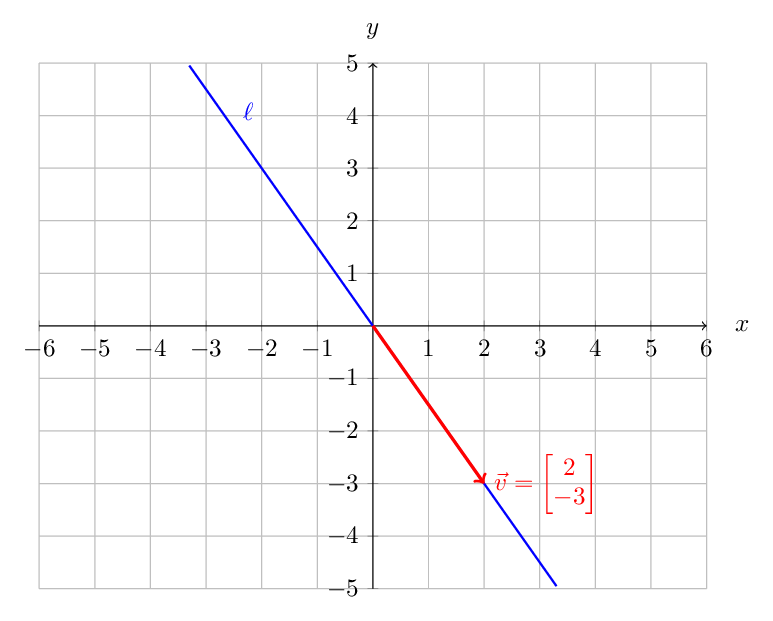
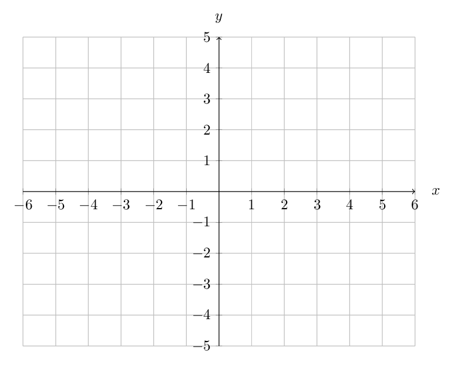
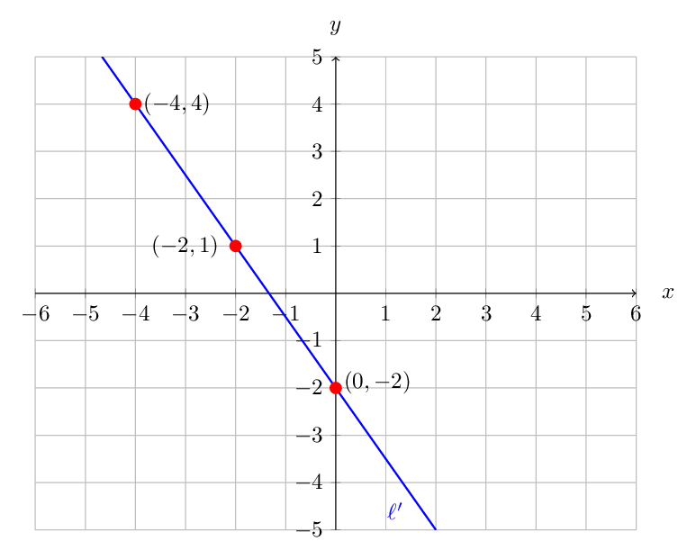
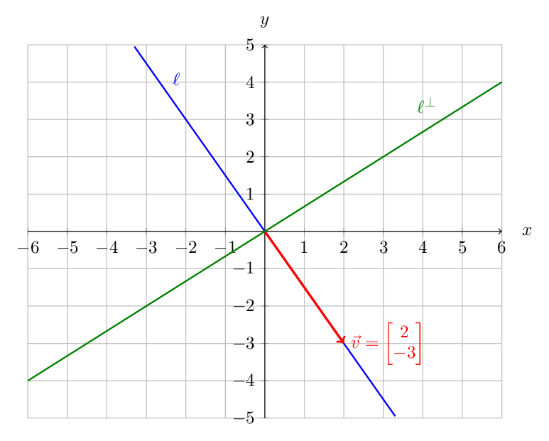



# Lab 3: Lines, Vectors and Orthogonality in $\mathbb{R}^2$

**due** by the end of class on Wednesday, September 16, 2026

<a class="btn btn-info assignment-pdf-button" href="/resources/labs/lab03/lab03.pdf" target="_blank">View as PDF ✏️</a>
<a class="btn btn-info assignment-pdf-button" href="/resources/labs/lab03/lab03-solutions.pdf" target="_blank">Solutions PDF ✅</a>

{: .yellow }

Each lab worksheet will contain several activities, most of which will involve writing math on paper, and some of which will involve running code in a Jupyter Notebook. Lab activities are meant to last an hour, and the second hour of lab is dedicated to starting the homework assignment. To receive credit for a lab, you must show your lab TA your work on both the lab worksheet and homework assignment.

While you must get checked off by your lab TA **individually**, we encourage you to form groups with 1-2 other students to complete the activities together.

---

## Activities

- [Activity 1: Homogeneous and Inhomogeneous Equations](#activity-1-homogeneous-and-inhomogeneous-equations)
- [Activity 2: The Span of One Vector](#activity-2-the-span-of-one-vector)
- [Activity 3: Translating a Line](#activity-3-translating-a-line)
- [Activity 4: A Line and Its Perpendicular Line](#activity-4-a-line-and-its-perpendicular-line)
- [Activity 5: An Affine Line in Equation Form](#activity-5-an-affine-line-in-equation-form)
- [Activity 6: Orthonormal Bases](#activity-6-orthonormal-bases)
- [Activity 7: Coordinates in an Orthonormal Basis](#activity-7-coordinates-in-an-orthonormal-basis)

---

## Activity 1: Homogeneous and Inhomogeneous Equations

Classify each linear equation as *homogeneous* or *inhomogeneous*.

a)

\\(3x-4y=0\\)

 Homogeneous Inhomogeneous

Solution

 Homogeneous Inhomogeneous

A linear equation in two variables is homogeneous if it can be written in the form

$$
ax+by=0.
$$

 Otherwise, it is inhomogeneous.

b)

\\(x+2y=5\\)

 Homogeneous Inhomogeneous

Solution

 Homogeneous Inhomogeneous

c)

\\(2x-y=0\\)

 Homogeneous Inhomogeneous

Solution

 Homogeneous Inhomogeneous

d)

\\(x-4y+7=0\\)

 Homogeneous Inhomogeneous

Solution

 Homogeneous Inhomogeneous

---

## Activity 2: The Span of One Vector

Let

$$
\vec{v}
=
\begin{bmatrix}
2\\
-3
\end{bmatrix}
.
$$

a)

Write \\(\operatorname{span}(\vec{v})\\) explicitly in set-builder notation.

$$
\operatorname{span}(\vec{v})
=
\Big\{
\hspace{11cm}
\Big\}.
$$

Solution

$$
\operatorname{span}(\vec{v})
=
\left\{
t
\begin{bmatrix}
2\\
-3
\end{bmatrix}
:
t\in\mathbb{R}
\right\}.
$$

Equivalently,

$$
\operatorname{span}(\vec{v})
=
\left\{
\begin{bmatrix}
2t\\
-3t
\end{bmatrix}
:
t\in\mathbb{R}
\right\}.
$$

b)

Draw \\(\operatorname{span}(\vec{v})\\) on the coordinate plane below. Label the line \\(\ell\\), and mark the vector \\(\vec{v}\\).

Solution

The graph is the line through the origin with direction vector

$$
\begin{bmatrix}
2\\
-3
\end{bmatrix}.
$$

Its equation is

$$
3x+2y=0.
$$

---

## Activity 3: Translating a Line

Let

$$
\vec{v}_0
=
\begin{bmatrix}
-2\\
1
\end{bmatrix}
\qquad\text{and}\qquad
\vec{v}
=
\begin{bmatrix}
2\\
-3
\end{bmatrix}.
$$

a)

Write

$$
\vec{v}_0+\operatorname{span}(\vec{v})
$$

 explicitly in set-builder notation.

$$
\vec{v}_0+\operatorname{span}(\vec{v})
=
\Big\{
\hspace{11cm}
\Big\}.
$$

Solution

$$
\vec{v}_0+\operatorname{span}(\vec{v})
=
\left\{
\begin{bmatrix}
-2\\
1
\end{bmatrix}
+
t
\begin{bmatrix}
2\\
-3
\end{bmatrix}
:
t\in\mathbb{R}
\right\}.
$$

Equivalently,

$$
\vec{v}_0+\operatorname{span}(\vec{v})
=
\left\{
\begin{bmatrix}
-2+2t\\
1-3t
\end{bmatrix}
:
t\in\mathbb{R}
\right\}.
$$

b)

Draw this set on the coordinate plane below. Label the affine line \\(\ell'\\) and mark the points represented by \\(\vec{v}&#95;0\\), \\(\vec{v}&#95;0+\vec{v}\\), \\(\vec{v}&#95;0 - \vec{v}\\).

Solution

The three requested points are

$$
\vec{v}_0
=
\begin{bmatrix}
-2\\
1
\end{bmatrix},
$$

$$
\vec{v}_0+\vec{v}
=
\begin{bmatrix}
-2\\
1
\end{bmatrix}
+
\begin{bmatrix}
2\\
-3
\end{bmatrix}
=
\begin{bmatrix}
0\\
-2
\end{bmatrix},
$$

and

$$
\vec{v}_0-\vec{v}
=
\begin{bmatrix}
-2\\
1
\end{bmatrix}
-
\begin{bmatrix}
2\\
-3
\end{bmatrix}
=
\begin{bmatrix}
-4\\
4
\end{bmatrix}.
$$

The affine line passes through these three points and is parallel to the line drawn in Activity 2. Its equation is

$$
3x+2y=-4.
$$

---

## Activity 4: A Line and Its Perpendicular Line

Let \\(\ell\\) be the line drawn in Activity 2:

$$
\ell
=
\operatorname{span}
\left(
\begin{bmatrix}
2\\
-3
\end{bmatrix}
\right).
$$

a)

<ol class="assignment-enumeration" markdown="1">

<li markdown="1">

i.

Recall that \\(\ell^\perp\\) is the line through the origin that is perpendicular to \\(\ell\\). Draw \\(\ell^\perp\\) on the coordinate plane from Activity 2.

</li>
<li markdown="1">

ii.

Find a nonzero vector \\(\vec{w}\\) on \\(\ell^\perp\\).

$$
\vec{w}
=
\begin{bmatrix}
\phantom{-00}\\
\phantom{-00}
\end{bmatrix}.
$$

</li>
<li markdown="1">

iii.

Check that \\(\vec{w}\\) is perpendicular to \\(\vec{v}\\):

$$
\vec{w}\cdot\vec{v}
=
\begin{bmatrix}
\phantom{-00}\\
\phantom{-00}
\end{bmatrix}
\cdot
\begin{bmatrix}
2\\
-3
\end{bmatrix} =
$$

</li>
</ol>

Solution

For (i), drawing \\(\ell^{\perp}\\) on top of the graph from Activity 2 gives us:

For (ii), one possible choice is

$$
\vec{w}
=
\begin{bmatrix}
3\\
2
\end{bmatrix}.
$$

Indeed, we check at (iii) that

$$
\vec{w}\cdot\vec{v}
=
\begin{bmatrix}
3\\
2
\end{bmatrix}
\cdot
\begin{bmatrix}
2\\
-3
\end{bmatrix}
=
6-6
=
0.
$$

Therefore,

$$
\ell^\perp
=
\operatorname{span}
\left(
\begin{bmatrix}
3\\
2
\end{bmatrix}
\right).
$$

Thus, \\(\ell^\perp\\) is the line through the origin in the direction

$$
\begin{bmatrix}
3\\
2
\end{bmatrix}.
$$

Any nonzero scalar multiple of

$$
\begin{bmatrix}
3\\
2
\end{bmatrix}
$$

 is also a valid choice for \\(\vec{w}\\).

b)

Use \\(\vec{w}\\) and the dot product to write an equation for \\(\ell\\).

<ol class="assignment-enumeration" markdown="1">

<li markdown="1">

i.

Equation in dot-product form:

$$
\vec{w}\cdot\begin{bmatrix}
x\\
y
\end{bmatrix}
=
\underline{\hspace{1cm}}.
$$

</li>
<li markdown="1">

ii.

Equation written explicitly in \\(x,y\\) coordinates:

</li>
</ol>

Solution

<ol class="assignment-enumeration" markdown="1">

<li markdown="1">

i.

Using

$$
\vec{w}
=
\begin{bmatrix}
3\\
2
\end{bmatrix},
$$

 the equation in dot-product form is

$$
\vec{w}\cdot
\begin{bmatrix}
x\\
y
\end{bmatrix}
=0.
$$

Equivalently,

$$
\begin{bmatrix}
3\\
2
\end{bmatrix}
\cdot
\begin{bmatrix}
x\\
y
\end{bmatrix}
=0.
$$

</li>
<li markdown="1">

ii.

Written explicitly in coordinates, this is

$$
3x+2y=0.
$$

</li>
</ol>

c)

Use \\(\vec{v}\\) and the dot product to write an equation for \\(\ell^\perp\\).

<ol class="assignment-enumeration" markdown="1">

<li markdown="1">

i.

Equation in dot-product form:

$$
\vec{v}\cdot\begin{bmatrix}
x\\
y
\end{bmatrix}
=
\underline{\hspace{1cm}}.
$$

</li>
<li markdown="1">

ii.

Equation written explicitly in \\(x,y\\) coordinates:

</li>
</ol>

Solution

<ol class="assignment-enumeration" markdown="1">

<li markdown="1">

i.

Since \\(\ell^\perp\\) consists of the vectors perpendicular to \\(\vec{v}\\), its equation in dot-product form is

$$
\vec{v}\cdot
\begin{bmatrix}
x\\
y
\end{bmatrix}
=0.
$$

Equivalently,

$$
\begin{bmatrix}
2\\
-3
\end{bmatrix}
\cdot
\begin{bmatrix}
x\\
y
\end{bmatrix}
=0.
$$

</li>
<li markdown="1">

ii.

Written explicitly in coordinates, this is

$$
2x-3y=0.
$$

</li>
</ol>

---

## Activity 5: An Affine Line in Equation Form

Let \\(\ell'\\) be the affine line drawn in Activity 3:

$$
\ell'
=
\vec{v}_0+\operatorname{span}(\vec{v}),
$$

where

$$
\vec{v}_0
=
\begin{bmatrix}
-2\\
1
\end{bmatrix},
\qquad
\vec{v}
=
\begin{bmatrix}
2\\
-3
\end{bmatrix}.
$$

Use \\(\vec{v}&#95;0\\), the vector \\(\vec{w}\\) from Activity 4, and the dot product to write an equation for \\(\ell'\\).

a)

First compute the constant on the right-hand side:

$$
\vec{w}\cdot\vec{v}_0
=
\begin{bmatrix}
\phantom{-00}\\
\phantom{-00}
\end{bmatrix}
\cdot
\begin{bmatrix}
-2\\
1
\end{bmatrix}
=
\underline{\hspace{3cm}}.
$$

Solution

Using

$$
\vec{w}
=
\begin{bmatrix}
3\\
2
\end{bmatrix}
\qquad\text{and}\qquad
\vec{v}_0
=
\begin{bmatrix}
-2\\
1
\end{bmatrix},
$$

we obtain

$$
\begin{aligned}
\vec{w}\cdot\vec{v}_0
&=
\begin{bmatrix}
3\\
2
\end{bmatrix}
\cdot
\begin{bmatrix}
-2\\
1
\end{bmatrix}\\
&=
3(-2)+2(1)\\
&=
-6+2\\
&=
-4.
\end{aligned}
$$

b)

<ol class="assignment-enumeration" markdown="1">

<li markdown="1">

i.

Find the equation in dot-product form:

$$
\vec{w}\cdot\begin{bmatrix}
x\\
y
\end{bmatrix}
=
\vec{w}\cdot\vec{v}_0
=
\underline{\hspace{3cm}}.
$$

</li>
<li markdown="1">

ii.

Equation written explicitly in \\(x,y\\) coordinates:

</li>
</ol>

Solution

\\(i\\) From the previous subactivity,

$$
\vec{w}\cdot\vec{v}_0=-4.
$$

Therefore, the equation in dot-product form is

$$
\vec{w}\cdot
\begin{bmatrix}
x\\
y
\end{bmatrix}
=
-4.
$$

\\(ii\\) Using

$$
\vec{w}
=
\begin{bmatrix}
3\\
2
\end{bmatrix},
$$

this becomes

$$
\begin{bmatrix}
3\\
2
\end{bmatrix}
\cdot
\begin{bmatrix}
x\\
y
\end{bmatrix}
=
-4.
$$

Written explicitly in coordinates, the equation is

$$
3x+2y=-4.
$$

---

## Activity 6: Orthonormal Bases

Which of the following pairs of vectors are orthonormal bases of \\(\mathbb{R}^2\\)?

For each pair, compute the length of each vector and the dot product of the two vectors. Explain your answer.

a)

$$
\vec{u}
=
\begin{bmatrix}
\frac{1}{\sqrt{5}}\\[2pt]
\frac{2}{\sqrt{5}}
\end{bmatrix},
\qquad
\vec{v}
=
\begin{bmatrix}
-\frac{2}{\sqrt{5}}\\[2pt]
\frac{1}{\sqrt{5}}
\end{bmatrix}.
$$

$$
\lVert\vec{u}\rVert=\underline{\hspace{1.5cm}},
\qquad
\lVert\vec{v}\rVert=\underline{\hspace{1.5cm}},
\qquad
\vec{u}\cdot\vec{v}=\underline{\hspace{1.5cm}}.
$$

Is \\((\vec{u},\vec{v})\\) an orthonormal basis?

 Yes No

Solution

 Yes No

For \\(\vec{u}\\) and \\(\vec{v}\\) to form an orthonormal basis of \\(\mathbb{R}^2\\), both vectors must have length 1 and be perpendicular to each other (their dot product must be 0).

$$
\lVert\vec{u}\rVert
    =
    \sqrt{\frac15+\frac45}
    =
    1,
    \qquad
    \lVert\vec{v}\rVert
    =
    \sqrt{\frac45+\frac15}
    =
    1,
$$

 and

$$
\vec{u}\cdot\vec{v}
    =
    -\frac25+\frac25
    =
    0.
$$

 Therefore this pair is an orthonormal basis.

b)

$$
\vec{u}
=
\begin{bmatrix}
\frac35\\[2pt]
\frac45
\end{bmatrix},
\qquad
\vec{v}
=
\begin{bmatrix}
\frac45\\[2pt]
\frac35
\end{bmatrix}.
$$

$$
\lVert\vec{u}\rVert=\underline{\hspace{1.5cm}},
\qquad
\lVert\vec{v}\rVert=\underline{\hspace{1.5cm}},
\qquad
\vec{u}\cdot\vec{v}=\underline{\hspace{1.5cm}}.
$$

Is \\((\vec{u},\vec{v})\\) an orthonormal basis?

 Yes No

Solution

 Yes No

$$
\lVert\vec{u}\rVert=1,
    \qquad
    \lVert\vec{v}\rVert=1,
$$

 but

$$
\vec{u}\cdot\vec{v}
    =
    \frac{12}{25}+\frac{12}{25}
    =
    \frac{24}{25}\neq 0.
$$

 Both vectors are unit vectors, but they are not orthogonal. Therefore, this pair is not an orthonormal basis.

c)

$$
\vec{u}
=
\begin{bmatrix}
2\\
-1
\end{bmatrix},
\qquad
\vec{v}
=
\begin{bmatrix}
1\\
2
\end{bmatrix}.
$$

$$
\lVert\vec{u}\rVert=\underline{\hspace{1.5cm}},
\qquad
\lVert\vec{v}\rVert=\underline{\hspace{1.5cm}},
\qquad
\vec{u}\cdot\vec{v}=\underline{\hspace{1.5cm}}.
$$

Is \\((\vec{u},\vec{v})\\) an orthonormal basis?

 Yes No

Solution

 Yes No

$$
\lVert\vec{u}\rVert=\sqrt{5},
    \qquad
    \lVert\vec{v}\rVert=\sqrt{5},
$$

 and

$$
\vec{u}\cdot\vec{v}
    =
    2-2
    =
    0.
$$

 The vectors are orthogonal, but they are not unit vectors. Therefore, this pair is not an orthonormal basis.

---

## Activity 7: Coordinates in an Orthonormal Basis

Recall, only one of the three pairs \\((\vec{u},\vec{v})\\) from Activity 6 are an orthonormal basis of \\(\mathbb{R}^2\\). Write those two vectors here again for your convenience.

$$
\vec{u}=\begin{bmatrix}
\phantom{\dfrac{-00}{\sqrt{5}}}\\[6pt]
\phantom{\dfrac{-00}{\sqrt{5}}}
\end{bmatrix},
\quad
\vec{v}=\begin{bmatrix}
\phantom{\dfrac{-00}{\sqrt{5}}}\\[6pt]
\phantom{\dfrac{-00}{\sqrt{5}}}
\end{bmatrix}.
$$

Now let

$$
\vec{x}
=
\begin{bmatrix}
4\\
-1
\end{bmatrix}.
$$

Our goal in this activity is to write \\(\vec{x}\\) as a **linear combination** of \\(\vec{u}\\) and \\(\vec{v}\\). That is, find scalars \\(a\\) and \\(b\\) such that

$$
\vec{x}=a\vec{u}+b\vec{v}.
$$

 Because \\((\vec{u},\vec{v})\\) is an orthonormal basis, the coefficients can be found using dot products:

$$
a=\vec{x}\cdot\vec{u},
\qquad
b=\vec{x}\cdot\vec{v}.
$$

Fill in the blanks below.

Compute \\(a\\):

$$
\begin{aligned}
a
&=
\vec{x}\cdot\vec{u}\\
&=
\underline{\hspace{5cm}}.
\end{aligned}
$$

Compute \\(b\\):

$$
\begin{aligned}
b
&=
\vec{x}\cdot\vec{v}\\
\\
&=
\underline{\hspace{5cm}}.
\end{aligned}
$$

Therefore,

$$
\vec{x}
=
\underline{\hspace{3cm}}\,\vec{u}
+
\underline{\hspace{3cm}}\,\vec{v}.
$$

Solution

The orthonormal basis from the previous activity is

$$
\vec{u}
=
\begin{bmatrix}
\frac{1}{\sqrt{5}}\\[2pt]
\frac{2}{\sqrt{5}}
\end{bmatrix},
\qquad
\vec{v}
=
\begin{bmatrix}
-\frac{2}{\sqrt{5}}\\[2pt]
\frac{1}{\sqrt{5}}
\end{bmatrix}.
$$

Since the basis is orthonormal, the coefficients are given by the dot products of \\(\vec{x}\\) with the basis vectors.

First,

$$
\begin{aligned}
a
&=
\vec{x}\cdot\vec{u}\\
&=
\begin{bmatrix}
4\\
-1
\end{bmatrix}
\cdot
\begin{bmatrix}
\frac{1}{\sqrt{5}}\\[2pt]
\frac{2}{\sqrt{5}}
\end{bmatrix}\\
&=
\frac{4}{\sqrt{5}}-\frac{2}{\sqrt{5}}\\
&=
\frac{2}{\sqrt{5}}.
\end{aligned}
$$

Next,

$$
\begin{aligned}
b
&=
\vec{x}\cdot\vec{v}\\
&=
\begin{bmatrix}
4\\
-1
\end{bmatrix}
\cdot
\begin{bmatrix}
-\frac{2}{\sqrt{5}}\\[2pt]
\frac{1}{\sqrt{5}}
\end{bmatrix}\\
&=
-\frac{8}{\sqrt{5}}-\frac{1}{\sqrt{5}}\\
&=
-\frac{9}{\sqrt{5}}.
\end{aligned}
$$

Therefore,

$$
\boxed{
\vec{x}
=
\frac{2}{\sqrt{5}}\,\vec{u}
-
\frac{9}{\sqrt{5}}\,\vec{v}.
}
$$

We can check the answer:

$$
\begin{aligned}
\frac{2}{\sqrt{5}}\vec{u}
-
\frac{9}{\sqrt{5}}\vec{v}
&=
\frac{2}{\sqrt{5}}
\begin{bmatrix}
\frac{1}{\sqrt{5}}\\[2pt]
\frac{2}{\sqrt{5}}
\end{bmatrix}
-
\frac{9}{\sqrt{5}}
\begin{bmatrix}
-\frac{2}{\sqrt{5}}\\[2pt]
\frac{1}{\sqrt{5}}
\end{bmatrix}\\
&=
\begin{bmatrix}
\frac25\\[2pt]
\frac45
\end{bmatrix}
+
\begin{bmatrix}
\frac{18}{5}\\[2pt]
-\frac95
\end{bmatrix}\\
&=
\begin{bmatrix}
4\\
-1
\end{bmatrix}\\
&=
\vec{x}.
\end{aligned}
$$


