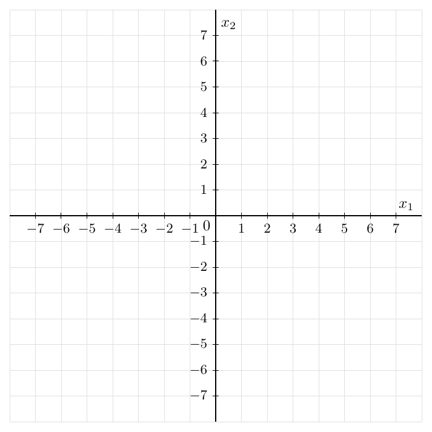
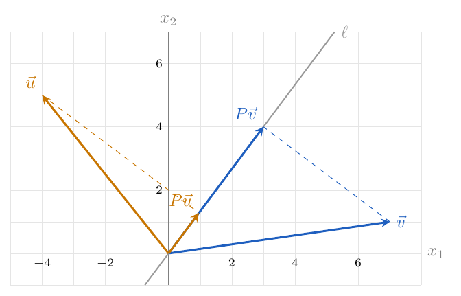



# Lab 6: Matrix-Vector Multiplication

**due** by the end of class on Wednesday, October 7, 2026

<a class="btn btn-info assignment-pdf-button" href="/resources/labs/lab06/lab06.pdf" target="_blank">View as PDF ✏️</a>
<a class="btn btn-info assignment-pdf-button" href="/resources/labs/lab06/lab06-solutions.pdf" target="_blank">Solutions PDF ✅</a>

{: .yellow }

Each lab worksheet will contain several activities, most of which will involve writing math on paper, and some of which will involve running code in a Jupyter Notebook. Lab activities are meant to last an hour, and the second hour of lab is dedicated to starting the homework assignment. To receive credit for a lab, you must show your lab TA your work on both the lab worksheet and homework assignment.

While you must get checked off by your lab TA **individually**, we encourage you to form groups with 1-2 other students to complete the activities together.

---

## Activities

- [Activity 1: Is the expression valid?](#activity-1-is-the-expression-valid)
- [Activity 2: Fundamentals](#activity-2-fundamentals)
- [Activity 3: Shuffle and stretch](#activity-3-shuffle-and-stretch)
- [Activity 4: Mystery matrices](#activity-4-mystery-matrices)
- [Activity 5: Drawing projections](#activity-5-drawing-projections)
- [Activity 6: Programming: Matrix-Vector Multiplication](#activity-6-programming-matrix-vector-multiplication)

---

This content is covered in [Chapter 3.1](https://notes.math124.org/ch03/03-01/) and [Chapter 3.2](https://notes.math124.org/ch03/03-02/) of the course notes, which are now posted. Have these open while working on the worksheet. Homework 5 will be released on Friday.

---

## Activity 1: Is the expression valid?

Suppose:

-   \\(A\in\mathbb R^{5\times3}\\).

-   \\(B\in\mathbb R^{3\times4}\\).

-   \\(\vec u\in\mathbb R^4\\).

-   \\(\vec v\in\mathbb R^3\\).

Draw a circle around each valid expression and ~~cross out~~ each invalid expression. An expression is valid if the shapes allow the operation shown. **Since you don't actually know \\(A\\), \\(B\\), \\(\vec u\\), and \\(\vec v\\), you can't actually do the calculation.**

<table>
<tbody>
<tr>
<td style="text-align: left;">\(A\vec v\)</td>
<td style="text-align: left;">\(\vec v A\)</td>
<td style="text-align: left;">\(B\vec u\)</td>
<td style="text-align: left;">\(B\vec v\)</td>
</tr>
<tr>
<td style="text-align: left;">\(B\vec u+\vec v\)</td>
<td style="text-align: left;">\(A\vec v+\vec u\)</td>
<td style="text-align: left;">\(\vec u\cdot\vec v\)</td>
<td style="text-align: left;">\(\vec v\cdot\vec v\)</td>
</tr>
<tr>
<td style="text-align: left;">\((B\vec u)\cdot\vec v\)</td>
<td style="text-align: left;">\((A\vec v)\cdot(B\vec u)\)</td>
<td style="text-align: left;">\(\|A\vec v\|^2\)</td>
<td style="text-align: left;">\(\|\vec u+\vec v\|\)</td>
</tr>
<tr>
<td style="text-align: left;">\(A(B\vec u)\)</td>
<td style="text-align: left;">\(B\vec u-3\vec v\)</td>
<td style="text-align: left;">\(\vec u+2\vec u\)</td>
<td style="text-align: left;">\(\|B\vec u\|^2+\|\vec v\|^2\)</td>
</tr>
</tbody>
</table>

Compare with your group. Explain any disagreements using the shapes.

Solution

Here \\(A\\) has shape \\(5\times3\\), \\(B\\) has shape \\(3\times4\\), \\(\vec u\\) has shape \\(4\times1\\) (it is a vector in \\(\mathbb R^4\\)), and \\(\vec v\\) has shape \\(3\times1\\) (it is a vector in \\(\mathbb R^3\\)). Thus \\(A\vec v\\) has shape \\(5\times1\\) (it is a vector in \\(\mathbb R^5\\)) and \\(B\vec u\\) has shape \\(3\times1\\) (it is a vector in \\(\mathbb R^3\\)).

<table>
<thead>
<tr>
<th style="text-align: left;">Expression</th>
<th style="text-align: left;">Valid?</th>
<th style="text-align: left;">Reason or shape of the result</th>
</tr>
</thead>
<tbody>
<tr>
<td style="text-align: left;">\(A\vec v\)</td>
<td style="text-align: left;">Valid</td>
<td style="text-align: left;">\(A\) has 3 columns and \(\vec v\) has 3 entries; result \(5\times1\) (it is a vector in \(\mathbb R^5\)).</td>
</tr>
<tr>
<td style="text-align: left;">\(\vec v A\)</td>
<td style="text-align: left;">Invalid</td>
<td style="text-align: left;">\(\vec v\) has shape \(3\times1\) (it is a vector in \(\mathbb R^3\)). The inner numbers in \((3\times1)(5\times3)\) do not match: \(1\ne5\).</td>
</tr>
<tr>
<td style="text-align: left;">\(B\vec u\)</td>
<td style="text-align: left;">Valid</td>
<td style="text-align: left;">\(B\) has 4 columns and \(\vec u\) has 4 entries; result \(3\times1\) (it is a vector in \(\mathbb R^3\)).</td>
</tr>
<tr>
<td style="text-align: left;">\(B\vec v\)</td>
<td style="text-align: left;">Invalid</td>
<td style="text-align: left;">\(B\) needs 4 entries, but \(\vec v\) has 3.</td>
</tr>
<tr>
<td style="text-align: left;">\(B\vec u+\vec v\)</td>
<td style="text-align: left;">Valid</td>
<td style="text-align: left;">Each vector has shape \(3\times1\) (it is a vector in \(\mathbb R^3\)).</td>
</tr>
<tr>
<td style="text-align: left;">\(A\vec v+\vec u\)</td>
<td style="text-align: left;">Invalid</td>
<td style="text-align: left;">The shapes \(5\times1\) (it is a vector in \(\mathbb R^5\)) and \(4\times1\) (it is a vector in \(\mathbb R^4\)) differ.</td>
</tr>
<tr>
<td style="text-align: left;">\(\vec u\cdot\vec v\)</td>
<td style="text-align: left;">Invalid</td>
<td style="text-align: left;">A dot product needs the same number of entries: \(4\ne3\).</td>
</tr>
<tr>
<td style="text-align: left;">\(\vec v\cdot\vec v\)</td>
<td style="text-align: left;">Valid</td>
<td style="text-align: left;">Both have 3 entries; the result is a scalar.</td>
</tr>
<tr>
<td style="text-align: left;">\((B\vec u)\cdot\vec v\)</td>
<td style="text-align: left;">Valid</td>
<td style="text-align: left;">Both have 3 entries; the result is a scalar.</td>
</tr>
<tr>
<td style="text-align: left;">\((A\vec v)\cdot(B\vec u)\)</td>
<td style="text-align: left;">Invalid</td>
<td style="text-align: left;">The vectors have 5 and 3 entries.</td>
</tr>
<tr>
<td style="text-align: left;">\(\|A\vec v\|^2\)</td>
<td style="text-align: left;">Valid</td>
<td style="text-align: left;">\(A\vec v\) exists; its squared length is a scalar.</td>
</tr>
<tr>
<td style="text-align: left;">\(\|\vec u+\vec v\|\)</td>
<td style="text-align: left;">Invalid</td>
<td style="text-align: left;">The sum inside is not defined.</td>
</tr>
<tr>
<td style="text-align: left;">\(A(B\vec u)\)</td>
<td style="text-align: left;">Valid</td>
<td style="text-align: left;">\(B\vec u\) has 3 entries, as \(A\) needs; result \(5\times1\) (it is a vector in \(\mathbb R^5\)).</td>
</tr>
<tr>
<td style="text-align: left;">\(B\vec u-3\vec v\)</td>
<td style="text-align: left;">Valid</td>
<td style="text-align: left;">Each vector has shape \(3\times1\) (it is a vector in \(\mathbb R^3\)).</td>
</tr>
<tr>
<td style="text-align: left;">\(\vec u+2\vec u\)</td>
<td style="text-align: left;">Valid</td>
<td style="text-align: left;">Each vector has shape \(4\times1\) (it is a vector in \(\mathbb R^4\)).</td>
</tr>
<tr>
<td style="text-align: left;">\(\|B\vec u\|^2+\|\vec v\|^2\)</td>
<td style="text-align: left;">Valid</td>
<td style="text-align: left;">Both squared lengths are scalars, so they can be added.</td>
</tr>
</tbody>
</table>

---

## Activity 2: Fundamentals

Let

$$
A=\begin{bmatrix}4&-3&6\\-2&5&1\end{bmatrix},\qquad
\vec v=\begin{bmatrix}-2\\3\\4\end{bmatrix},\qquad
B=\begin{bmatrix}2&-1\\-3&4\\5&2\end{bmatrix}.
$$

a)

Compute \\(A\vec v\\). What are the shapes of \\(\vec v\\) and \\(A\vec v\\)?

Solution

Using a dot product with each row,

$$
A\vec v
=\begin{bmatrix}4(-2)+(-3)(3)+6(4)\\(-2)(-2)+5(3)+1(4)\end{bmatrix}
=\boxed{\begin{bmatrix}7\\23\end{bmatrix}}.
$$

 The shape of \\(\vec v\\) is \\(3\times1\\) (it is a vector in \\(\mathbb R^3\\)); the shape of \\(A\vec v\\) is \\(2\times1\\) (it is a vector in \\(\mathbb R^2\\)).

b)

Compute \\(B(A\vec v)\\). What is its shape?

Solution

Multiply \\(B\\) by the result from part (a):

$$
B(A\vec v)
=\begin{bmatrix}2&-1\\-3&4\\5&2\end{bmatrix}
\begin{bmatrix}7\\23\end{bmatrix}
=\begin{bmatrix}14-23\\-21+92\\35+46\end{bmatrix}
=\boxed{\begin{bmatrix}-9\\71\\81\end{bmatrix}}.
$$

 Its shape is \\(3\times1\\) (it is a vector in \\(\mathbb R^3\\)).

c)

Is \\(B\vec v\\) defined? Explain. Explain why \\(B(A\vec v)\\) can be defined even when \\(B\vec v\\) is not.

Solution

\\(B\vec v\\) is not defined: \\(B\\) has 2 columns, but \\(\vec v\\) has 3 entries. However, \\(A\vec v\\) has 2 entries. Therefore it has the shape needed to multiply by \\(B\\). We compute \\(A\vec v\\) first and then apply \\(B\\).

---

## Activity 3: Shuffle and stretch

Let

$$
S=\begin{bmatrix}0&1&0\\0&0&1\\1&0&0\end{bmatrix},\qquad
D=\begin{bmatrix}5&0&0\\0&-2&0\\0&0&1/3\end{bmatrix},\qquad
\vec x=\begin{bmatrix}-4\\7\\9\end{bmatrix}.
$$

a)

Compute \\(S\vec x\\) and \\(D\vec x\\). Describe in words what each matrix does to the entries of an input vector.

Solution

The rows of \\(S\\) pick out the second, third, and first entries, in that order:

$$
S\vec x=\boxed{\begin{bmatrix}7\\9\\-4\end{bmatrix}},
\qquad
D\vec x=\begin{bmatrix}5(-4)\\(-2)(7)\\(1/3)(9)\end{bmatrix}
=\boxed{\begin{bmatrix}-20\\-14\\3\end{bmatrix}}.
$$

 \\(S\\) moves the first entry to the bottom and moves the other two up one position. \\(D\\) multiplies the first entry by \\(5\\), the second by \\(-2\\), and the third by \\(1/3\\).

b)

Compute \\(S(D\vec x)\\) and \\(D(S\vec x)\\).

Solution

Apply the matrices one at a time:

$$
S(D\vec x)=S\begin{bmatrix}-20\\-14\\3\end{bmatrix}
=\boxed{\begin{bmatrix}-14\\3\\-20\end{bmatrix}},
\qquad
D(S\vec x)=D\begin{bmatrix}7\\9\\-4\end{bmatrix}
=\boxed{\begin{bmatrix}35\\-18\\-4/3\end{bmatrix}}.
$$

c)

Why are \\(S(D\vec x)\\) and \\(D(S\vec x)\\) different? Explain using what \\(S\\) and \\(D\\) do to the entries of a vector.

Solution

The scaling factor depends on an entry's position. In \\(S(D\vec x)\\), the original second entry, \\(7\\), is first multiplied by \\(-2\\) and then moved to the first position, giving \\(-14\\). In \\(D(S\vec x)\\), it is first moved to the first position and then multiplied by \\(5\\), giving \\(35\\). The same change of position changes which factor is applied to the other entries, too.

---

## Activity 4: Mystery matrices

There is a matrix \\(A\\), but we have not been given its entries.

a)

Suppose

$$
A\begin{bmatrix}1\\0\end{bmatrix}=\begin{bmatrix}5\\-2\\12\end{bmatrix}.
$$

 What does this tell you about \\(A\\)?

Solution

Multiplication by \\(\begin{bmatrix}1\\\\0\end{bmatrix}\\) takes one copy of the first column and zero copies of the second column. Therefore the first column of \\(A\\) is \\(\begin{bmatrix}5\\\\-2\\\\12\end{bmatrix}\\). The given input and output also show that \\(A\\) has shape \\(3\times2\\). Its second column is not yet determined.

b)

We also know that

$$
A\begin{bmatrix}0\\1\end{bmatrix}=\begin{bmatrix}10\\0\\1\end{bmatrix}.
$$

 What does this tell you about \\(A\\)? Use both pieces of information to write \\(A\\).

Solution

Multiplication by \\(\begin{bmatrix}0\\\\1\end{bmatrix}\\) selects the second column. Therefore

$$
\boxed{A=\begin{bmatrix}5&10\\-2&0\\12&1\end{bmatrix}}.
$$

c)

There is another matrix \\(B\\). We know only that

$$
B\begin{bmatrix}1\\0\\0\end{bmatrix}=\begin{bmatrix}15\\3\\4\\2\end{bmatrix},\qquad
B\begin{bmatrix}0\\1\\0\end{bmatrix}=\begin{bmatrix}-6\\11\\0\\-5\end{bmatrix},\qquad
B\begin{bmatrix}0\\0\\1\end{bmatrix}=\begin{bmatrix}2\\-7\\9\\6\end{bmatrix}.
$$

 Using just this information, find \\(B\begin{bmatrix}-2\\\\1\\\\3\end{bmatrix}\\). Explain how you used the three given outputs.

Solution

The three given outputs are the three columns of \\(B\\):

$$
B=\begin{bmatrix}15&-6&2\\3&11&-7\\4&0&9\\2&-5&6\end{bmatrix}.
$$

 By the column-combination interpretation of matrix-vector multiplication,

$$
\begin{aligned}
B\begin{bmatrix}-2\\1\\3\end{bmatrix}
&=-2\begin{bmatrix}15\\3\\4\\2\end{bmatrix}
+\begin{bmatrix}-6\\11\\0\\-5\end{bmatrix}
+3\begin{bmatrix}2\\-7\\9\\6\end{bmatrix}\\[0.6em]
&=\begin{bmatrix}-30-6+6\\-6+11-21\\-8+0+27\\-4-5+18\end{bmatrix}
=\boxed{\begin{bmatrix}-30\\-16\\19\\9\end{bmatrix}}.
\end{aligned}
$$

 The coefficients \\(-2\\), \\(1\\), and \\(3\\) are the entries of the input vector. Thus the three known outputs give exactly the column vectors needed for this calculation.

---

## Activity 5: Drawing projections

Let \\(\ell=\operatorname{span}(\vec w)\\), where

$$
\vec w=\begin{bmatrix}3/5\\4/5\end{bmatrix},\qquad \vec v=\begin{bmatrix}7\\1\end{bmatrix}.
$$

a)

First, let's refresh: find \\(\operatorname{proj}&#95;{\ell}(\vec v)\\) the usual way.

Solution

Here \\(\vec w=\begin{bmatrix}3/5\\\\4/5\end{bmatrix}\\) has length \\(1\\), since \\((3/5)^2+(4/5)^2=1\\). The usual unit-vector projection formula gives

$$
\vec v\cdot\vec w=7\left(\frac35\right)+1\left(\frac45\right)=5.
$$

$$
\operatorname{proj}_{\ell}(\vec v)
=(\vec v\cdot\vec w)\vec w
=5\begin{bmatrix}3/5\\4/5\end{bmatrix}
=\boxed{\begin{bmatrix}3\\4\end{bmatrix}}.
$$

b)

We can also project onto \\(\ell\\) by multiplying by a matrix. A **projection matrix** \\(P\\) satisfies \\(P\vec v=\operatorname{proj}&#95;{\ell}(\vec v)\\) for every input \\(\vec v\\). If a unit vector \\(\vec w=\begin{bmatrix}w&#95;1\\\\w&#95;2\end{bmatrix}\\) spans \\(\ell\\), then

$$
P=\begin{bmatrix}w_1^2&w_1w_2\\w_1w_2&w_2^2\end{bmatrix}.
$$

 Find \\(P\\) for this line, then find \\(P\vec v\\). Compare with your answer in part (a). What do you notice about the columns of \\(P\\)?

Solution

Substitute \\(w&#95;1=3/5\\) and \\(w&#95;2=4/5\\) into the supplied formula:

$$
\boxed{P=\begin{bmatrix}9/25&12/25\\12/25&16/25\end{bmatrix}}.
$$

$$
P\vec v
=\begin{bmatrix}(9/25)7+(12/25)1\\(12/25)7+(16/25)1\end{bmatrix}
=\begin{bmatrix}75/25\\100/25\end{bmatrix}
=\boxed{\begin{bmatrix}3\\4\end{bmatrix}}.
$$

 This agrees with part (a). Both columns of \\(P\\) lie on \\(\ell\\):

$$
\begin{bmatrix}9/25\\12/25\end{bmatrix}=\frac35\vec w,
\qquad
\begin{bmatrix}12/25\\16/25\end{bmatrix}=\frac45\vec w.
$$

 Every product \\(P\vec z\\) is a combination of these columns, so it is also a multiple of \\(\vec w\\) and lies on \\(\ell\\).

**Activity 5: Drawing projections (continued)**

c)

Use \\(P\\) to find the projection onto \\(\ell\\) of \\(\vec u=\begin{bmatrix}-4\\\\5\end{bmatrix}\\). On the coordinate axes below, draw \\(\ell\\) and the four vectors \\(\vec u\\), \\(\vec v\\), \\(P\vec u\\), and \\(P\vec v\\), all starting at the origin. What do you notice?

Solution

For \\(\vec u=\begin{bmatrix}-4\\\\5\end{bmatrix}\\),

$$
P\vec u=\begin{bmatrix}(9/25)(-4)+(12/25)5\\(12/25)(-4)+(16/25)5\end{bmatrix}
=\boxed{\begin{bmatrix}24/25\\32/25\end{bmatrix}}.
$$

 In the sketch, both \\(P\vec u\\) and \\(P\vec v\\) lie on \\(\ell\\). The dashed segments from each original tip to its projected tip are perpendicular to \\(\ell\\).

---

## Activity 6: Programming: Matrix-Vector Multiplication

This lab has a programming notebook to help you visualize various matrix-vector operations, and to show you how matrix-vector multiplication works in Python.

To open the notebook for Lab 6, click the Google Colab link under "Code" on the course website for Lab 6. Instructions on how to use Google Colab are at [math124.org/running-code](https://math124.org/running-code). If you are viewing the lab worksheet after it has been posted, [this direct link](https://colab.research.google.com/github/math-124/fa26-code/blob/main/labs/lab06/lab06.ipynb) will work, too. To receive credit for the programming component of the lab, work through the entire notebook and show your lab TA your work.


